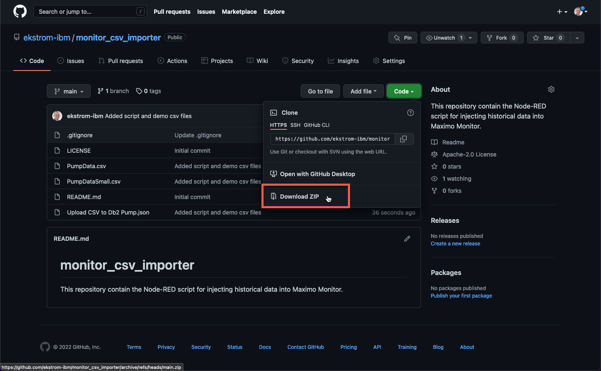
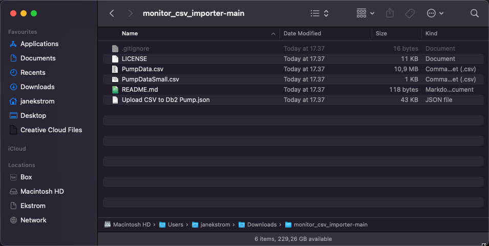
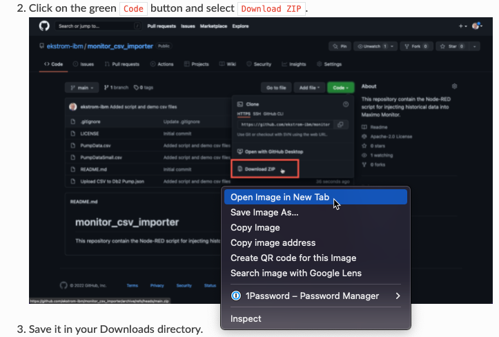
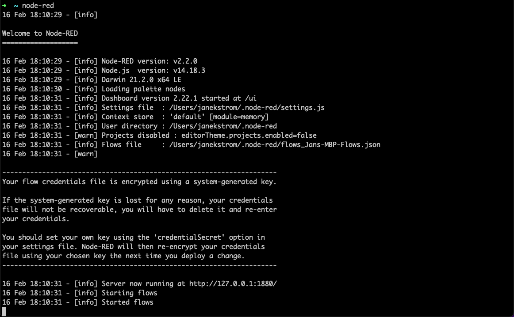
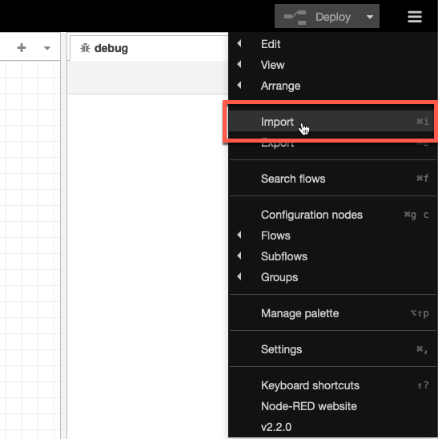
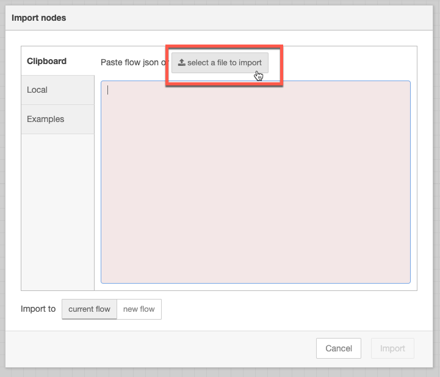
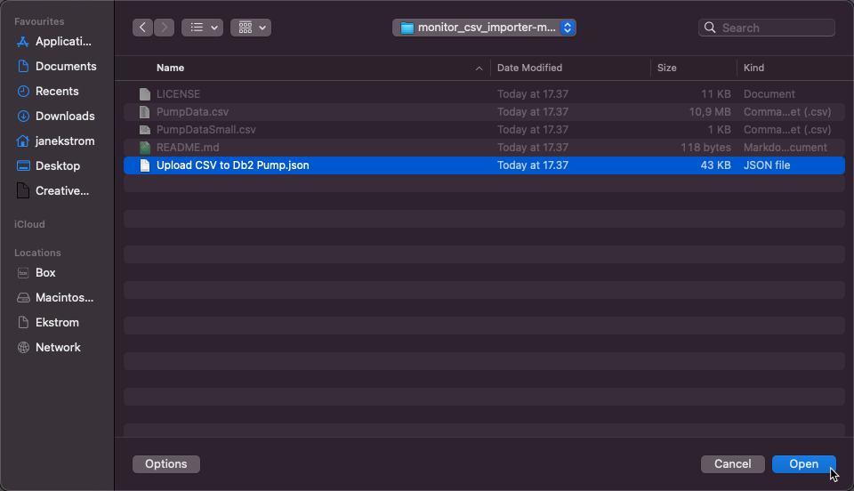
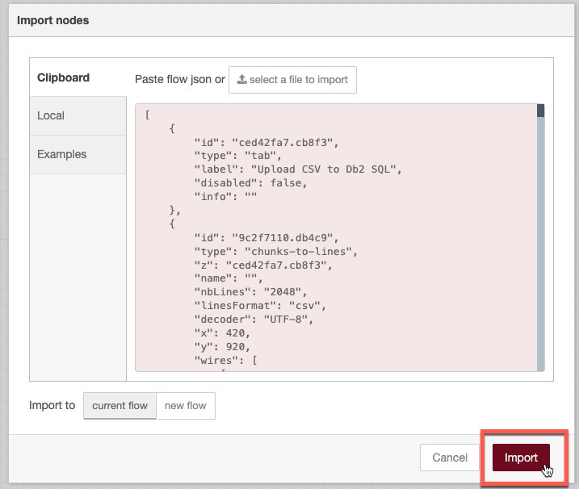
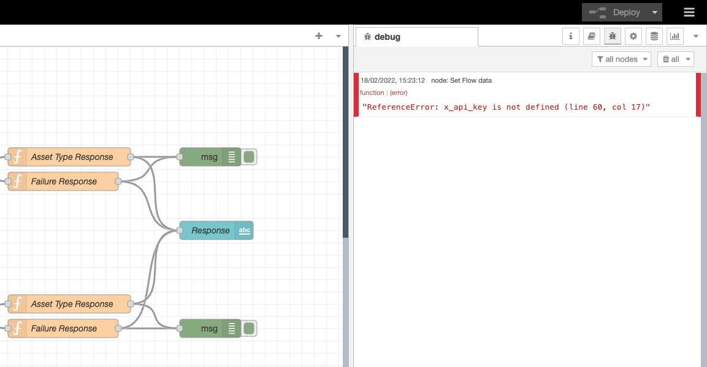
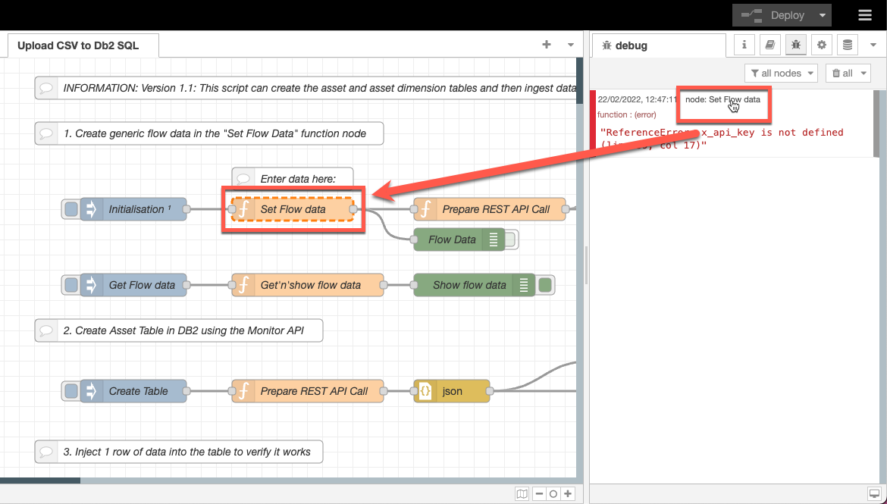

# Objectives
In this Exercise you will learn how to:

* Get the required Node-RED script
* Import the script into Node-RED

---
*Before you begin:*  
This Exercise requires that you have:

1. completed the pre-requisites required for [all labs](prereqs.md)
2. completed the [setup of Node-RED locally](setup.md)
 
---
##  Get the required Node-RED script

1.  Open a browser and navigate to [monitor_csv_importer github repository](https://github.com/ekstrom-ibm/monitor_csv_importer){target=_blank}.
2.  Click on the green `Code` button and select `Download ZIP`.
  
3.  Save it in your Downloads directory.
4.  Extract the ZIP file (double-click on Mac) and you will have a directory with the files you need:
  

!!! tip 
    You can Right-Click on the images in this lab and select `Open Image in New Tab`  
    to view the details in the screen shots:  
      

##  Import the script into Node-RED

Now it is time to import the downloaded Node-RED script.

1.  Start the Node-RED instance if not already done (in a CMD/Terminal/iTerm window).
  
2.  Open the browser and navigate to [localhost:1880](http://localhost:1880){target=_blank}.
3.  Click on the burger menu in upper right hand corner and select `Import`.
  
4.  Click on `select a file to import`.
  
5.  Select the `Upload CSV to Db2 Pump.json`and click Open.
  
6.  Click `Import`.
  
7.  Click the `Deploy` button 
  
8.  and see this:
 
Don't worry about the error message at this point. 
This should be solved during the next exercise.

!!! tip 
    If you see red error messages in the Debug pane, you can hover over the node name and then 
    the node which caused the error to occur will appear with dashed orange lines:  
      
    This should help you identify where the error has occured and what needs to be done is indicated with the error decription.  

---
Congratulations you have successfully downloaded and imported the Node-RED script. 
You will now be able to adjust the Node-RED script to your environment.