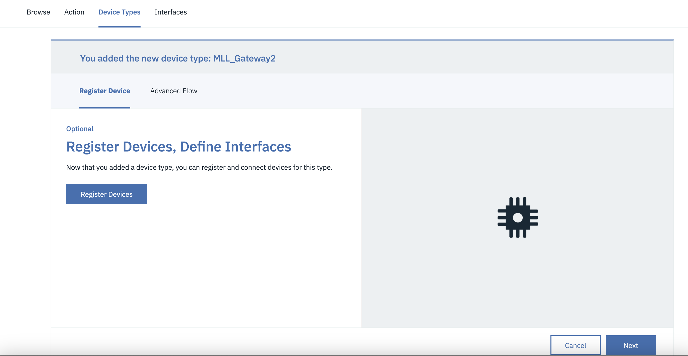
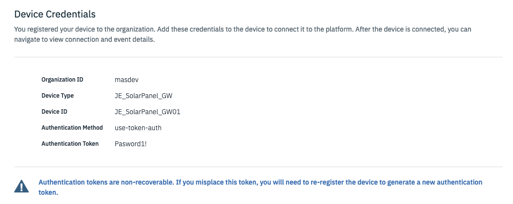

# Objectives
In this Exercise you will learn how to setup Monitor to receive data from a CSV file that contains solar panel data and send the data through a gateway.  The gateway will create the devices in Monitor.

* Create a device type and setup metrics in Monitor
* Create a gateway in IoT to send events to the device type in Monitor
* Configure Node-RED flow
* Run Node-RED flow
* Verify the devices and data are in Monitor

## Create a device type and setup metrics in Monitor

!!! tip
    If you have already done the previous exercise, then skip to [Create a gateway in IoT and register a device](#create-a-gateway-in-iot-and-register-a-device) and reuse the device type setup.

### Create a device type

1. Go to Setup in Monitor
2. Go to Devices tab
3. Click on + button to create a device type
4. Choose Basic template
5. Next
6. Enter a Device type name, e.g. XX_SolarPanel (replace XX with your initials). 
   Take note of the name you give as you will need this in the Node-RED flow config
7. Create

### Create Metrics in the device type

1. Under Metrics section click Add metric
2. Click Add metric
     a. Enter AC_POWER for Metric
     b. Enter AC_POWER for Display name
     c. Enter event_1 for Event
     d. Choose NUMBER for Type 
     e. Enter Watt for Unit 
3. Click Add metric
     a. Enter DC_POWER for Metric
     b. Enter DC_POWER for Display name
     c. Choose event_1 for Event
     d. Choose NUMBER for Type
     e. Enter Watt for Unit 
4. Click Add metric
     a. Enter DAILY_YIELD for Metric
     b. Enter DAILY_YIELD for Display name
     c. Choose event_1 for Event
     d. Choose NUMBER for Type
5. Click Add metric
     a. Enter TOTAL_YIELD for Metric
     b. Enter TOTAL_YIELD for Display name
     c. Choose event_1 for Event
     d. Choose NUMBER for Type
6. Click Add metric
     a. Enter EVT_TIMESTAMP for Metric
     b. Enter EVT_TIMESTAMP for Display name
     c. Choose event_1 for Event
     d. Choose TIMESTAMP for Type
7. Click Add
8. Apply checkmark in the box to `Use this as the default timestamp`
9. The metrics should look like this:  

9. Click Save

## Create a gateway in IoT and register a device

1. Click the AppSwitcher in the top right corner and choose IoT 

2. Click on Device Types
3. Click on Add Device Type
4. Click on Type Gateway
5. Enter a name for the gateway type, e.g. XX_SolarPanel_GW (replace XX with your initials). 
   Take note of the name you give as you will need this in the Node-RED flow config
5. Click Next
6. Click Finish
7. Click Register Devices

8. Enter a name for the gateway device, e.g. XX_SolarPanel_GW01 (replace XX with your initials). 
Note:  This is not the DEVICEID in your CSV file
9. Click Next 4 times
13. In Authenticaton Token enter Pasword1! and click Next

14. Click Finish

## Import Node-RED flow to import the CSV

!!! tip
    If you have already done the previous exercise, then skip to [next step](#update-the-device-type) and use the Node-RED script already imported.

1. Download the [flow](https://github.com/ekstrom-ibm/monitor_csv_importer/blob/main/V2/Monitor_CSV_to_MQTT_flow.json){target=_blank}, if you have completed the previous device exercise skip these steps 
2. Launch Node-RED
3. Click on the burger menu and choose Import
4. Click on select a file to import
5. Choose the file downloaded in step 1.
6. Click Import

## Configure Node-RED flow "CSV to MQTT to Monitor through a gateway"

### Configure Node-RED flow for your MAS Monitor environment

Collect the following (or skip if done in previous exercise): 
* name of the device type created above 
* Messaging hostname which should look like this 
&ensp;[tenant/workspace].messaging.iot.[domain] 
&ensp;e.g. masdev.messaging.iot.monitordemo2.ibmmam.com 

### Update the device type

1. Double click on the "Set Flow Data" `function` node in the Initializtion section
2. Change the deviceType to the device type you created previously, 
   e.g. XX_SolarPanel (replace XX with your initials).
3. Click Done

### Update the Client ID

1. Double click on the purple `mqtt out` node named `Send MQTT event to a gateway in MAS Monitor`
2. Click on the pencil icon next to Server
3. In the Server box replace with your Messaging hostname
4. Click on the pencil icon next to TLS configuration
5. In the Server Name box replace with your Messaging hostname
6. Uncheck `Verify server certificate` and click Update
7. The Client ID for a gateway looks like this: `g:<tenant>:<device type>:<device ID>`
8. In the Client ID field replace masdev with your tenant/workspace name if it is not the same
9. In the Client ID field replace XX_SolarPanel_GW with your gateway device type created above
10. In the Client ID field replace XX_SolarPanel_GW01 with the device Id of your gateway created above
11. Click on the Security tab, write `use-token-auth` as the username 
    and write `Pasword1!` as the Password
12. Click Update
13. Click Done
14. Click Deploy in the top right corner
15. You should now see a green dot and `connected` below the `mqtt out` node  
if all credentials were entered correctly: 

## Run the Node-RED flow for a gateway

1. Download [multiple_solar_panels.csv](https://github.com/ekstrom-ibm/monitor_csv_importer/blob/main/V2/multiple_solar_panels.csv){target=_blank} from github
2. Click on the down arrow in the upper right corner in Node-RED and choose Dashboard 

3. Click on the launch arrow 

4. Click on Choose File or Browse under "Upload CSV with multiple devices" and select the recently downloadet CSV file. 

5. Select the `multiple_solar_panels.csv` file and click the right arrow play button
6. Go back to the Node-RED flow window
7. Under the light purple `delay` node it shows the amount of messages left to send to Monitor
8. Under the green `debug` Progress node it shows the amount of messages that have been sent to Monitor
9. All the data is ingested into Monitor once the number under the light purple `delay` node 
   shows 0 but you can go ahead to the next step to verify data is going into Monitor. 
   It will take approx. 11 minutes. 

## Verify the devices and data in Monitor

1. Go to Setup in Monitor
2. Click on the Device Type created earlier in the lab
3. See that 21 (+1 from previous exercise) devices were created in Monitor under the device type

3. Click on the black button "Set up device type"
4. On the left side open Metric and then select DAILY_YIELD
5. Click on Data table to see the values of that metric and notice the different Device ID's 

---

Congratulations!  You have ingested data from a CSV file into Monitor for several devices through a gateway. 
Now you can explore creating calculated data metrics and dashboards in Monitor. 
Which could be something like this: 
  

!!! attention
    Please archive and delete your device type when it is no longer being used.

