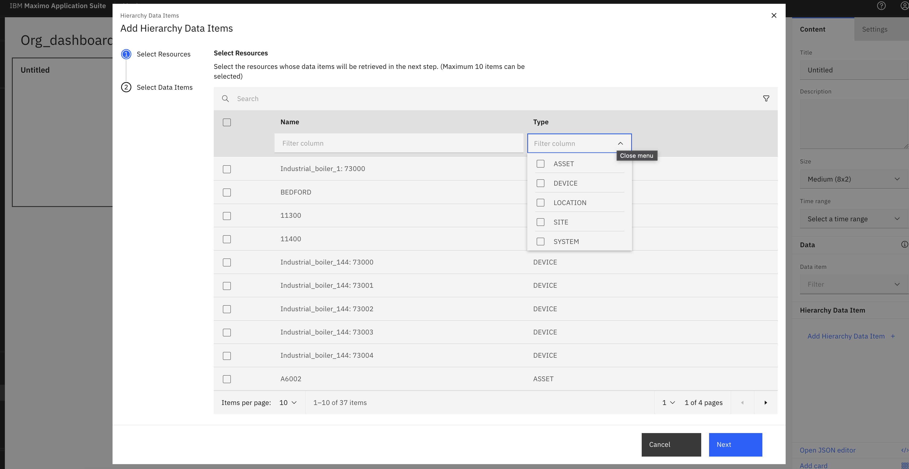
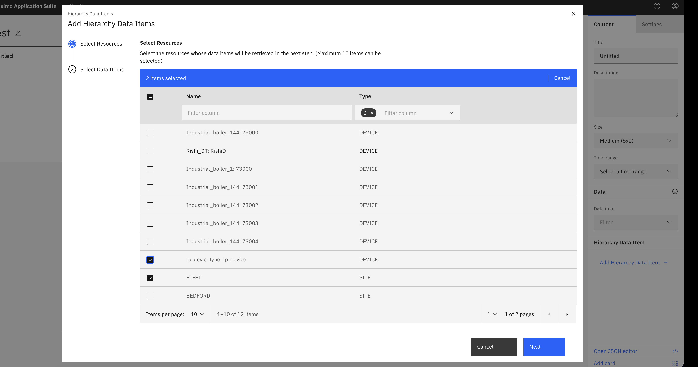
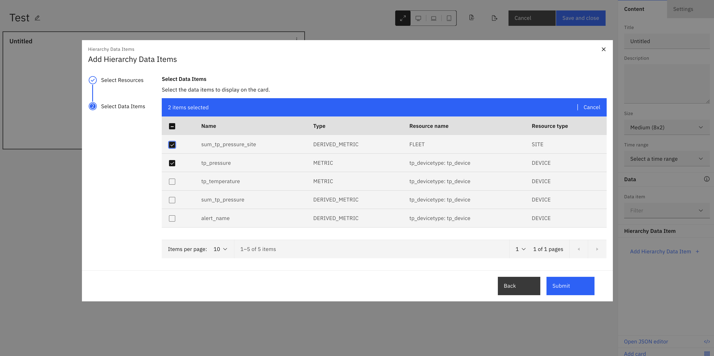
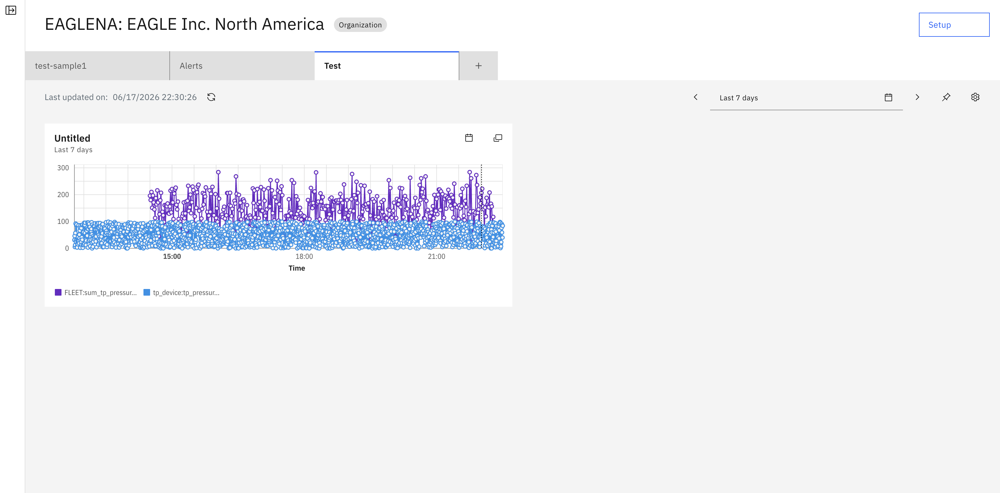

# Objectives
In this exercise you will learn how to:

* Understand hierarchy levels in Maximo Monitor
* Create dashboards at Organization
* Select resources from the hierarchy 

---

## Overview

Parent-level aggregation works across all hierarchy levels in Maximo Monitor. While the previous exercises focused on Asset-level dashboards, you can create dashboards at any hierarchy level:

**Hierarchy Structure:**
```
Organization (Top Level)
  └── Site
      └── System
          └── Location / Asset
              └── Device (Bottom Level)
```

!!! info "Key Concept"
    Devices are always assigned to **Location** or **Asset**. When creating dashboards at higher levels in hierarchy, inorder to get data, you must ensure that device assugned to location or asset which are present in the hierarchy.

---

## Understanding Hierarchy Levels

**Supported Hierarchy Levels for Parent-Level Aggregation:**

1. **Organization** - Top-level entity representing your entire organization
2. **Site** - Physical sites within your organization
3. **System** - Logical groupings of assets or locations
4. **Location** - Physical locations where devices are installed
5. **Asset** - Equipment or machinery with assigned devices

---

## Creating Dashboard at Organization Level

Organization-level dashboards provide a comprehensive view of data from your entire organizational hierarchy. This is ideal for executive dashboards and enterprise-wide monitoring.

## Create Organization dashboard

1. Goto dashboard tab and select `Add dashboard` to configure new dashboard and click on `Add Hierarchy Data Item`. Here we can data items from all hierarchy levels.</br></br>
</br></br>

2. We can use filter option to select data items from specific hierarchy level.</br></br>
</br></br>

3. We can use filter option to select data items from specific hierarchy level.</br></br>
</br></br>

4. View selected child resource metrics in card. Likewise we can create similar dashboards using other cards as discussed in previous sectionss.</br></br>
</br></br>

!!! success
    You have successfully created an Organization-level dashboard that aggregates data from devices across your entire organizational hierarchy!

---

## Important Considerations

!!! tip "Resource Selection"
    When selecting resources at higher hierarchy levels, you can mix different resource types (Location, Asset, Site) in the same dashboard to get a comprehensive view.

!!! note "Data Aggregation"
    Use aggregation functions (sum, average, min, max) to meaningfully combine data from multiple devices across the hierarchy.

---

🎉 Congratualtions! You have now completed the core exercises for parent-level aggregation.

---
