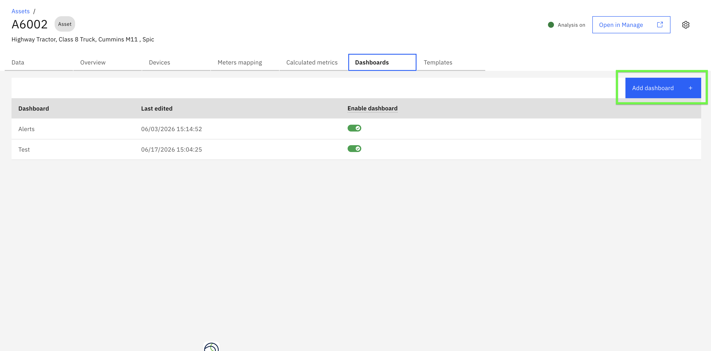
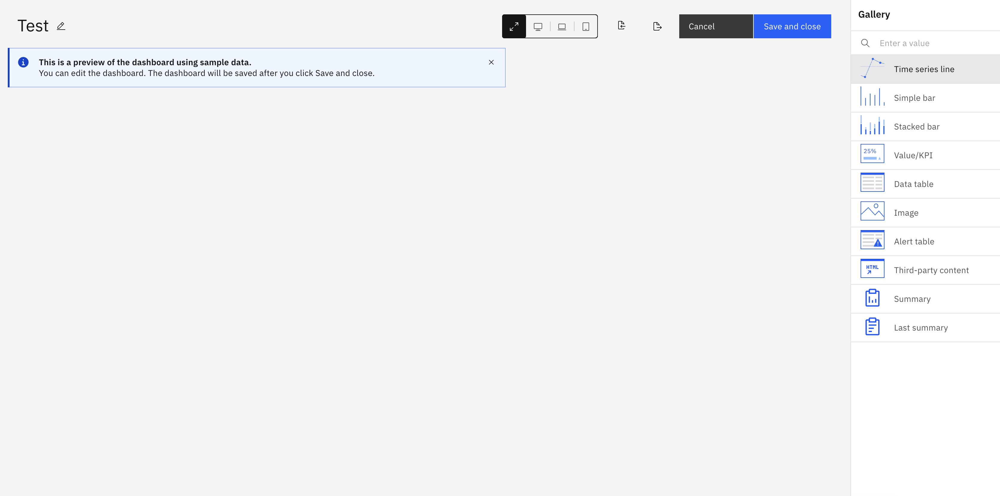
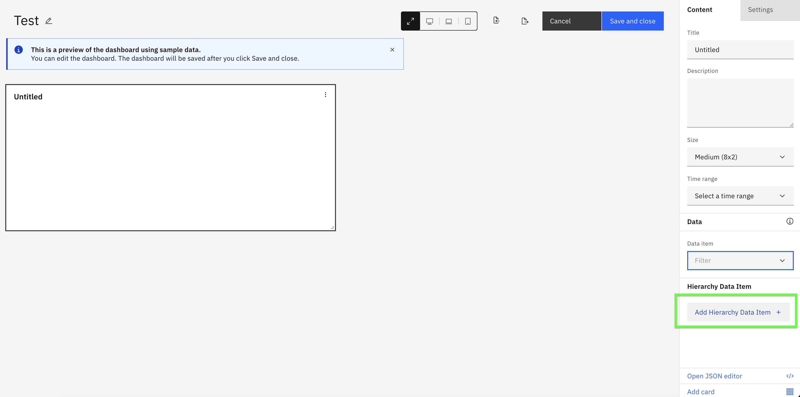
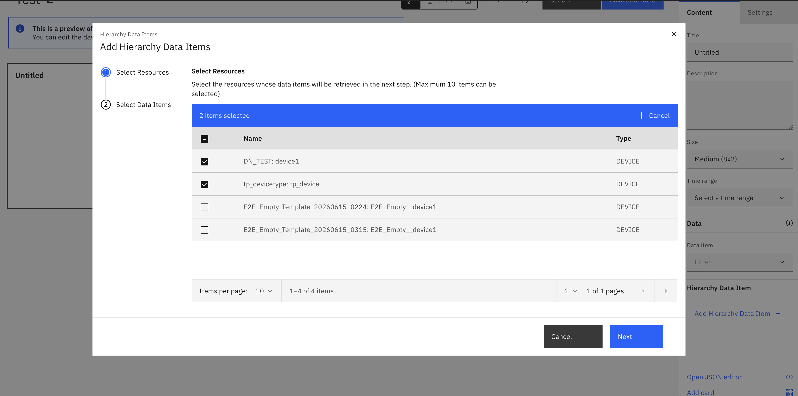
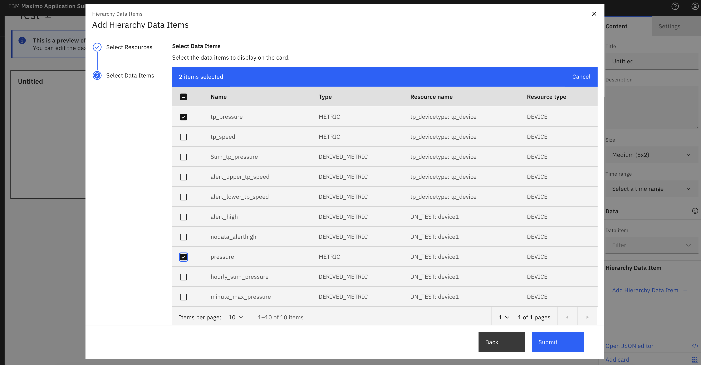
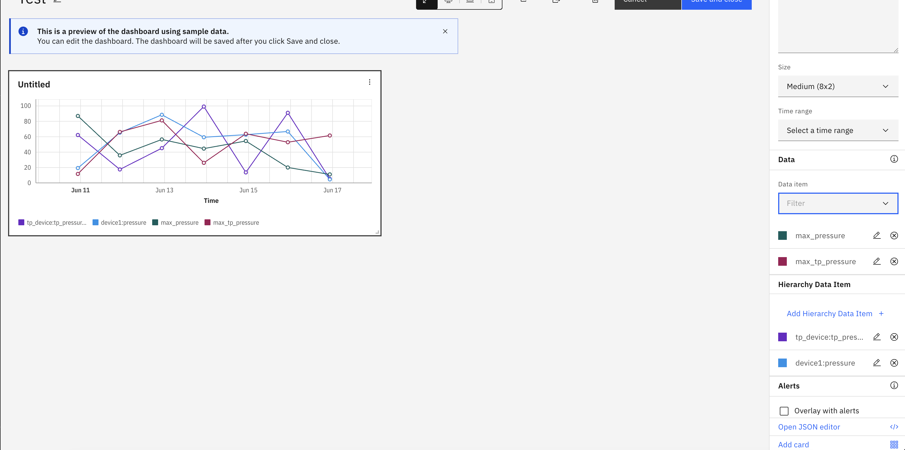
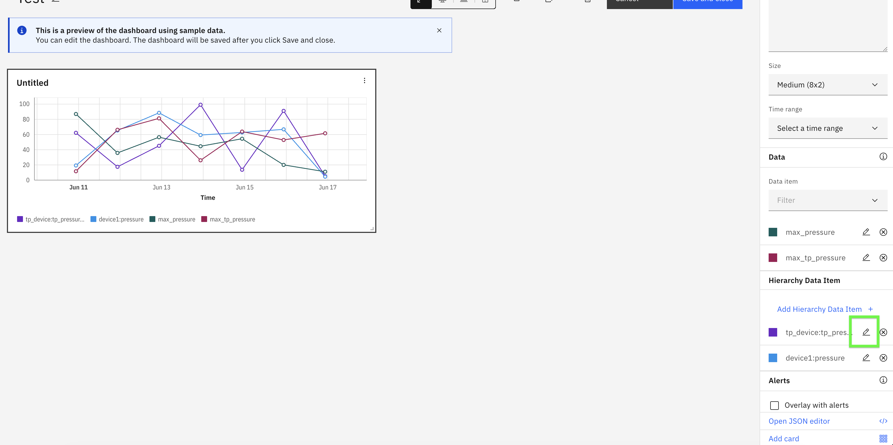
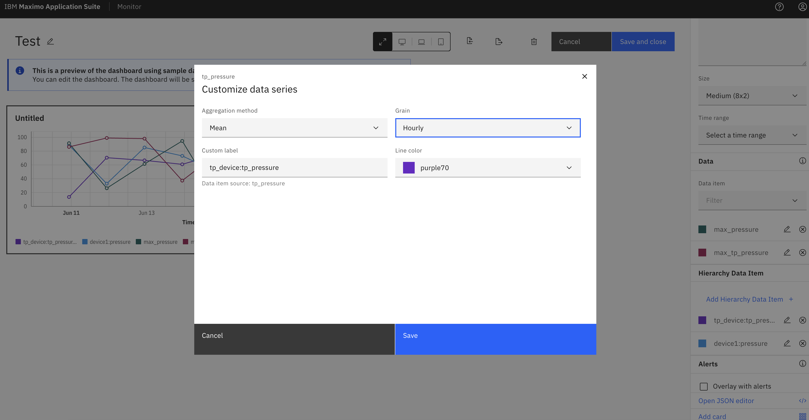
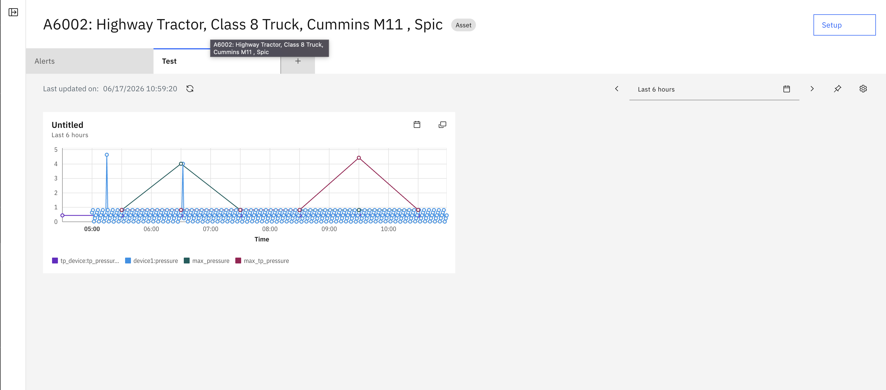

# Exercise 2: Create dashboard for parent asset and add child device metrics

## Objectives
In this exercise you will learn how to:

* Create a dashboard for the parent asset
* Add hierarchy data items from child devices to dashboard cards
* Use Time series line card to visualize child device metrics
* Configure aggregation functions (sum, average, min, max, count) on child metrics
* Apply time-based grain (hourly, daily, weekly) to aggregate data over time
* Compare data from multiple child devices on a single chart

---

## Overview

!!! info
    Parent-level aggregation allows you to add child device metrics directly to parent resource dashboards. This eliminates the need to create duplicate KPIs or manually aggregate data.

**Supported Card Types for Hierarchy Data:**

* **Time series line** - Display trends over time from multiple child devices
* **Simple bar** - Compare values across child devices
* **Stacked bar** - Show cumulative values from child devices
* **Value/KPI** - Display aggregated metrics as single values
* **Data table** - Show detailed data in tabular format
* **Image** - Display images with hierarchy context

In this exercise, we will focus on the **Time series line** card to visualize and compare metrics from multiple child devices. You will also learn how to configure **aggregation functions** (sum, average, min, max, count) and **time-based grain** (hourly, daily, weekly) for child device metrics.

!!! note
    You can also add hierarchy data items to existing dashboards. Creating a new dashboard is optional.

---

## Create new dashboard

1. Goto dashboard tab and select `Add dashboard` to configure new dashboard.
  

2. Select `Time series line` card type.
  

3. Click `Add Hierarchy Data Item` button.
  

4. In the **Add Hierarchy Data Items** dialog, you will see all child resources (devices) assigned to the current asset. Select the child devices whose metrics you want to display on the chart. You can select multiple devices to compare their data. Click `Next` to proceed to data item selection.
  

5. In the next step, you will see all available data items (metrics) from the selected child devices. Select the data items you want to visualize on the chart. eg. We have selected pressure from 2 different device to compare with each other. You can select the same metric from multiple devices to compare them, or select different metrics. Click `Submit` to add the data items to the card.
  

6. The card will display the selected metrics from child devices. We can also add dataitems from asset asusal if KPI created at asset.
  

7. Select `edit` button child metrics to add aggregation functions and time grain.
  
  

8. Save and The Time series line card now displays data from multiple child devices on a single chart. You can compare trends and patterns of metrices across different devices easily.
  

---

!!! success
    You have successfully added child device metrics to the parent asset dashboard! The chart displays data from multiple child devices, allowing you to compare and analyze their performance in one view.

---

In the next exercise, you will explore different card types for visualizing hierarchy data. Each card type provides unique insights.   

---