# Objectives
In this exercise you will learn how to:

* Create different card types for visualizing hierarchy data
* Use Simple bar cards to compare current values across devices
* Use Stacked bar cards to show cumulative metrics
* Use Value/KPI cards to display aggregated totals
* Use Data table cards to view detailed data
* Use Image cards with hierarchy context

---

## Overview

Parent-level aggregation supports multiple card types, each providing different ways to visualize and analyze child device data. In the previous exercise, you learned how to use Time series line cards with aggregation functions and time grain. In this exercise, you will explore other card types to gain different insights from your hierarchy data.

!!! info
    All card types support the same hierarchy data item selection process you learned in Exercise 2. The key difference is how each card type visualizes the data.

---

## Simple Bar Card

Simple bar cards display a single metric grouped by time intervals, allowing you to see how values change over different time periods.

1. Click `Add card` and select `Simple bar` card type.
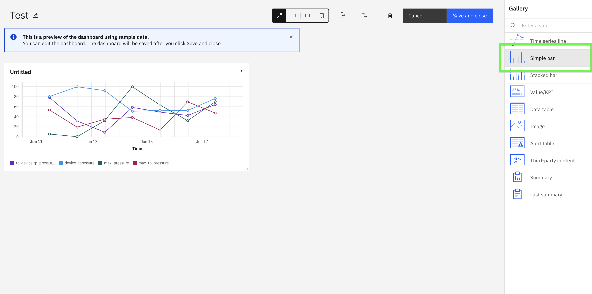  

2. Click `Add Hierarchy Data Item` button and select the child devices.
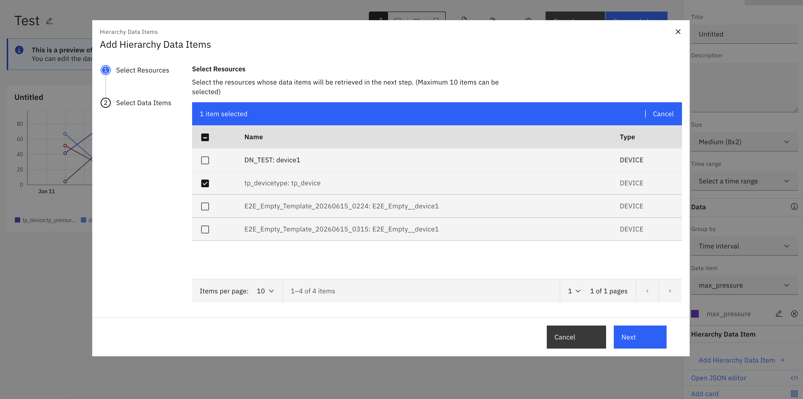  

3. Select the data item (metric) to display. **Note:** Simple bar cards allow you to select only ONE metric at a time.
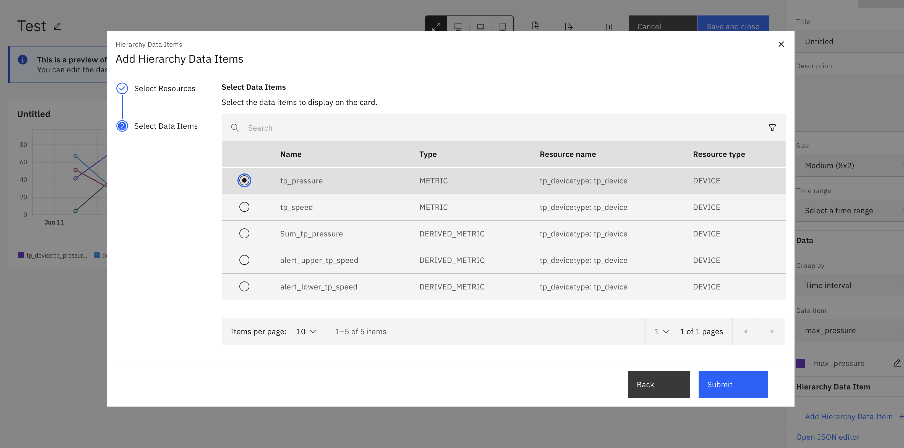  

4. The Simple bar card displays the selected metric grouped by time intervals (hourly, daily, weekly, etc.), showing how the value changes over time.
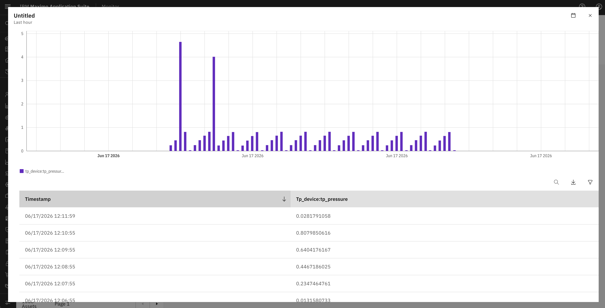  

!!! tip "Use Case Example"
    Simple bar cards are ideal for visualizing a single metric over time intervals, such as:
    
    * View hourly energy consumption patterns throughout the day
    * Compare daily production output across the week
    
    The grouping by time interval helps identify patterns and trends for a specific metric.

---

## Stacked Bar Card

Stacked bar cards are similar to Simple bar cards but allow you to select multiple data items. The card displays these metrics stacked on top of each other, grouped by time intervals, showing the cumulative contribution of each metric over time.

1. Click `Add card` and select `Stacked bar` card type.
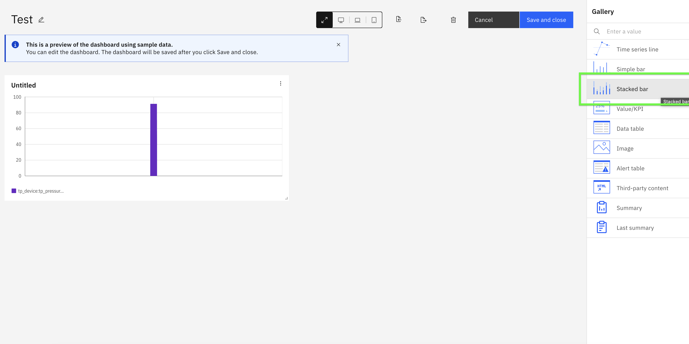  

2. Click `Add Hierarchy Data Item` button and select the child devices.
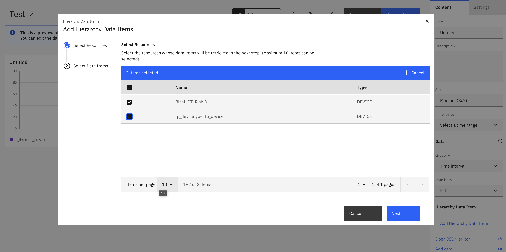  

3. Select multiple data items (metrics) to display. **Note:** Unlike Simple bar cards, Stacked bar cards allow you to select MULTIPLE metrics, which will be stacked together for same time interval.
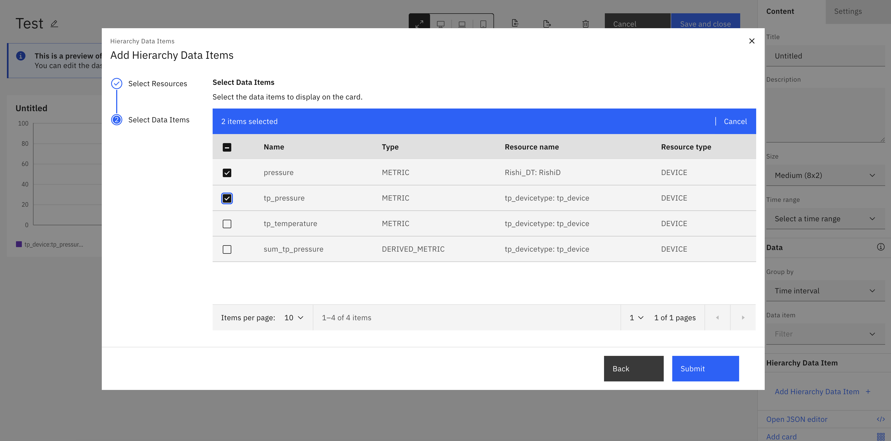  

4. The Stacked bar card displays the selected metrics stacked on top of each other, grouped by time intervals, showing how each metric contributes to the total over time.
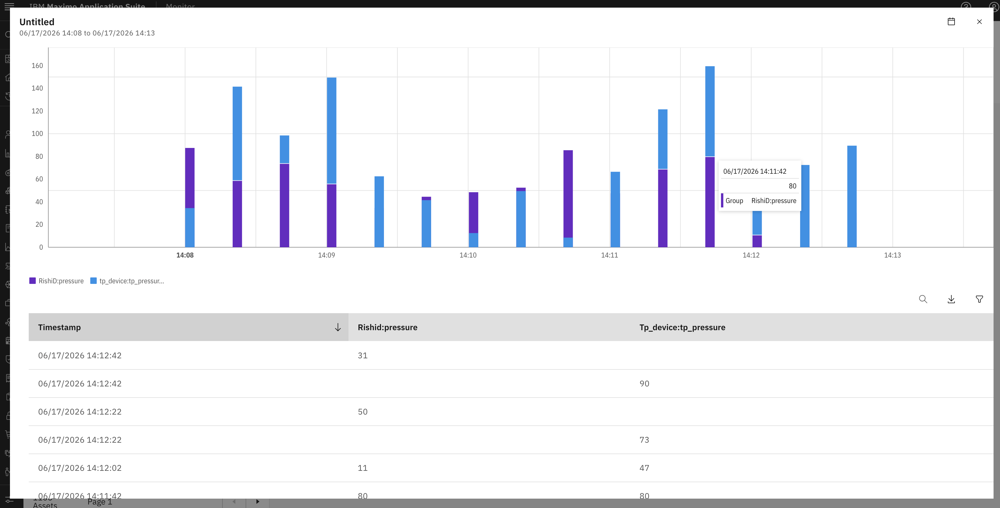  

!!! tip "Use Case Example"
    Stacked bar cards are ideal for visualizing multiple metrics stacked together over time intervals, such as:
    
    * Compare production output by stacking different product lines over time
    * Analyze total resource utilization by stacking metrics
    
    The stacked visualization helps you see both individual metric contributions and the total combined value across time intervals.

---

## Value/KPI Card

Value/KPI cards display aggregated metrics as single values, perfect for showing key performance indicators on your dashboard.

1. Click `Add card` and select `Value` card type.
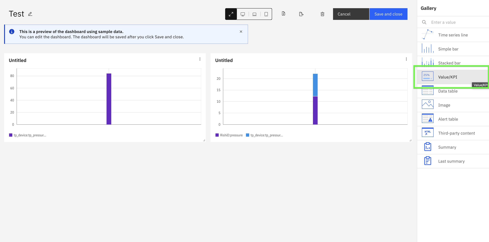  

2. Follow similar steps and Add hierarchy data items from child devices.
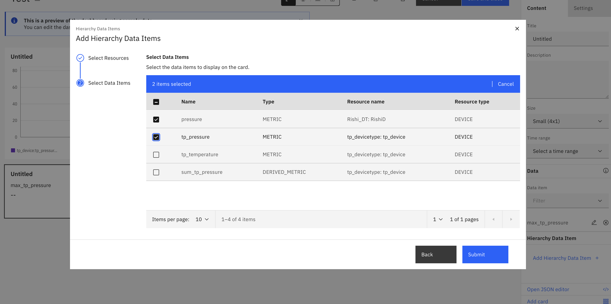  

3. Select edit on selected data items to configure aggregation method to calculate the KPI value. Bydefault last value is selected and can configure other fields similar to dataitem at hierarchy level.
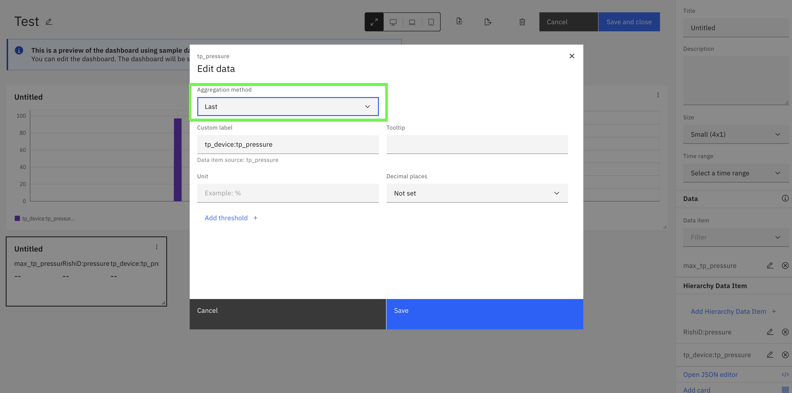  

4. The Value card displays the aggregated metric as a single prominent value.
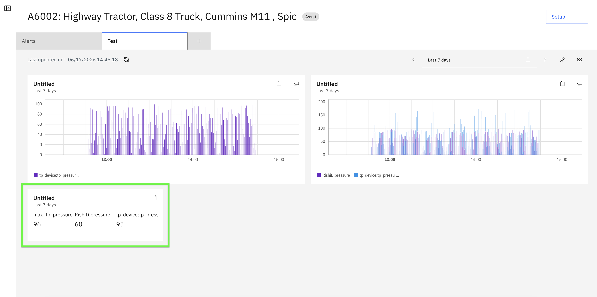  

!!! tip
    Value/KPI cards are excellent for executive dashboards where you need to display high-level metrics like total energy consumption, average temperature across all devices, or device count.

---

## Data Table Card

Data table cards provide a detailed tabular view of child device data, allowing you to see multiple metrics and devices in a structured format.

1. Click `Add card` and select `Data table` card type.
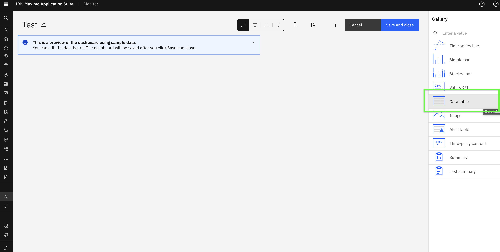  

2. Add hierarchy data items from child devices.
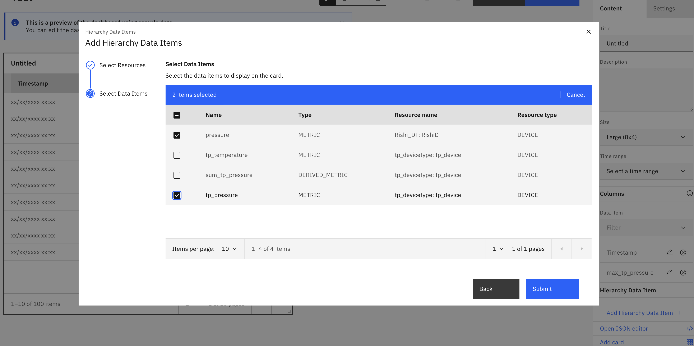  

3. The Data table card displays all selected metrics in a structured table format, making it easy to compare multiple values across devices.
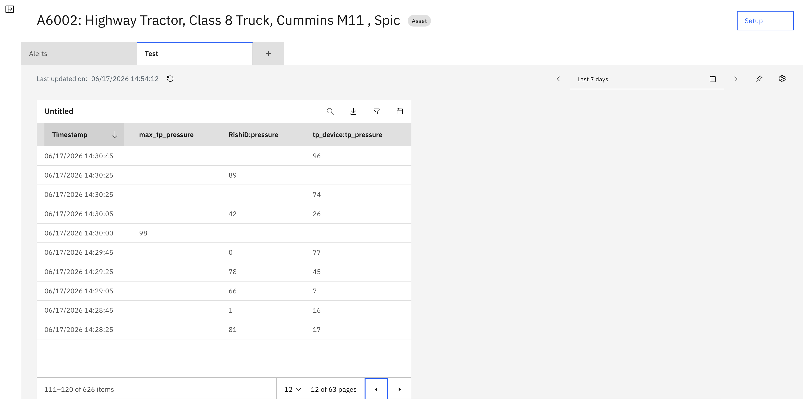  

!!! tip
    Data table cards are ideal when you need to display multiple metrics from multiple devices in a compact, scannable format. They're particularly useful for operational dashboards.

---

## Image Card

Image cards can display images with hierarchy context, useful for showing device photos, diagrams, or visual status indicators.

1. Click `Add card` and select `Image` card type.
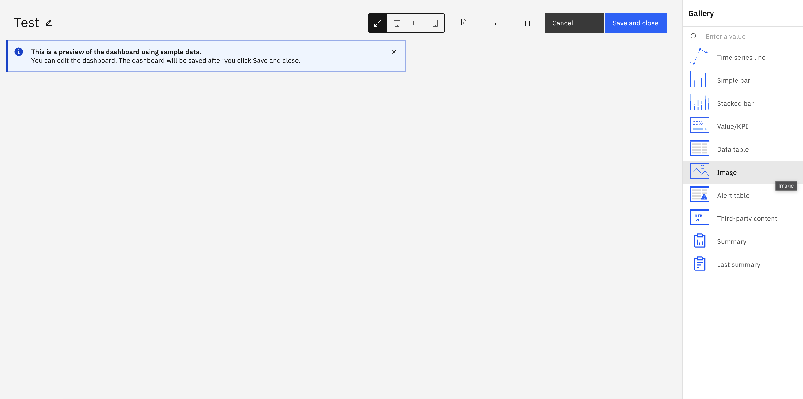  

2. Configure the image data source and add hierarchy data items as done earlier. We can also add aggreagtion similar to value card
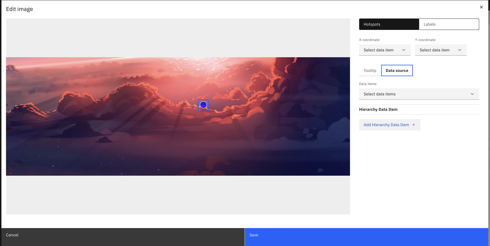  
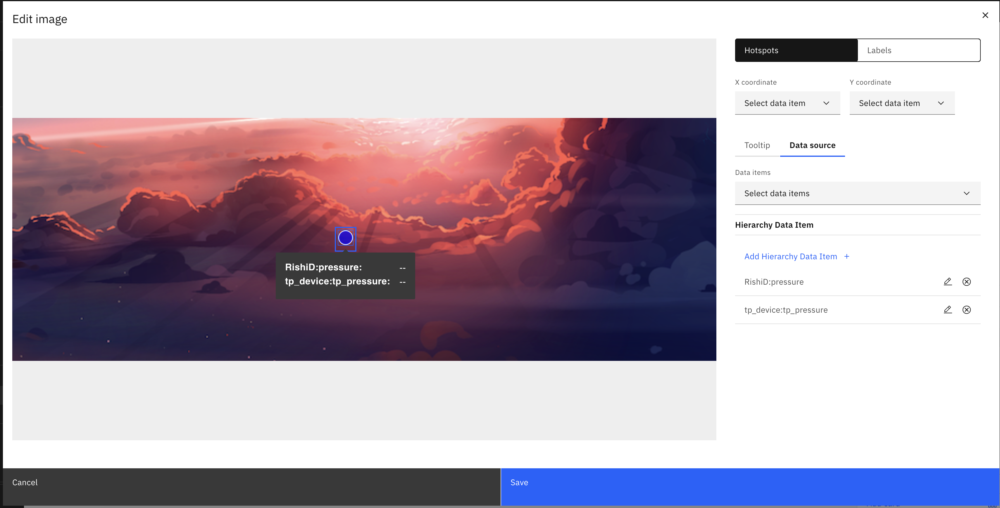  
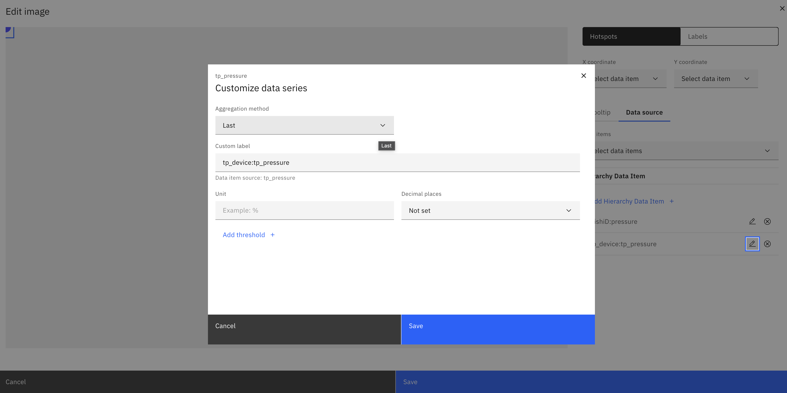  

3. The Image card displays the configured image with hierarchy data item.
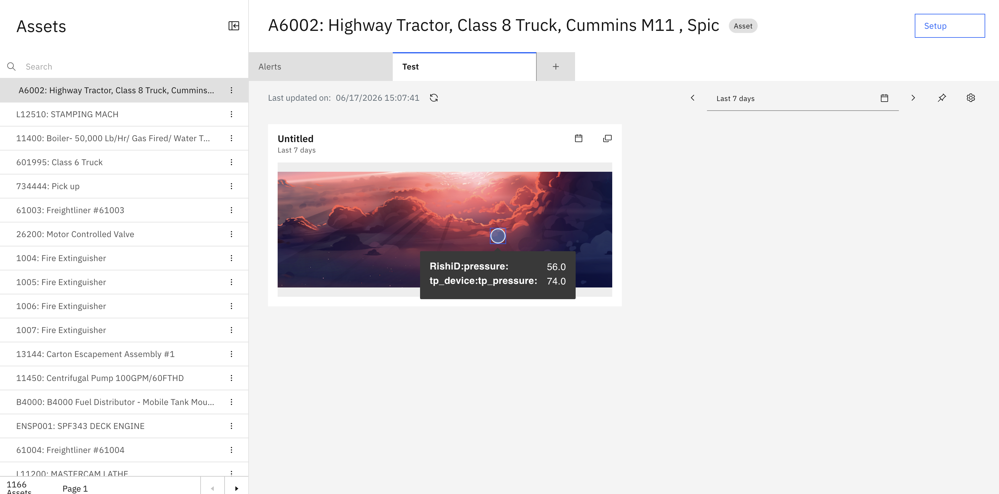  

!!! tip
    Image cards are useful for displaying device photos, facility layouts, or visual indicators that help operators quickly identify equipment or locations.

---

## Combining Multiple Card Types

The power of parent-level aggregation comes from combining different card types on a single dashboard to provide comprehensive insights.

!!! success
    You have successfully explored different card types for visualizing hierarchy data! Each card type provides unique insights, and combining them creates powerful, comprehensive dashboards for monitoring your asset hierarchy.

---

## Best Practices

When creating dashboards with hierarchy data:

1. **Use Time series cards** to identify trends and patterns over time
2. **Use Value/KPI cards** for high-level metrics that need immediate attention
3. **Use Simple bar cards** for quick comparisons of current values
4. **Use Stacked bar cards** to understand cumulative contributions
5. **Use Data table cards** when detailed multi-metric views are needed
6. **Use Image cards** to provide visual context and improve operator understanding

---

In the next exercise, you will explore dashoard creation at organization for visualizing hierarchy data.

---