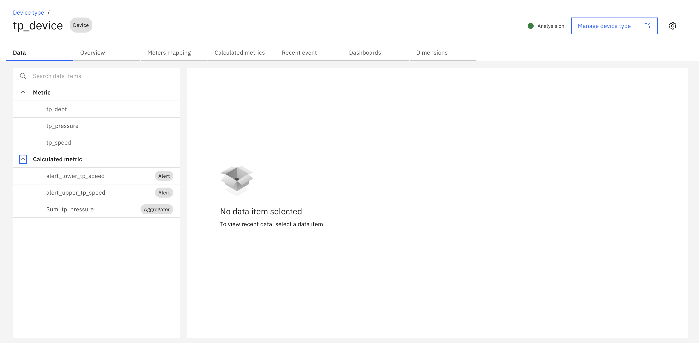

# Pre-Requisite Instructions

Here are the required pre-requisites for the Maximo Monitor Parent-Level Aggregation lab.

!!! attention
    This lab requires **Maximo Monitor version 9.1 or later**.</br>
    MAS application entitlement must be `Limited` or higher.

---

# All Exercises

All exercises require that you have:

1. A computer with a Chrome browser and internet connectivity.

2. User access to a Maximo Application Suite 9.1 environment.</br>
   Your exercise facilitator should have provided you with the information on your access.

3. An IBM ID. If you don't have an IBM ID you can get one [here](https://www.ibm.com/account/reg/signup?){target=_blank}:</br>
   - Click `Login to MY IBM` button</br>
   - Click `Create an IBM ID` link

4. Test your access to the Maximo Application Suite environment.

5. Administrator access to Maximo Monitor to create and configure dashboards.

!!! attention
    You should have the necessary permissions to:
    
    - View and edit parent resource dashboards (Asset, Location, System, Site, or Organization)
    - Add dashboard and configure data items on dashboards
    - Access child device metrics and data

---

# Required Setup

Before starting this lab, you need to have the following setup completed:

## 1. Device Type and Device with Metrics

You need a device with:

- **Raw metrics** (numeric data items from the device)
- **KPI metrics** (calculated metrics or functions applied to raw data)

!!! tip "Creating Device Types and Devices"
    If you need to create a device type and device with metrics, refer to the step-by-step instructions in the [Device and Device Type Setup Lab](https://ibm.github.io/maximo-labs/monitor_device_devicetype_setup_9.1/){target=_blank}.

### Example Device Setup

For this lab, we will use a device with the following metrics:



The device should have:

- At least one **numeric raw metric** (e.g., temperature, pressure, speed)
- At least one **KPI or calculated metric** (optional)
- Active data generation (simulator enabled or real data flowing)

## 2. Asset Hierarchy Setup

You need an Asset with child devices assigned to it:

- **Parent Asset** - The asset where you will create the parent-level aggregation dashboard
- **Child Devices** - One or more devices assigned to the parent asset

!!! tip "Creating Assets and Hierarchy"
    If you need to create assets and assign devices, refer to the [Maximo Monitor Hierarchy Lab](https://ibm.github.io/maximo-labs/monitor_hierarchy_9.1/){target=_blank}.

### Hierarchy Structure Example

```
Parent Asset
├── Device 1
├── Device 2
└── Device 3
```

## 3. Verify Device Data

Before proceeding with the lab exercises:

1. Ensure your devices are sending data (check device dashboard or data table)
2. Verify that metrics are being calculated correctly
3. Confirm that devices are properly assigned to the parent asset

!!! note
    Only **numeric metrics** can be used for parent-level aggregation. Ensure your device type has numeric data items configured.

---