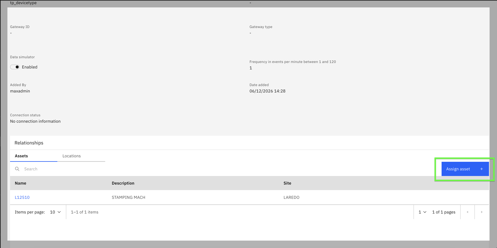
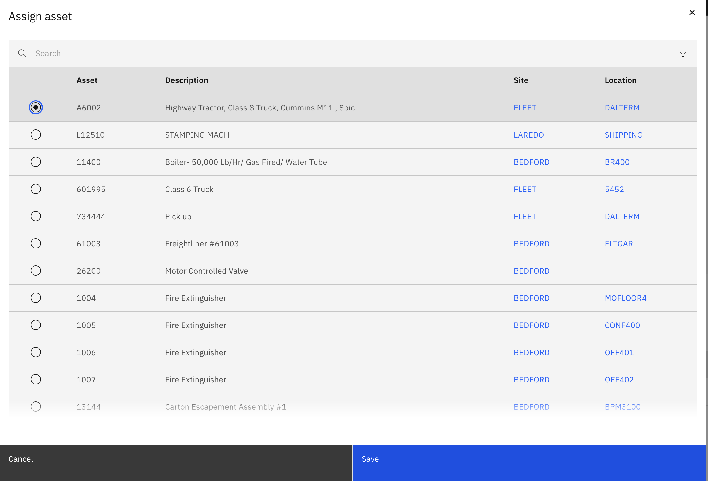
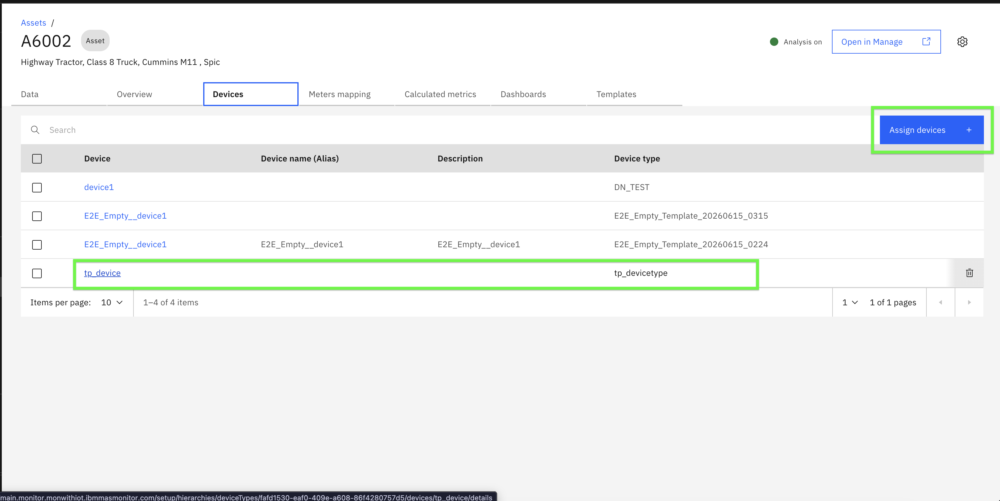

# Exercise 1: Setup Asset

## Objectives
In this exercise you will learn how to:

* Assign a device to an asset to establish parent-child relationship
* Verify the device assignment in the asset dashboard

---

*Before you begin:*  
This exercise requires that you have:

1. Completed the [pre-requisites](prereqs.md) required for this lab
2. A device with metrics created and data simulator enabled
3. An asset created in Maximo Manage (parent resource)

---

## Overview

!!! info
    Assigning devices to assets establishes the parent-child relationship necessary for parent-level aggregation. Once a device is assigned to an asset, the device's metrics become available for aggregation on the asset's dashboard.

---

## Assign Device to Asset

1. Navigate to Monitor and open the **Devices** page. Locate and click on the device you want to assign to the asset.

2. In the **Device Relationship** section, you will see options to assign the device to an Asset or Location.

3. On the device's **Overview** page, click the `Assign asset` button. 
   

4. Select the asset from the table. 
   

5. Click `Save` to confirm the assignment.

!!! note
    You can assign a device to either an Asset or a Location, but not both simultaneously. For this lab, we are focusing on Asset as the parent resource.

---

## Verify Device Assignment

After saving the device assignment:

1. Navigate to the **Asset** dashboard in Monitor. Search for and open the asset you assigned the device to.

2. On the asset's **Overview** page, you should see the assigned device listed in the **Devices** section.

!!! attention
    **Important:** After assigning a device to an asset, wait approximately **5 minutes** for the data to synchronize and reflect in the asset dashboard. This synchronization time is necessary for the system to process the relationship and make the device metrics available for parent-level aggregation.

---

You are now ready to proceed to the next exercise where you will add child resource metrics to the parent dashboard.

---