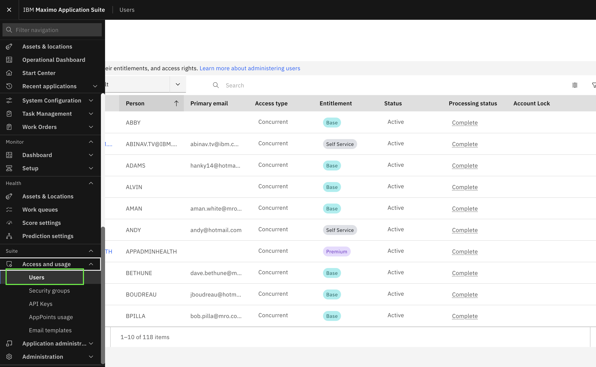
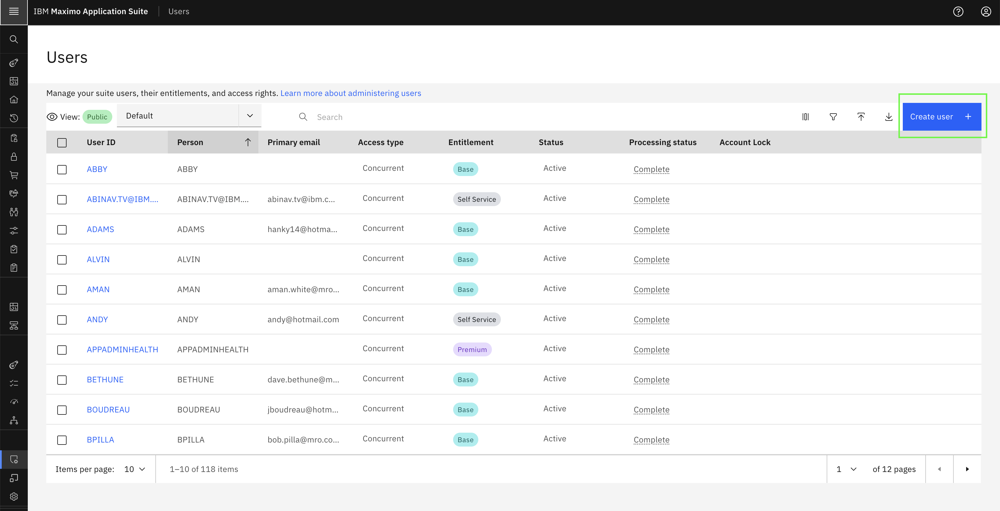
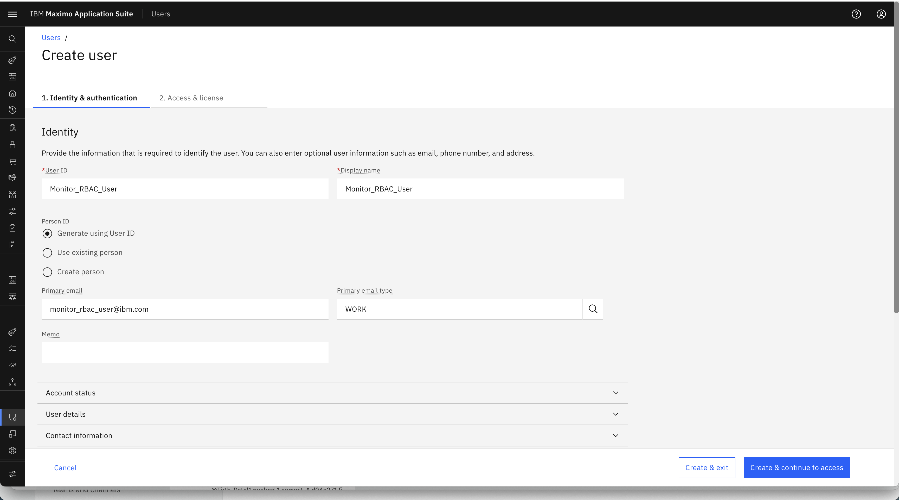
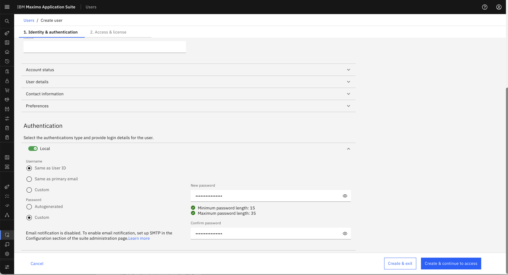
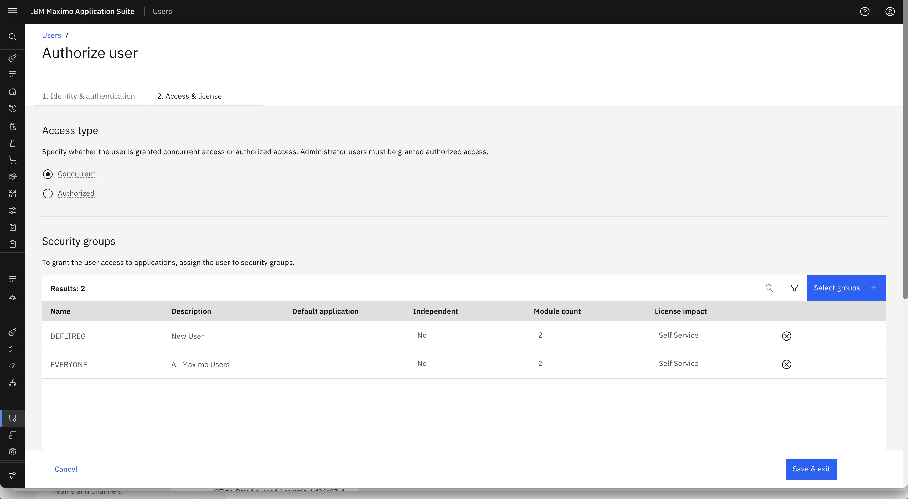
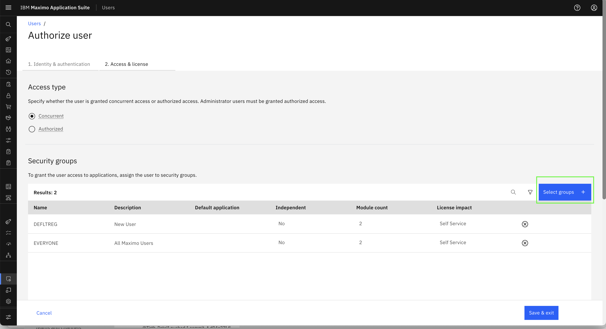
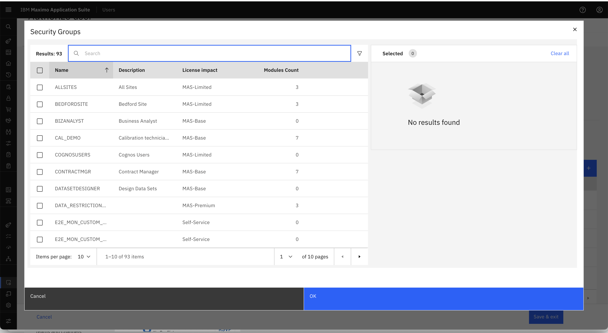
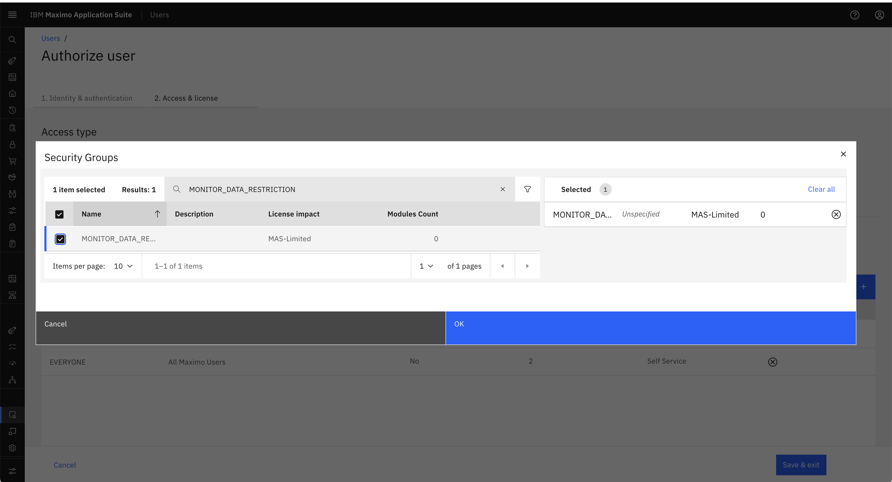
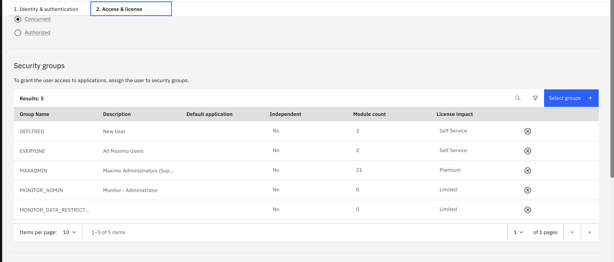
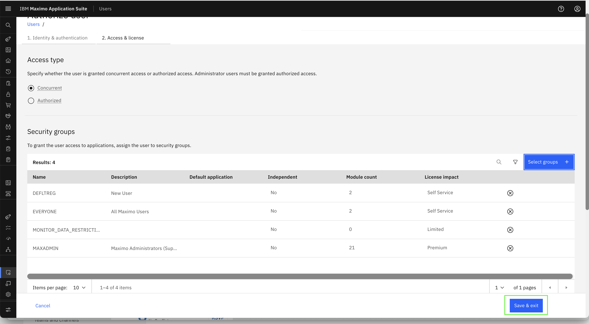

# Objectives
In this exercise, you will learn how to:

* Create users in Monitor
* Assign users to appropriate Security Groups
* Understand the effect of multiple group assignments

---

*Before you begin:*  
This exercise assumes that you have:

1. Completed the steps in [Creating Security Groups](create_security_groups.md)  
2. Admin access to Maximo Monitor

---

Users in Monitor must be assigned to one or more Security Groups to determine their access rights. The combination of these groups defines what features the user can see and interact with.

---

### Step 1: Navigate to User Management

1. Login to Monitor with an Admin user
2. Go to **Suite → Access and usage → Users**

 

---

### Step 2: Create a New User

1. Click **Create User**

 

2. Fill in the required fields: **User ID**,  **Name**, **Primary email**
    

   - **Password** Select Custom Password to create password of your choice. 
    

3. Click **Create & Continue to access** to proceed to Security Group assignment  

    

---

### Step 3: Assign Security Groups

 In the "Authorize User" section, and Click on Selects groups: 
   
    

    

   - For a **readonly user**, choose:  
     - `MONITOR_READ_ONLY`  
     - `MAXADMIN` *(to view the pages getting data from Manage)*
   - For a **normal user**, choose:  
     - `MONITOR_USERS`  
     - `MAXADMIN` *(to view the pages getting data from Manage)*
   - For a **full admin**, choose:  
     - `MONITOR_ADMIN`
     - `MAXADMIN` *(to view the pages getting data from Manage)*

- Search for MONITOR_DATA_RESTRICTION, security group created in the previous section and tick the selection  

 

- Search for MAXADMIN and MONITOR_ADMIN security Group to enable the user to get the data from Manage, Monitor and Tick the Selection  

 

Click **Save & exit**

 

!!! tip
    Users can be assigned **multiple groups**. Both role-based permissions AND data restrictions from all assigned groups are combined automatically. This means a user will have access to resources allowed by ANY of their assigned groups.

!!! note
    When you assign the `MONITOR_DATA_RESTRICTION` security group, the user will only see resources (Assets, Locations, Systems, etc.) that match the data restriction conditions configured in that group. This provides fine-grained control over which data the user can access.

---

### Example User Assignments

| Username       | Security Groups Assigned                    | Effective Permissions                         |
|----------------|---------------------------------------------|-----------------------------------------------|
| `readonly_user` | MONITOR_READ_ONLY, MAXADMIN                | View-only Dashboard, no setup access          |
| `normal_user`   | MONITOR_USERS, MAXADMIN                    | Full Dashboard CRUD, no setup access          |
| `admin_user`    | MONITOR_ADMIN, MAXADMIN                    | Full access to Dashboard and Setup            |

---

Congratulations!  
You've successfully created users and mapped them to appropriate Security Groups. Continue to the next step to [Add Data Restrictions in Security Group](data_restriction_update.md)

---
