# Add Data Restriction in Security Group

## Objectives
In this exercise, you will learn how to:

* Configure data restrictions in Security Groups
* Apply filters to limit resource visibility
* Test data restrictions with different filter conditions
* Understand how resource-based access control works with various resource types

---

*Before you begin:*  
This exercise assumes that you have:

1. Completed [Creating Security Groups](create_security_groups.md)  
2. Completed [Creating Users and Assigning Groups](create_users.md)  
3. Have existing resources (Assets, Locations, Systems, etc.) in your Monitor environment

---

## Understanding Data Restrictions

Data restrictions control which specific resources a user can see within Monitor applications. By adding conditions to Security Groups, you can filter data based on various attributes like names, UUIDs, descriptions, status, and more.

---

## Steps to Add Data Restrictions

Follow these steps to add data restrictions to the Security Group you created in the previous exercise:

### Step 1: Navigate to Security Groups

1. Login to Monitor with an Admin user
2. Go to **Suite → Access and usage → Security Groups**

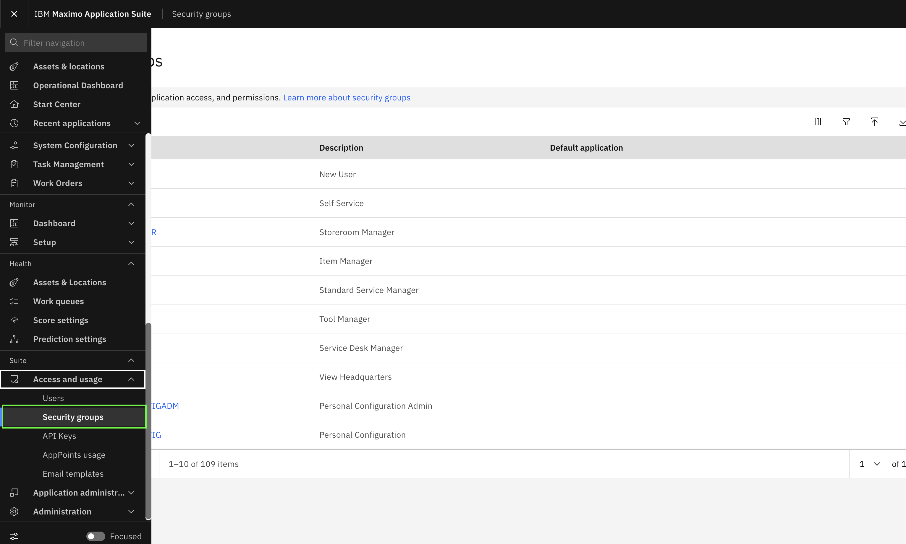</br>

---

### Step 2: Open the Security Group

1. In the Security Groups list, search for the security group you created (e.g., `MONITOR_DATA_RESTRICTION`)
2. Click on the security group name to open it

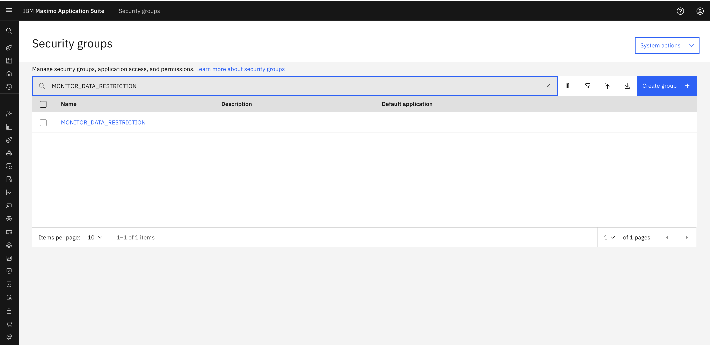</br>

---

### Step 3: Navigate to Restrictions Tab

1. Once the security group opens, click on the **Restrictions** tab
2. You will see an empty restrictions list if no restrictions have been added yet

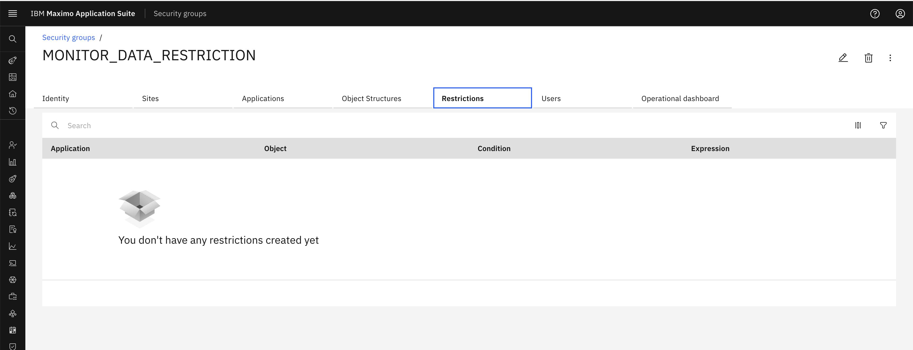</br>

---

### Step 4: Edit and Add Restriction

1. Click the **Edit** icon (pencil icon) to enable editing mode
2. Click the **Add restriction** button

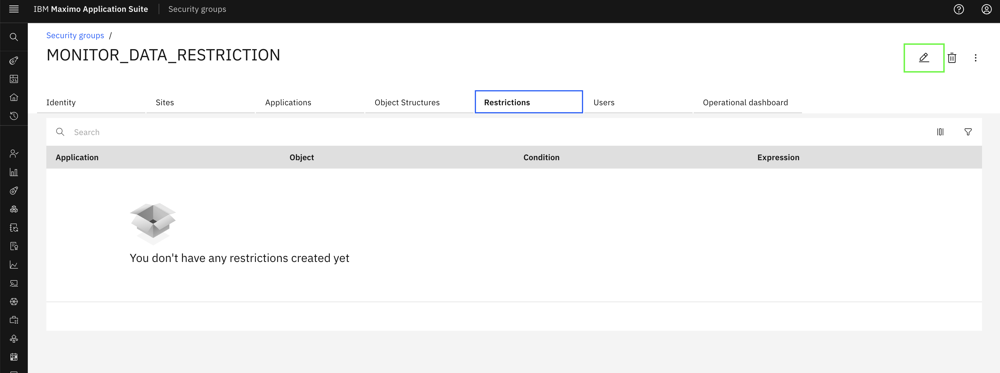</br>

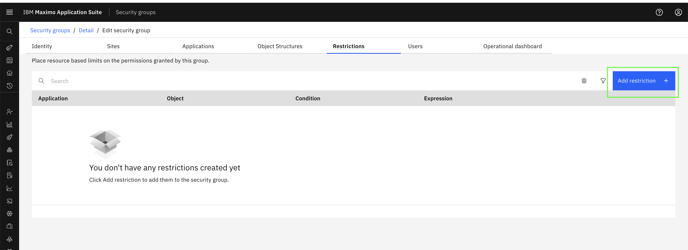</br>

---

### Step 5: Create Data Restriction

A "Create data restriction" modal will open. Follow these steps:

1. **Search for Application**: In the Application field, search for the Monitor application you want to add restrictions to
   - Example: `MONITOR_SETUP_LOCATIONS`

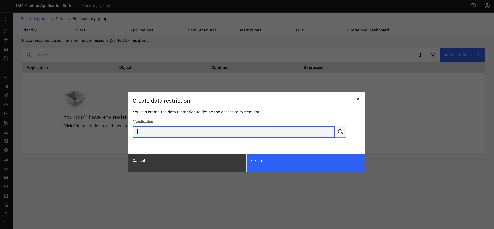</br>

2. **Select Application**: Click on the application from the dropdown list
   - Example: Select `MONITOR_SETUP_LOCATIONS` from the list

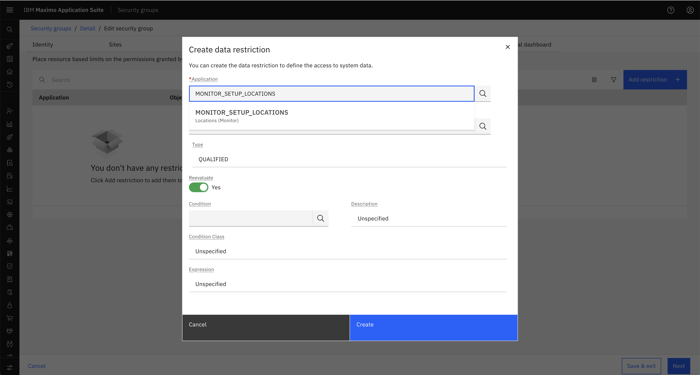</br>

3. **Add Condition**: In the "Condition expression" field, enter your filter condition
   - Example: `location="BR%"`
   - This will restrict the user to only see locations starting with "BR"

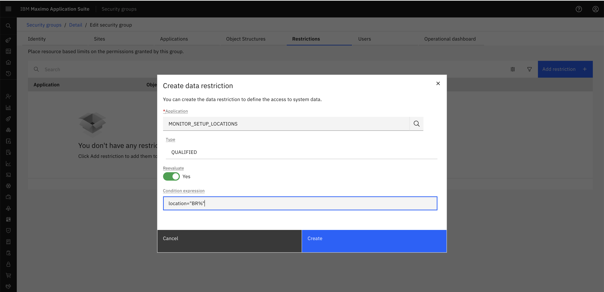</br>

4. Click **Create** to save the restriction

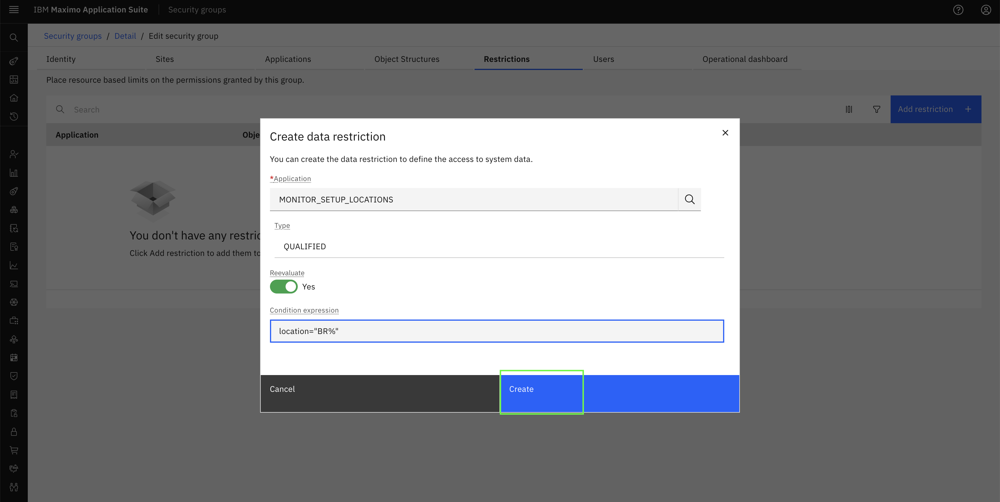</br>

---

### Step 6: View Created Restriction

The created restriction will now appear in the Restrictions tab, showing:

- **Application**: The Monitor application (e.g., MONITOR_SETUP_LOCATIONS)
- **Object**: The Maximo object being restricted (e.g., MASOBJECTNP)
- **Condition**: Empty (system managed)
- **Expression**: Your filter condition (e.g., `location="BR%"`)

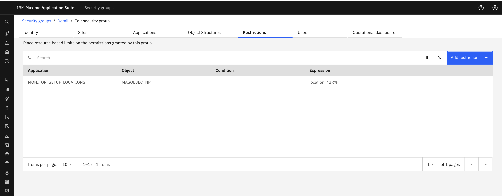</br>

---

### Step 7: Add Multiple Restrictions (Optional)

You can add multiple restrictions to the same security group:

1. Click **Add restriction** button again
2. Select a different application (e.g., `MONITOR_DB_LOCATIONS`)
3. Add the same or different condition
4. Click **Create**

Repeat this process for all applications where you want to apply data restrictions.

!!! tip
    You can add restrictions for both Dashboard (`MONITOR_DB_*`) and Setup (`MONITOR_SETUP_*`) applications to ensure consistent filtering across all Monitor interfaces.

---

### Step 8: Save Changes

1. After adding all desired restrictions, click **Save & exit** at the bottom of the page
2. The restrictions are now active and will be applied to all users assigned to this security group

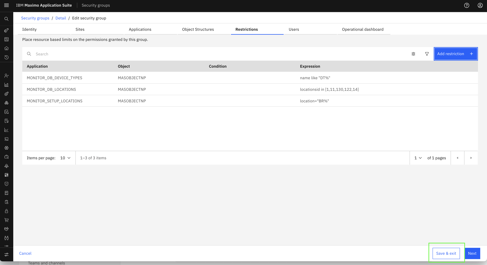</br>

!!! note
    Users assigned to this security group will only see resources matching the specified conditions.
    
    If a user is assigned to multiple security groups with different data restrictions, the restrictions are combined automatically. The user will have access to resources allowed by ANY of their assigned security groups.

---

Congratulations!
You've successfully added data restrictions to Security Groups. The examples below provide a comprehensive reference for various filter conditions you can use.

---

## RBAC Examples for Hierarchy Resources

The following table shows various scenarios for filtering hierarchy resources:

### Table 1: RBAC Examples for Hierarchy Resources

| Scenario | Applications | Condition | Expected Output |
|----------|-------------|-----------|-----------------|
| **Organization name filter** | `MONITOR_DB_ORGANIZATIONS`<br>`MONITOR_SETUP_ORGANIZATIONS` | `orgid="P%"` | Organizations starting with P are displayed on the dashboard and setup group. |
| **Site name filter** | `MONITOR_DB_SITES`<br>`MONITOR_SETUP_SITES` | `siteid="M%"` | All the sites starting with M are displayed on the dashboard and setup group. |
| **System name filter** | `MONITOR_DB_SYSTEMS`<br>`MONITOR_SETUP_SYSTEMS` | `systemid="M%"` | All the systems starting with M are displayed on the dashboard and setup group. |
| **Location name filter** | `MONITOR_DB_LOCATIONS`<br>`MONITOR_SETUP_LOCATIONS` | `location="M%"`<br>`location="P%"` | All the locations starting with M and P are displayed on the dashboard and setup group. |
| **Asset name filter** | `MONITOR_DB_ASSETS`<br>`MONITOR_SETUP_ASSETS` | `assetnum="M%"` | All the assets starting with M are displayed on the dashboard and setup group. |
| **Description filter** | `MONITOR_DB_ORGANIZATIONS`<br>`MONITOR_SETUP_ORGANIZATIONS`<br>`MONITOR_DB_SITES`<br>`MONITOR_SETUP_SITES`<br>`MONITOR_DB_SYSTEMS`<br>`MONITOR_SETUP_SYSTEMS`<br>`MONITOR_DB_ASSETS`<br>`MONITOR_SETUP_ASSETS`<br>`MONITOR_DB_LOCATIONS`<br>`MONITOR_SETUP_LOCATIONS` | `description="%esc%"` | Only the hierarchy levels with description "%esc%" are displayed on the dashboard and setup group. |
| **Org UUID filter** | `MONITOR_DB_ORGANIZATIONS`<br>`MONITOR_SETUP_ORGANIZATIONS` | `organizationid in [1,6,114,115,217,350]` | Only selected organizations are displayed in setup and dashboard. |
| **Site UUID filter** | `MONITOR_DB_SITES`<br>`MONITOR_SETUP_SITES` | `siteuid in [1,6,7,9,11,20]` | Only selected sites are displayed in the setup and dashboard. |
| **System UUID filter** | `MONITOR_DB_SYSTEMS`<br>`MONITOR_SETUP_SYSTEMS` | `locsystemid in [1,2,4,5,8,9]` | Only the selected systems are displayed in setup and dashboard. |
| **Location UUID filter** | `MONITOR_DB_LOCATIONS`<br>`MONITOR_SETUP_LOCATIONS` | `locationsid in [1,11,130,122,14]` | Only the selected locations are displayed in setup and dashboard. |
| **Asset UUID filter** | `MONITOR_DB_ASSETS`<br>`MONITOR_SETUP_ASSETS` | `assetid in [1,76,84,149,1276,104]` | Only the selected assets are displayed in setup and dashboard. |
| **Organization and site status filter** | `MONITOR_DB_ORGANIZATIONS`<br>`MONITOR_SETUP_ORGANIZATIONS`<br>`MONITOR_DB_SITES`<br>`MONITOR_SETUP_SITES` | `active=1` | Only active organizations and sites are displayed in setup and dashboard. |
| **Organization category filter** | `MONITOR_DB_ORGANIZATIONS`<br>`MONITOR_SETUP_ORGANIZATIONS` | `category="COUNT"`<br>or<br>`category="AVG"` | Only organizations with specified category type are displayed. |
| **System with org/site filter** | `MONITOR_DB_SYSTEMS`<br>`MONITOR_SETUP_SYSTEMS` | `orgid="M%"`<br>`siteid="M%"` | Only systems with orgid and siteid starting with M are displayed. |
| **Location with multiple filters** | `MONITOR_DB_LOCATIONS`<br>`MONITOR_SETUP_LOCATIONS` | `orgid="M%"`<br>`siteid="M%"`<br>`type=FLOOR`<br>`status=OPERATING`<br>`systemid="M%"` | Locations matching all specified conditions are displayed. |
| **Asset with multiple filters** | `MONITOR_DB_ASSETS`<br>`MONITOR_SETUP_ASSETS` | `type=<asset_type>`<br>`status=<status>`<br>`orgid=<org_name>`<br>`siteid=<site_name>`<br>`location=<location_name>`<br>`systemid=<system_name>` | Assets matching the specified combination of filters are displayed. |

---

## RBAC Examples for Device Types

!!! note
    Queries defined for `MONITOR_DB_DEVICES` and `MONITOR_SETUP_DEVICES` will not apply directly to devices. To apply restrictions on devices, the system uses the queries defined in `MONITOR_SETUP_DEVICE_TYPES` and `MONITOR_DB_DEVICE_TYPES`. Device access is controlled through their associated device types.


The following table shows various scenarios for filtering device types:

### Table 2: RBAC Examples for Device Types

| Application | Condition | Expected Output |
|-------------|-----------|-----------------|
| `MONITOR_DB_DEVICE_TYPES` | `name='DT1'` | Device type with name DT1 is displayed on the Dashboard page. |
| `MONITOR_SETUP_DEVICE_TYPES` | `name='DT1'` | Device type with name DT1 is displayed on the Setup page. |
| `MONITOR_DB_DEVICE_TYPES` | `uuid in ('34b3f40b-e253-428d-a500-d4dfe17c901b', '4b57c0b5-169b-4e1d-bd6c-298ea35808c0')` | Device types with specified UUIDs are displayed. |
| `MONITOR_SETUP_DEVICE_TYPES` | `uuid in ('34b3f40b-e253-428d-a500-d4dfe17c901b', '4b57c0b5-169b-4e1d-bd6c-298ea35808c0')` | Device types with specified UUIDs are displayed. |
| `MONITOR_DB_DEVICE_TYPES` | `name in ('Cisco_Webex', 'CJ_TESTKAFKA_PL', 'DT1')` | Only the specified 3 device types are displayed. |
| `MONITOR_SETUP_DEVICE_TYPES` | `name in ('Cisco_Webex', 'CJ_TESTKAFKA_PL', 'DT1')` | Only the 3 specified device types and their assigned devices are displayed. |
| `MONITOR_DB_DEVICE_TYPES` | `name like 'Empty%'` | Only device types starting with "Empty" are displayed. |
| `MONITOR_SETUP_DEVICE_TYPES` | `name like 'Empty%'` | Only device types starting with "Empty" are displayed. |
| `MONITOR_DB_DEVICE_TYPES` | `name like 't%' and description = 'hello'` | Device types starting with "t" and having description "hello" are displayed. |
| `MONITOR_SETUP_DEVICE_TYPES` | `name like 't%' and description = 'hello'` | Device types starting with "t" and having description "hello" are displayed. |
| `MONITOR_DB_DEVICE_TYPES` | `name='DT1' and description='qwerty'` | Device type DT1 with description "qwerty" is displayed. |
| `MONITOR_SETUP_DEVICE_TYPES` | `name='DT1' and description='qwerty'` | Device type DT1 with description "qwerty" is displayed. |
| `MONITOR_DB_DEVICE_TYPES` | `name NOT LIKE 'E%'` | Device types that do not start with "E" are displayed. |
| `MONITOR_SETUP_DEVICE_TYPES` | `name NOT LIKE 'E%'` | Device types that do not start with "E" are displayed. |
| `MONITOR_DB_DEVICE_TYPES` | `uuid='295e0c1f-423d-4296-90b4-94eaf3184449'` | Device type with the specified UUID is displayed. |
| `MONITOR_SETUP_DEVICE_TYPES` | `uuid='295e0c1f-423d-4296-90b4-94eaf3184449'` | Device type with the specified UUID is displayed. |
| `MONITOR_DB_DEVICE_TYPES` | `name like 'e%' or name like 'C%'` | Device types starting with "e" or "C" are displayed. |

---

## Filter Syntax Examples

Here are common filter syntax patterns you can use:

```
assetnum="USA"
orgid!="M2_ORG"
assetnum IN ["123","456","789"]
active=true
active=0
category IN ["COUNT","AVG"]
active=true AND siteid="BEDFORD"
assetnum="M2%"
```

!!! tip
    For more information on filtering hierarchy resources, see the [Maximo REST API Documentation](https://ibm-maximo-dev.github.io/maximo-restapi-documentation/query/filtering/).

---

## Parameter Reference for Hierarchy Resources

### Table 3: Parameter Terms and Examples

#### Organization Parameters

| Parameter | Description | Example |
|-----------|-------------|---------|
| `orgid` | Name of the organization | `orgid = "EAGLEN%"` |
| `organizationid` | UUID of the organization | `organizationid in [1,114,310,312,6000]` |
| `description` | Description of the organization | `description like "%sec%"`<br>`description in ["%AGLE%","%esc%"]` |
| `active` | Status of the organization | `true`, `false`, `0`, `1` |
| `category` | Type of organization | `category="COUNT"` or `category="AVG"` |

#### Site Parameters

| Parameter | Description | Example |
|-----------|-------------|---------|
| `siteid` | Name of the site | `siteid="BEDFORD"` |
| `siteuid` | Site UUID | `siteuid IN [1,6,7,9,11]` |
| `description` | Description of the site | `description like "%esc%"` |
| `active` | Status of the site | `0`, `1` |

#### System Parameters

| Parameter | Description | Example |
|-----------|-------------|---------|
| `systemid` | System name | `systemid like "M%"` |
| `locsystemid` | System UUID | `locsystemid in [1,2,4,5,8,9]` |
| `description` | Description of the system | `description like "%esc%"` |
| `orgid` | Organization name | `orgid="M%"` |
| `siteid` | Site name | `siteid="M%"` |

#### Location Parameters

| Parameter | Description | Example |
|-----------|-------------|---------|
| `location` | Name of the location | `location like "M%"` |
| `locationsid` | Location UUID | `locationsid in [1,11,107,108,109]` |
| `description` | Description of the location | `description = "%esc%"` |
| `type` | Location type name | `type="FLOOR"` or `type="OPERATING"` |
| `status` | Status of the location | `status="OPERATING"` or `status="ACTIVE"` |
| `orgid` | Organization name | `orgid="M%"` |
| `siteid` | Site name | `siteid="M%"` |
| `systemid` | System name | `systemid="M%"` |

#### Asset Parameters

| Parameter | Description | Example |
|-----------|-------------|---------|
| `assetnum` | Name of the asset | `assetnum like "M%"` |
| `assetid` | Asset UUID | `assetid in [1,104,117,123]` |
| `description` | Description of the asset | `description like '%esc%'` |
| `type` | Type of the asset | `type="PRODUCTION"` |
| `status` | Status of the asset | `status="OPERATING"` |
| `orgid` | Organization name | `orgid="M%"` |
| `siteid` | Site name | `siteid="BEDFORD"` |
| `location` | Location name | `location="FLOOR1"` |
| `systemid` | System name | `systemid="M%"` |

---
### Device Type

Device type data restrictions allow you to control access to specific device types based on various attributes.

**Supported Attributes:**

| Attribute | Description | Example |
|-----------|-------------|---------|
| `name` | Name of the device type | `name='ms_test_1' and description='test device type'` |
| `name` (pattern matching) | Name pattern using LIKE | `name like 'ms_test%'` |
| `name` (multiple values) | Multiple device type names | `name in ('type_1','type_2')` |
| `uuid` | Device type UUID | `uuid in ('uuid1','uuid2','uuid3')` |
| `alias` | Alias of the device type | `alias='device_alias_1'` |
| `alias` (pattern matching) | Alias pattern using LIKE | `alias like 'device%'` |
| `description` | Description of the device type | `description like '%test%'` |


---

Congratulations!
You have successfully learned how to configure data restrictions in Security Groups. Continue to the next section to explore practical scenarios for each resource type: [Resource Restriction Scenarios](resource_restriction_scenarios.md)

---
