# Exercise 4: Resource Restriction Scenarios

## Overview

This exercise demonstrates practical scenarios for each resource type in Maximo Monitor. Data restrictions work at each hierarchy level independently:

- **Organization restriction** → Controls access to organization details and dashboards
- **Site restriction** → Controls access to site details (sites list shown on org detail page uses site query)
- **System restriction** → Controls access to system details (systems shown on site detail page use system query)
- **Location restriction** → Controls access to location details and location list pages
- **Asset restriction** → Controls access to asset details and asset list pages
- **Device Type restriction** → Controls access to device type details and device type list pages
- **Device restriction** → Controls access to device details and device list pages (filtered by device type queries)

---

## 1. Organization Restrictions

### Scenario 1.1: Single Organization Access

**Applications**: 
- `MONITOR_DB_ORGANIZATIONS`
- `MONITOR_SETUP_ORGANIZATIONS`

**Query**: `orgid="EAGLENA"`

**Description**:
When this restriction is applied, users can only access the EAGLENA organization. In the Dashboard application (`MONITOR_DB_ORGANIZATIONS`), users will see the EAGLENA organization details page and its associated dashboards. In the Setup application (`MONITOR_SETUP_ORGANIZATIONS`), users can view EAGLENA organization details in overview page. The hierarchy page will only display EAGLENA in the organization list. All other organizations will be completely hidden from the user's view.


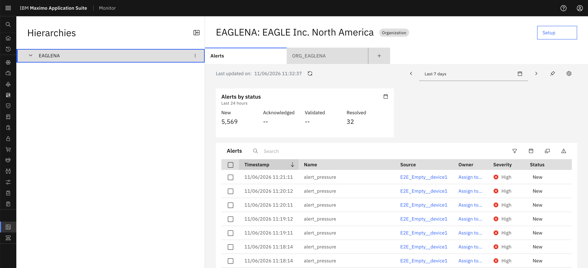

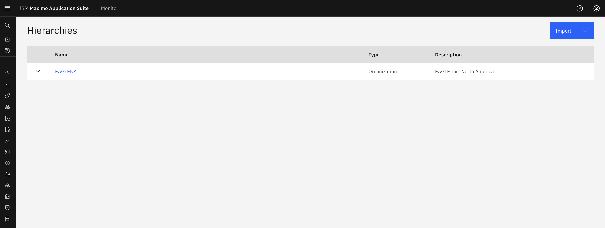

---

### Scenario 1.2: Multiple Organization Access

**Applications**: 
- `MONITOR_DB_ORGANIZATIONS`
- `MONITOR_SETUP_ORGANIZATIONS`

**Query**: `orgid in ["EAGLENA","EAGLESA"]`

**Description**:
Users with this restriction can access both EAGLENA and EAGLESA organizations. In the Dashboard application, they can view dashboards for both organizations. In the Setup application, The hierarchy page will show both EAGLENA and EAGLESA in the organization list, allowing users to navigate between them. Any other organizations in the system will remain hidden.


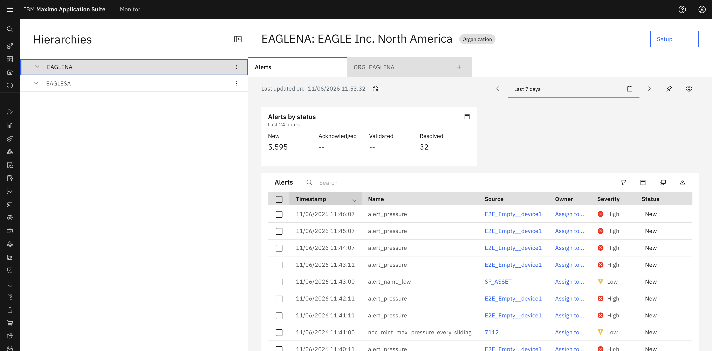

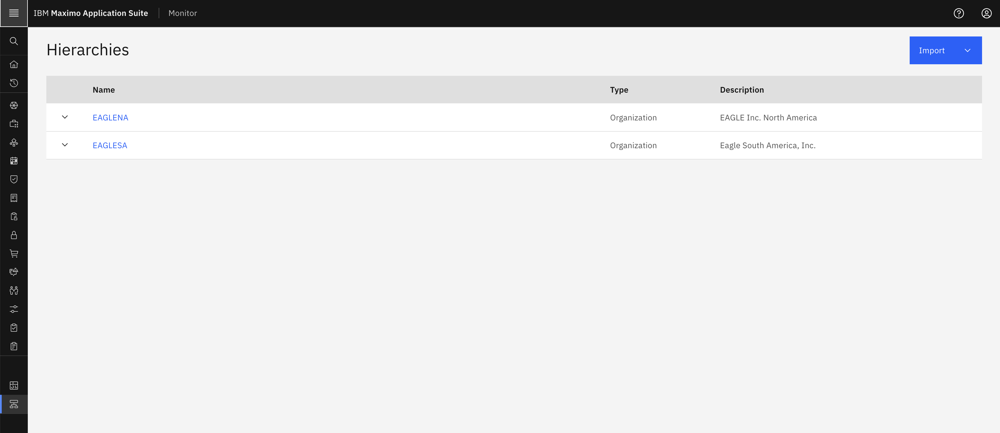


---

### Scenario 1.3: Organization Pattern Matching

**Applications**: 
- `MONITOR_DB_ORGANIZATIONS`
- `MONITOR_SETUP_ORGANIZATIONS`

**Query**: `orgid="EA%"`

**Description**:
This pattern-based restriction allows access to all organizations whose name start with "EA" (such as EAGLENA, EASTERN, EASTCOAST). Users can view and manage all matching organizations in both Dashboard and Setup applications. The hierarchy page will display all organizations matching this pattern. This is particularly useful when organizations follow a naming convention based on regions or business units.


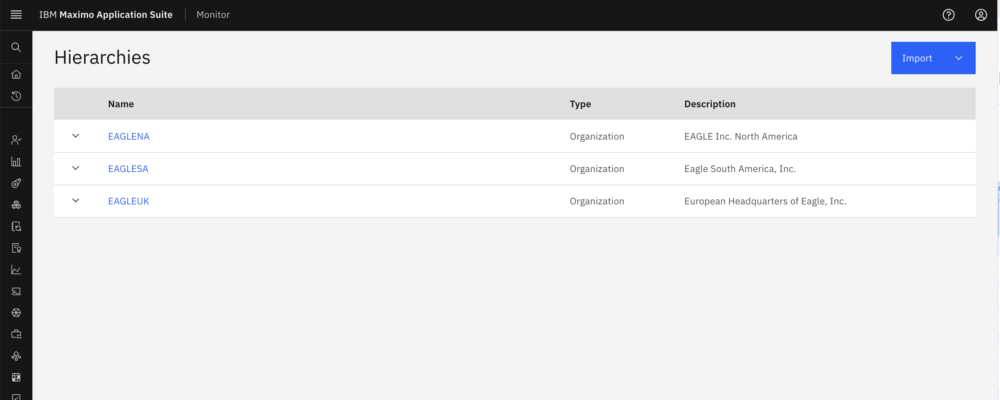

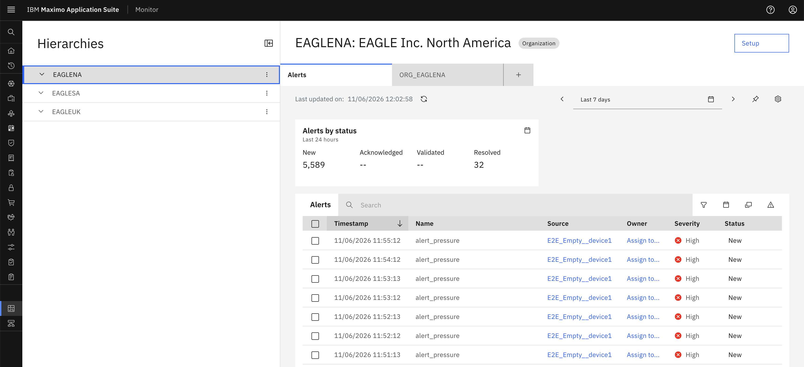


---

### Scenario 1.4: Organization by UUID

**Applications**: 
- `MONITOR_DB_ORGANIZATIONS`
- `MONITOR_SETUP_ORGANIZATIONS`

**Query**: `organizationid in [1,4,16,20,23]`

**Description**:
This restriction uses internal organization UUIDs. Users can access only the organizations with the specified UUID values. This approach is more stable than using organization names because UUIDs don't change even if the organization ID is modified. In both Dashboard and Setup applications, only organizations matching these UUIDs will be accessible. This is particularly useful for system integrations or when organization names might be renamed.


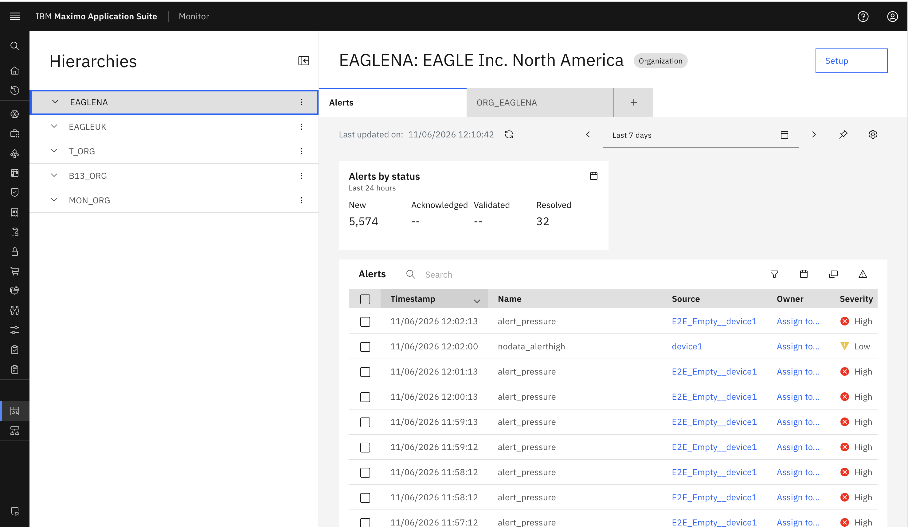

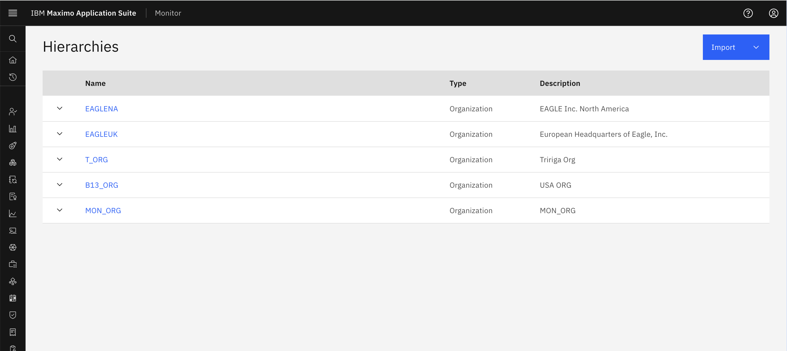


---

### Scenario 1.5: Active Organizations Only

**Applications**: 
- `MONITOR_DB_ORGANIZATIONS`
- `MONITOR_SETUP_ORGANIZATIONS`

**Query**: `active=1`

**Description**:
This restriction filters organizations based on their active status. Users will only see organizations that are currently active (active=1 or active=true). Inactive or decommissioned organizations will not appear in either the Dashboard or Setup applications. The hierarchy page will only show active organizations. This helps operations teams focus on current, operational organizations without being distracted by historical or inactive data.


---

### Scenario 1.6: Organization by Category

**Applications**: 
- `MONITOR_DB_ORGANIZATIONS`
- `MONITOR_SETUP_ORGANIZATIONS`

**Query**: `category="COUNT"`

**Description**:
Organizations can be categorized for different business purposes. This restriction limits access to organizations with a specific category value. Users will only see organizations where the category field equals "COUNT". This allows you to segment organizations by type, business unit, or any other categorical classification. Both Dashboard and Setup applications will respect this filter.


---

## 2. Site Restrictions

### Scenario 2.1: Single Site Access

**Applications**: 
- `MONITOR_DB_SITES`
- `MONITOR_SETUP_SITES`

**Query**: `siteid="BEDFORD"`

**Description**:
Users with this restriction can only access the BEDFORD site. In the Dashboard application (`MONITOR_DB_SITES`), users will see dashboards created for the BEDFORD site. In the Setup application (`MONITOR_SETUP_SITES`), users can view BEDFORD site details in overview page. The hierarchy page will only display BEDFORD in the site list. When viewing an organization's detail page, only BEDFORD will appear in the sites list (if it belongs to that organization). All other sites will be completely hidden from the user's view.


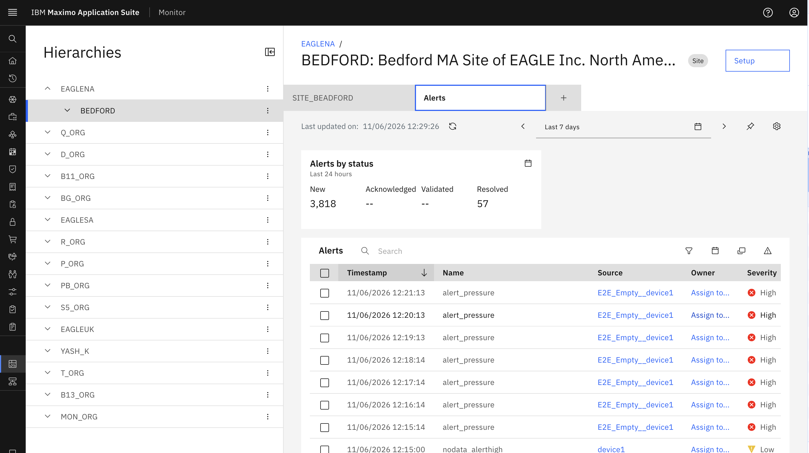

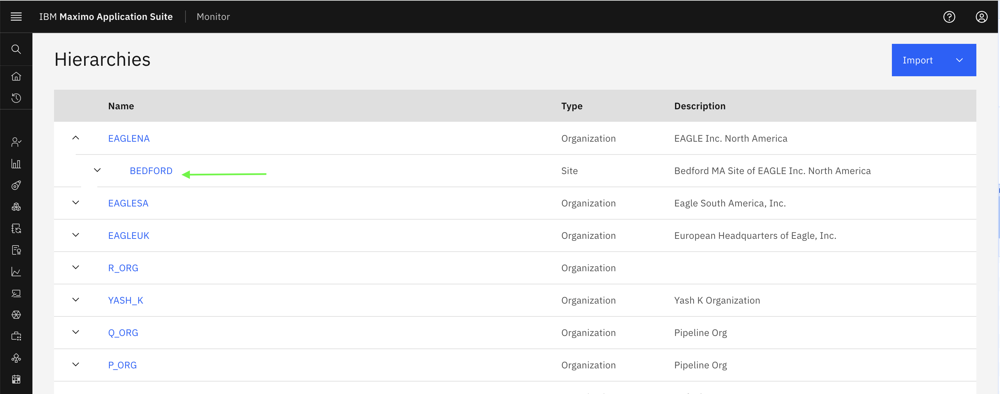


---

### Scenario 2.2: Multiple Site Access

**Applications**: 
- `MONITOR_DB_SITES`
- `MONITOR_SETUP_SITES`

**Query**: `siteid in ["BEDFORD","TEXAS"]`

**Description**:
This restriction grants access to both BEDFORD and TEXAS sites. In the Dashboard application, users can view dashboards created for both BEDFORD and TEXAS sites. In the Setup application, the hierarchy page will show both BEDFORD and TEXAS in the site list, and users can view their details in overview page. When viewing organization detail pages, the sites list will show only BEDFORD and TEXAS (if they belong to that organization). Any other sites in the system will remain hidden.


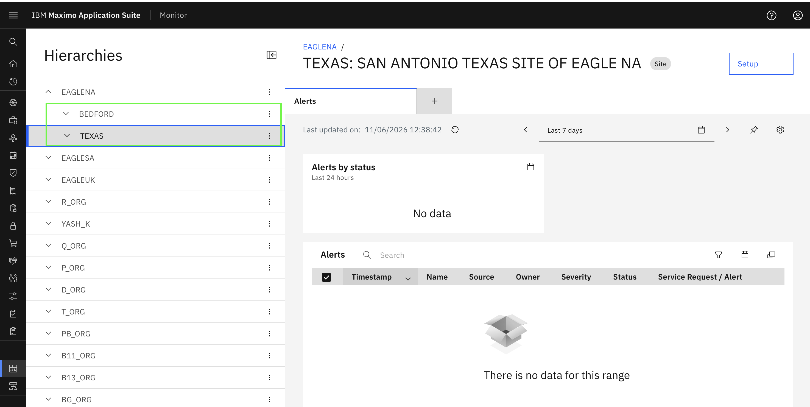

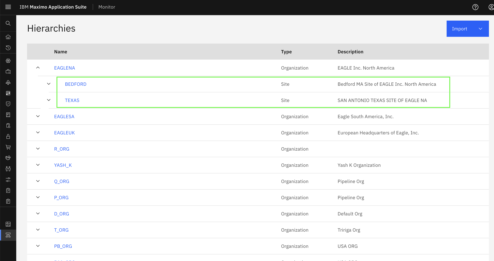


---

### Scenario 2.3: Site Pattern Matching

**Applications**: 
- `MONITOR_DB_SITES`
- `MONITOR_SETUP_SITES`

**Query**: `siteid="C%"`

**Description**:
This pattern-based restriction allows access to all sites whose names start with "C" (such as CHILEHDQ, CONCSITE). In the Dashboard application, users can view dashboards created for all matching sites. In the Setup application, the hierarchy page will display all sites matching this pattern, and users can view their details in overview page. When viewing organization detail pages, only sites matching this pattern will appear. This is useful when sites follow a geographic or functional naming convention.


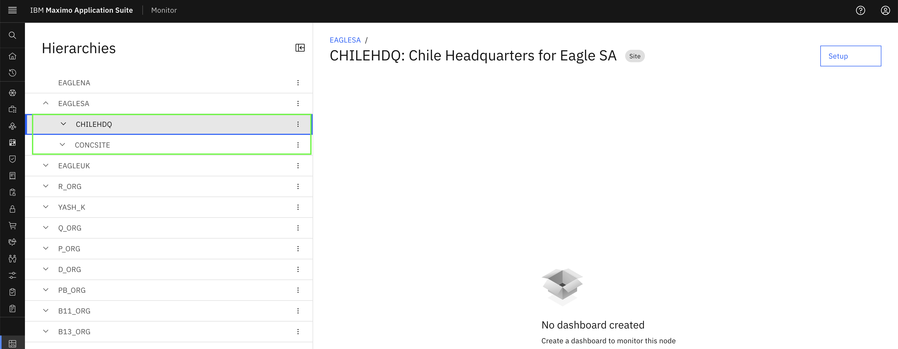

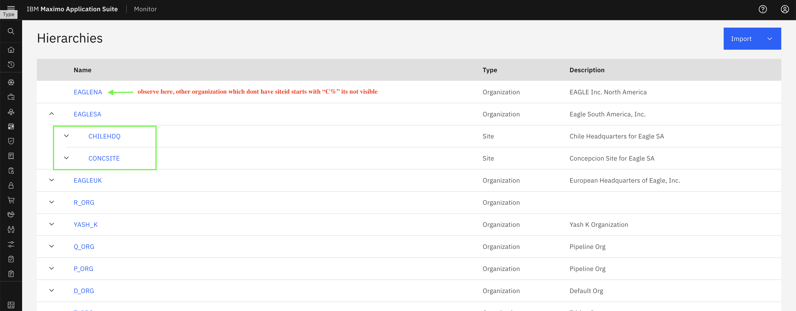


---

### Scenario 2.4: Active Sites Only

**Applications**: 
- `MONITOR_DB_SITES`
- `MONITOR_SETUP_SITES`

**Query**: `active=1`

**Description**:
This restriction filters sites based on their active status. Users will only see sites that are currently operational (active=1). In the Dashboard application, users can view dashboards created for active sites only. In the Setup application, the hierarchy page will only show active sites, and users can view their details in overview page. When viewing organization detail pages, only active sites will appear. Inactive, closed, or decommissioned sites will not appear in either application. This helps operations teams focus on current facilities without being distracted by historical or inactive sites.


---

## 3. System Restrictions

### Scenario 3.1: Single System Access

**Applications**: 
- `MONITOR_DB_SYSTEMS`
- `MONITOR_SETUP_SYSTEMS`

**Query**: `systemid='ITHQ'`

**Description**:
Users with this restriction can only access the system with ID "ITHQ". In the Dashboard application (`MONITOR_DB_SYSTEMS`), users will see dashboards created for the ITHQ system. In the Setup application (`MONITOR_SETUP_SYSTEMS`), users can view ITHQ system details in overview page. The hierarchy page will only display ITHQ in the system list. When viewing a site's detail page, only "ITHQ" will appear in the systems list (if it belongs to that site). All other systems will be completely hidden from the user's view.


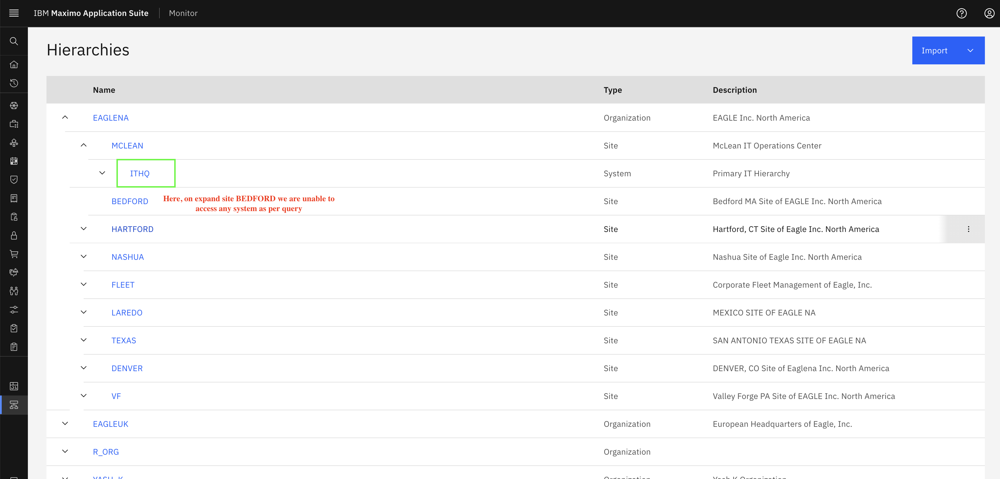

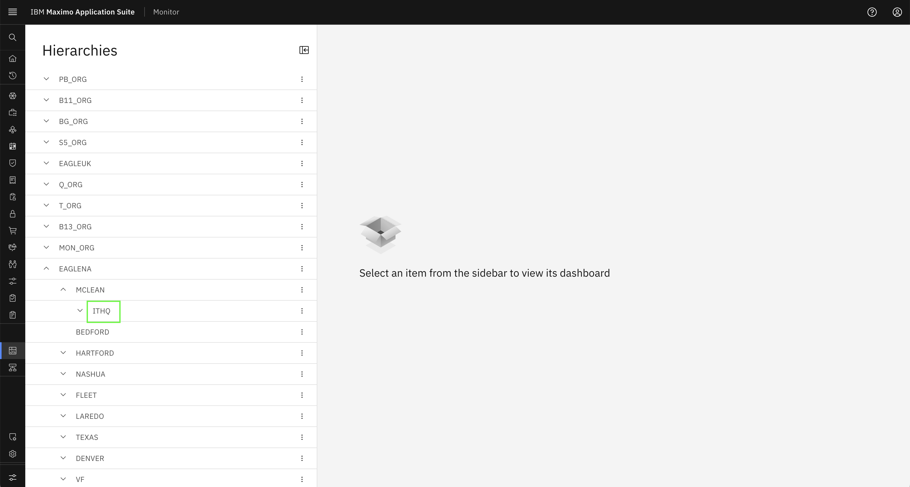


---

### Scenario 3.2: Multiple System Access

**Applications**: 
- `MONITOR_DB_SYSTEMS`
- `MONITOR_SETUP_SYSTEMS`

**Query**: `systemid in ['ITHQ','NEW']`

**Description**:
This restriction grants access to both "ITHQ" and "NEW" systems. In the Dashboard application, users can view dashboards created for both ITHQ and NEW systems. In the Setup application, the hierarchy page will show both ITHQ and NEW in the system list, and users can view their details in overview page. When viewing site detail pages, the systems list will show only these two systems (if they belong to that site). Any other systems in the system will remain hidden.


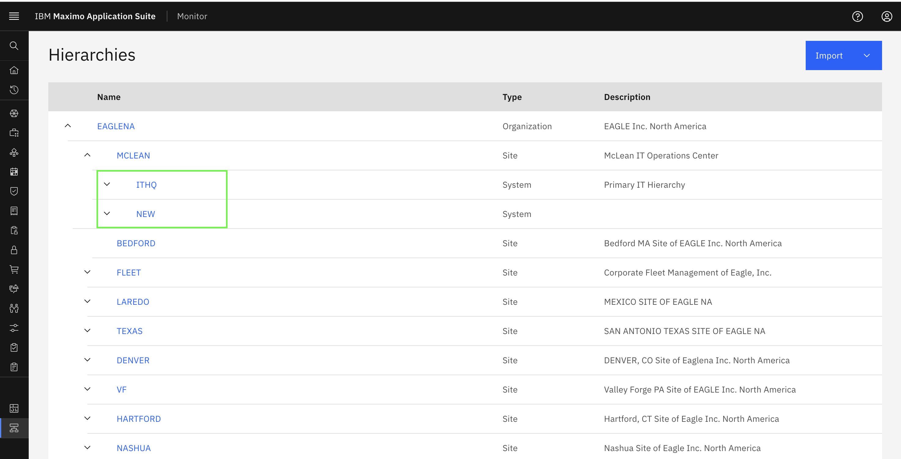


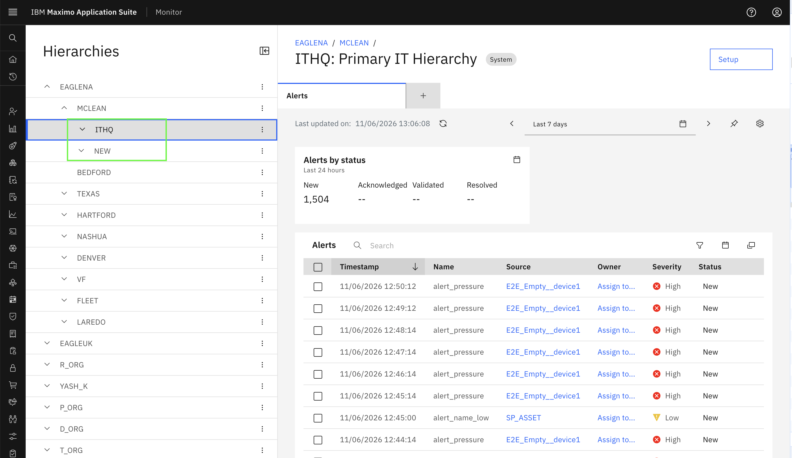


---

### Scenario 3.3: System Pattern Matching

**Applications**: 
- `MONITOR_DB_SYSTEMS`
- `MONITOR_SETUP_SYSTEMS`

**Query**: `systemid="IT%"`

**Description**:
This pattern-based restriction allows access to all systems whose names start with "IT" (such as "ITHQ", "ITOPS", "ITDEV"). In the Dashboard application, users can view dashboards created for all matching systems. In the Setup application, the hierarchy page will display all systems matching this pattern, and users can view their details in overview page. When viewing site detail pages, only systems matching this pattern will appear. This is useful for managing equipment families or product lines.


---

### Scenario 3.4: System by UUID

**Applications**: 
- `MONITOR_DB_SYSTEMS`
- `MONITOR_SETUP_SYSTEMS`

**Query**: `locsystemid in [1,2,4,5,8,9]`

**Description**:
This restriction uses the system's internal UUID (locsystemid) for precise identification. Users can access only systems with these specific UUID values. This approach is more stable than using system names because UUIDs don't change even if the system ID is modified. In the Dashboard application, users can view dashboards created for systems with these UUIDs. In the Setup application, the hierarchy page will display only systems matching these UUIDs, and users can view their details in overview page. This is particularly useful for system integrations or when system names might be renamed.


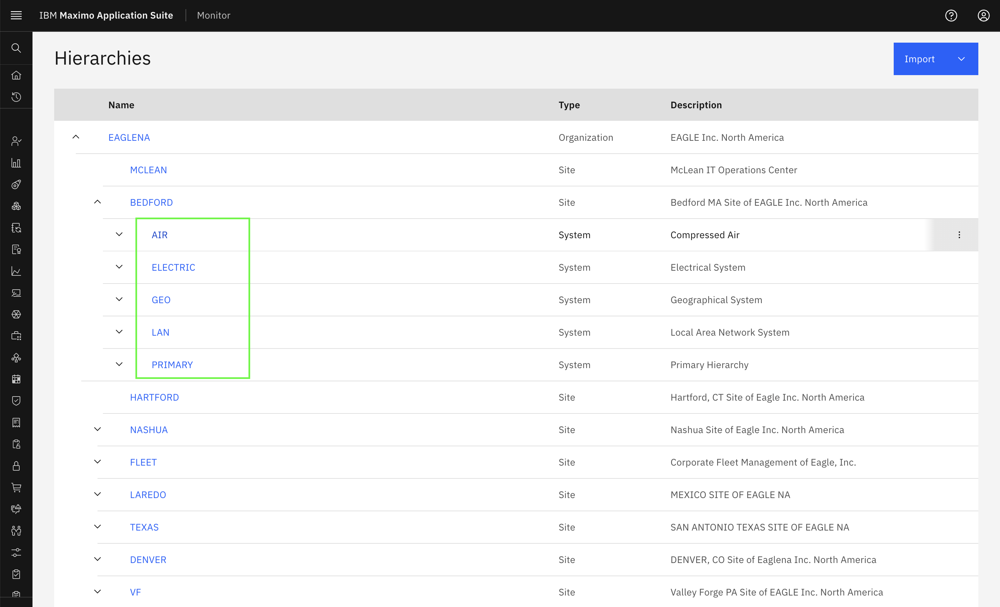


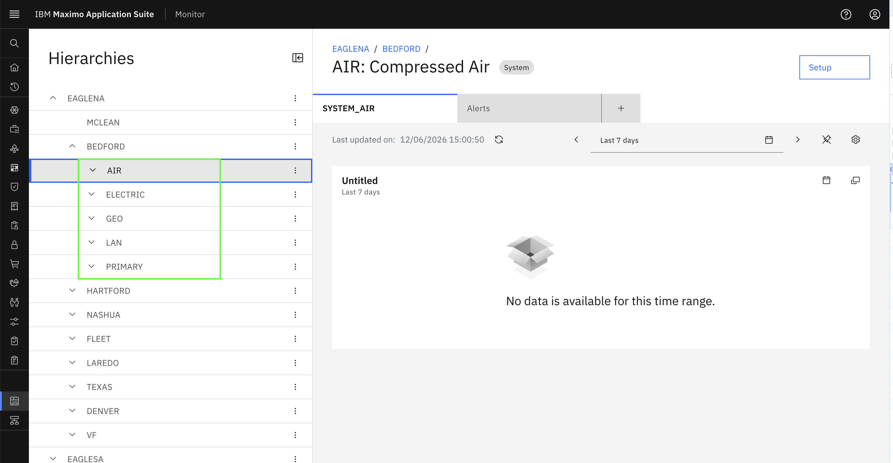


---

### Scenario 3.5: System with multiple conditions
**Applications**:
- `MONITOR_DB_SYSTEMS`
- `MONITOR_SETUP_SYSTEMS`

**Query Options**:
```
orgid="EA%" and siteid="BED%"
```

**Description**:
This scenario demonstrates how to filter systems by organization and site. The behavior depends on how you configure the restrictions:

**Option 1: Single Security Group with AND Query**
- **Query**: `orgid="EA%" and siteid="BED%"`
- **Behavior**: Shows systems that match BOTH conditions (AND logic)
- **Result**: Only systems in organizations starting with "EA" AND at sites starting with "BED"
- **Use Case**: Restrict to specific sites within specific organizations

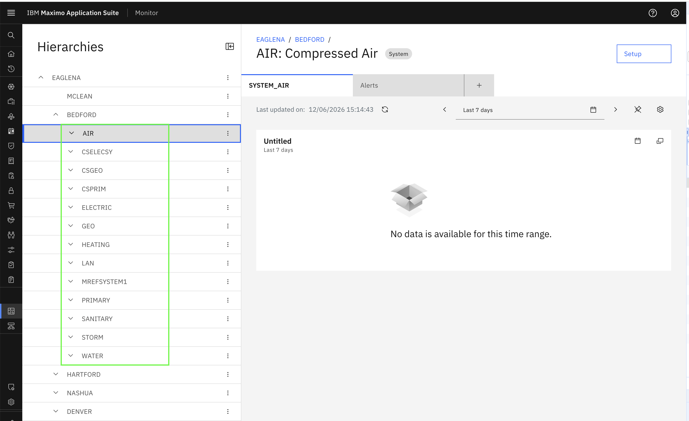

**Option 2: Multiple Security Groups with Separate Queries**
- **Security Group 1**: `orgid='EA%'`
- **Security Group 2**: `siteid='BED%'`
- **Behavior**: Shows systems that match EITHER condition (OR logic)
- **Result**: Systems in organizations starting with "EA" OR systems at sites starting with "BED"
- **Use Case**: Grant access to all systems in certain organizations OR all systems at certain sites

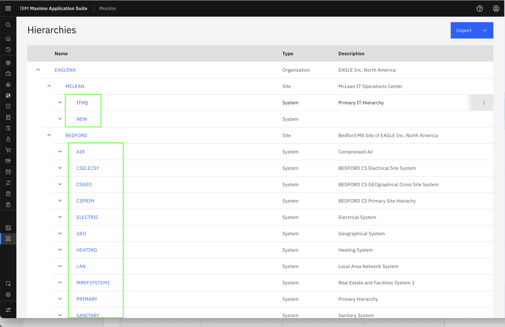

**Individual Filters**:
- **Organization Pattern**: `orgid='EA%'` - Shows systems in organizations starting with "EA"
- **Site Pattern**: `siteid='BED%'` - Shows systems at sites starting with "BED"

The hierarchy page and site detail pages will show only systems matching the specified criteria based on whether you use AND (single group) or OR (multiple groups) logic.


---

## 4. Location Restrictions

### Scenario 4.1: Single Location Access

**Applications**: 
- `MONITOR_DB_LOCATIONS`
- `MONITOR_SETUP_LOCATIONS`

**Query**: `location="BR200"`

**Description**:
Users with this restriction can only access location BR200. In the Dashboard application (`MONITOR_DB_LOCATIONS`), users will see dashboards created for the BR200 location. In the Setup application (`MONITOR_SETUP_LOCATIONS`), users can view BR200 location details in overview page. The locations list page will only display BR200. When viewing a system's detail page, only BR200 will appear in the locations list (if it belongs to that system). The hierarchy page will only show this location. All other locations will be completely hidden from the user's view.


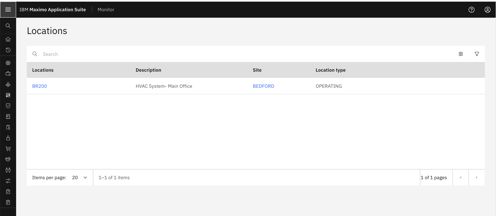

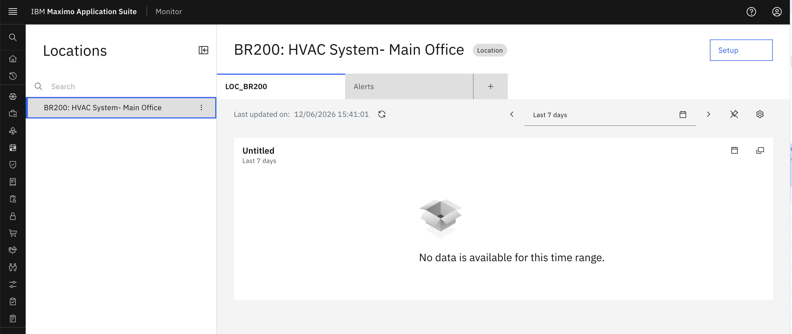


---

### Scenario 4.2: Multiple Location Access

**Applications**: 
- `MONITOR_DB_LOCATIONS`
- `MONITOR_SETUP_LOCATIONS`

**Query**: `location in ["BR200","BR210","BR430"]`

**Description**:
This restriction grants access to three specific locations: BR200, BR210, and BR430. In the Dashboard application, users can view dashboards created for all three locations. In the Setup application, the locations list page will only display these three locations, and users can view their details in overview page. When viewing system detail pages, the locations list will show only these locations (if they belong to that system). The hierarchy page will display all three locations. Any other locations in the system will remain hidden.


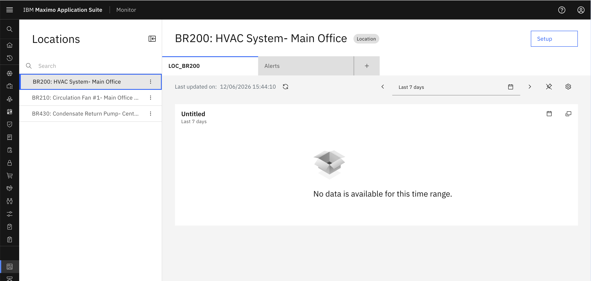

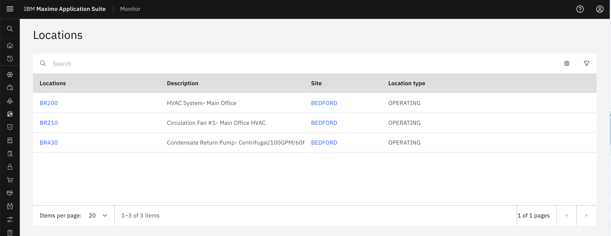


---

### Scenario 4.3: Location Pattern Matching

**Applications**: 
- `MONITOR_DB_LOCATIONS`
- `MONITOR_SETUP_LOCATIONS`

**Query**: `location="BR%"`

**Description**:
This pattern-based restriction allows access to all locations whose names start with "BR" (such as BR200, BR210, BR430, BR400). In the Dashboard application, users can view dashboards created for all matching locations. In the Setup application, the locations list page will display all matching locations, and users can view their details in overview page. When viewing system detail pages, only locations matching this pattern will appear. The hierarchy page will display all matching locations. This is useful when locations follow a building or floor naming convention.


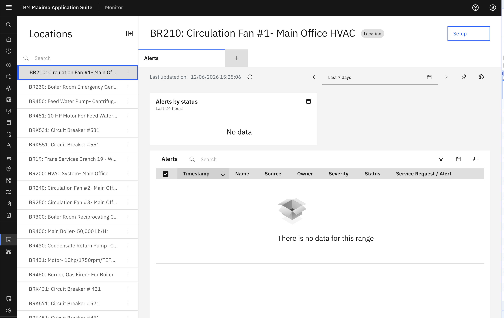

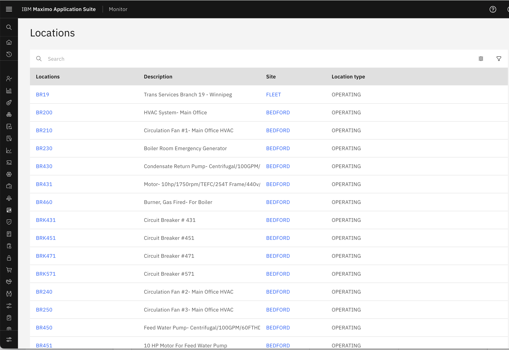


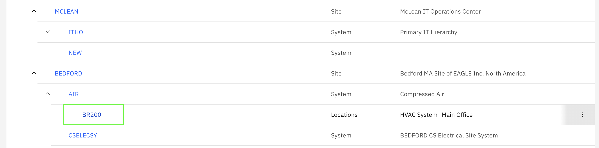


---

### Scenario 4.4: Location by ID Range

**Applications**: 
- `MONITOR_DB_LOCATIONS`
- `MONITOR_SETUP_LOCATIONS`

**Query**: `locationsid in [1,11,130]`

**Description**:
This restriction uses internal location names (UUIDs) instead of location codes. Users can access only the locations with the specified ID values: 1, 11, and 130. This approach is useful when working with system integrations or when location codes might change. In the Dashboard application, users can view dashboards created for locations with these names. In the Setup application, the locations list page will only display locations with these names, and users can view their details in overview page.


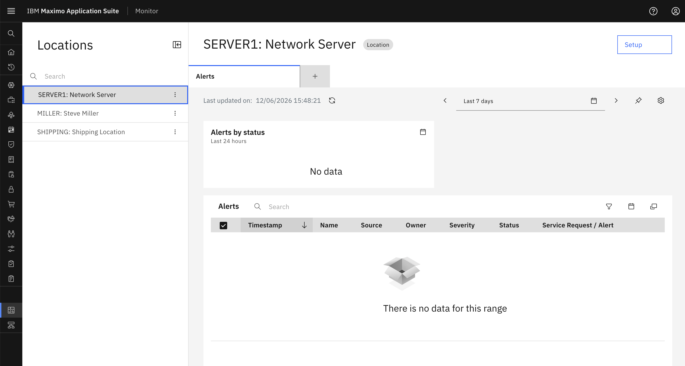

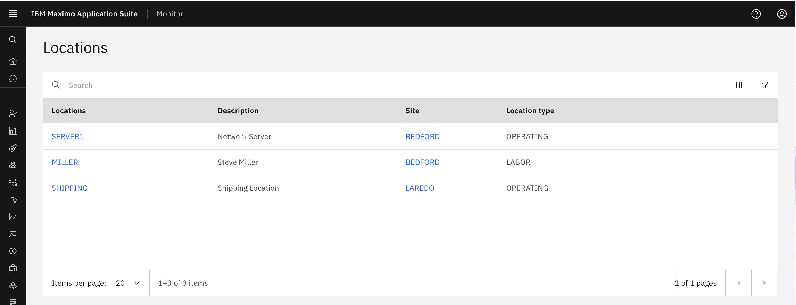


---

### Scenario 4.5: Location with Various Filter Combinations

**Applications**:
- `MONITOR_DB_LOCATIONS`
- `MONITOR_SETUP_LOCATIONS`

**Query Options** (use various combinations):
```
orgid="EA%"
siteid="HA%"
type="FLOOR" or type="OPERATING"
status='OPERATING' or status="ACTIVE"
systemid='AIR'
```

**Example Combined Query**: `siteid="HA%" and type="OPERATING" and status="ACTIVE"`

**Description**:
This scenario demonstrates how to combine multiple location attributes for precise filtering. You can filter locations by:

- **Organization Pattern**: `orgid="EA%"` - Shows locations in organizations starting with "EA"
- **Site Pattern**: `siteid="HA%"` - Shows locations at sites starting with "BED"
- **Location Type**: `type="FLOOR"` or `type="OPERATING"` - Filters by location type (FLOOR, OPERATING, etc.)
- **Location Status**: `status="OPERATING"` or `status="ACTIVE"` - Shows only locations with specific operational status
- **System Assignment**: `systemid='AIR'` - Shows locations associated with the "AIR" system

These filters can be combined using `and`/`or` operators to create complex location restrictions. For example, `siteid="HA%" and type="OPERATING" and status="ACTIVE"` would show only operating locations with active status at sites starting with "BED". In the Dashboard application, users can view dashboards created for matching locations. In the Setup application, the locations list page will only display matching locations, and users can view their details in overview page. The hierarchy page and system detail pages will show only locations matching all specified criteria.


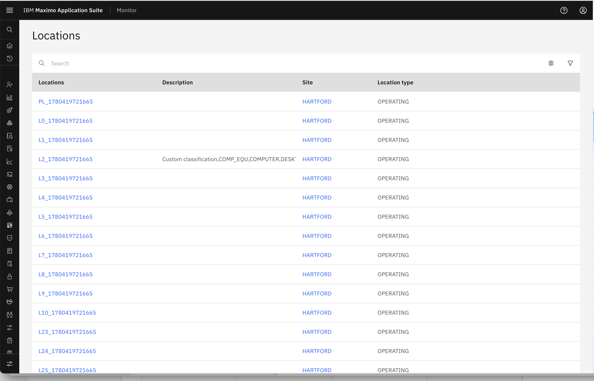

---

## 5. Asset Restrictions

### Scenario 5.1: Single Asset Access

**Applications**: 
- `MONITOR_DB_ASSETS`
- `MONITOR_SETUP_ASSETS`

**Query**: `assetnum="A6002"`

**Description**:
Users with this restriction can only access asset A6002. In the Dashboard application (`MONITOR_DB_ASSETS`), users will see dashboards created for the A6002 asset. In the Setup application (`MONITOR_SETUP_ASSETS`), users can view A6002 asset details in overview page. The assets list page will only display A6002. When viewing a location's detail page, only asset A6002 will appear in the assets list (if it's at that location). The hierarchy page will only show this asset. All other assets will be completely hidden from the user's view.


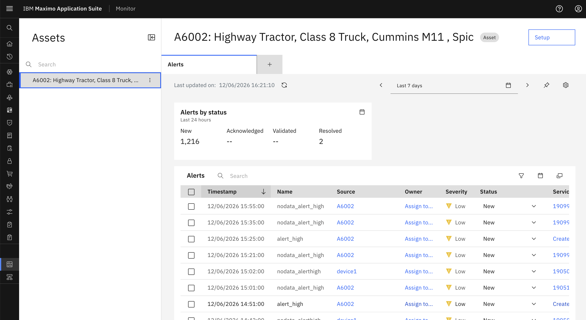

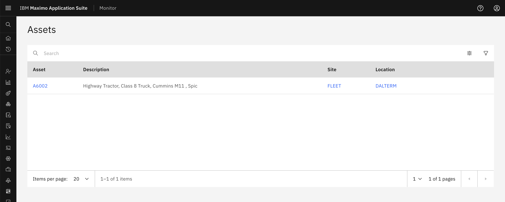


---

### Scenario 5.2: Multiple Asset Access

**Applications**: 
- `MONITOR_DB_ASSETS`
- `MONITOR_SETUP_ASSETS`

**Query**: `assetnum in ["A6002","11400","1004"]`

**Description**:
This restriction grants access to three specific assets: A6002, 11400, and 1004. In the Dashboard application, users can view dashboards created for all three assets. In the Setup application, the assets list page will only display these three assets, and users can view their details in overview page. When viewing location detail pages, the assets list will show only these assets (if they're at that location). The hierarchy page will display all three assets. Any other assets in the system will remain hidden.


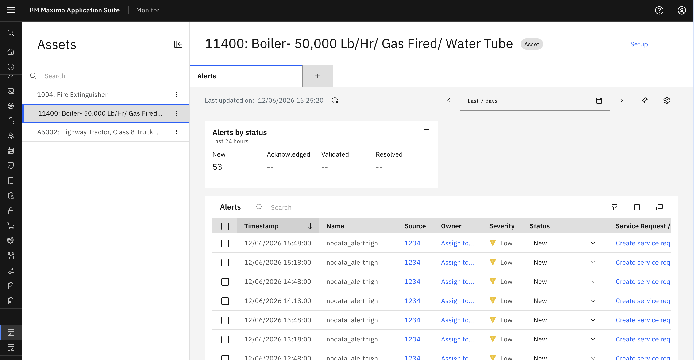

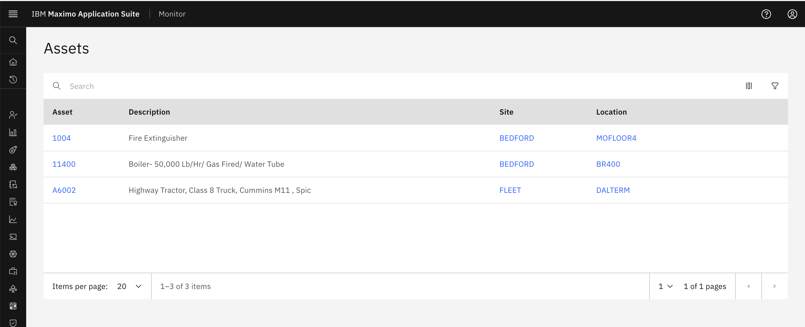


---

### Scenario 5.3: Asset Pattern Matching

**Applications**: 
- `MONITOR_DB_ASSETS`
- `MONITOR_SETUP_ASSETS`

**Query**: `assetnum="11%"`

**Description**:
This pattern-based restriction allows access to all assets whose numbers start with "11" (such as 11200, 11230, 11240). In the Dashboard application, users can view dashboards created for all matching assets. In the Setup application, the assets list page will display all matching assets, and users can view their details in overview page. When viewing location detail pages, only assets matching this pattern will appear. The hierarchy page will display all matching assets. This is useful when asset numbers follow a departmental or categorical numbering convention.


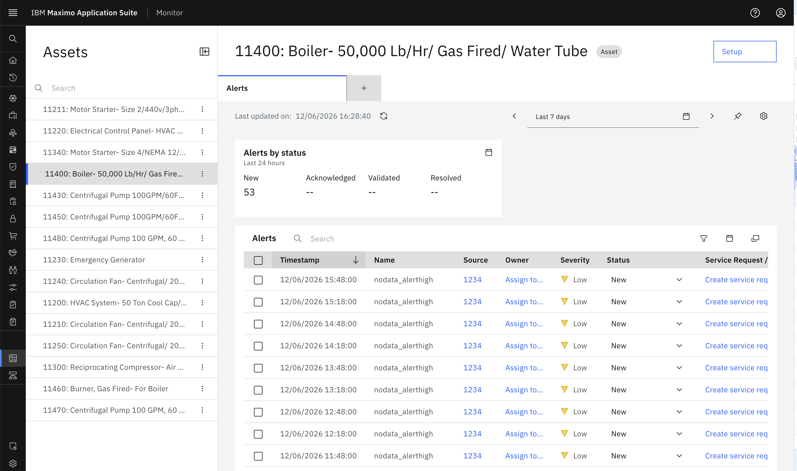

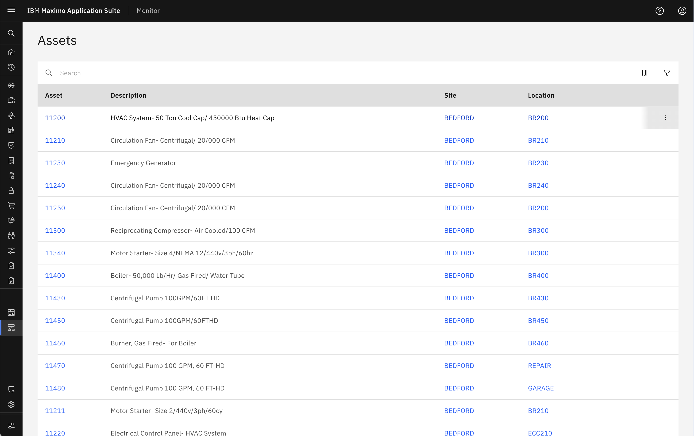


---

### Scenario 5.4: Asset by Location

**Applications**: 
- `MONITOR_DB_ASSETS`
- `MONITOR_SETUP_ASSETS`

**Query**: `location="REPAIR"`

**Description**:
This restriction filters assets based on their location. Users will only see assets that are physically located at REPAIR. In the Dashboard application, users can view dashboards created for all assets at REPAIR. In the Setup application, the assets list page will display all assets at location REPAIR, and users can view their details in overview page. When viewing the REPAIR location detail page, all its assets will be visible. When viewing other location detail pages, no assets will appear. This is useful for area-based access control where users should only see equipment in their designated area.


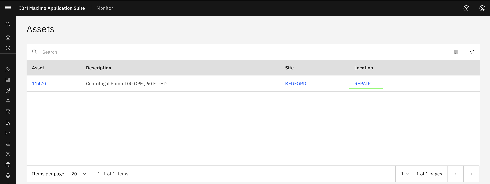

---

### Scenario 5.5: Asset by Site

**Applications**: 
- `MONITOR_DB_ASSETS`
- `MONITOR_SETUP_ASSETS`

**Query**: `siteid="BEDFORD"`

**Description**:
This restriction filters assets based on their site. Users will only see assets that belong to the BEDFORD site. In the Dashboard application, users can view dashboards created for all assets at BEDFORD site. In the Setup application, the assets list page will display all assets at BEDFORD site (across all locations), and users can view their details in overview page. When viewing location detail pages within BEDFORD site, assets will be visible. When viewing locations at other sites, no assets will appear. This is useful for site-level access control where users should see all equipment at their facility.


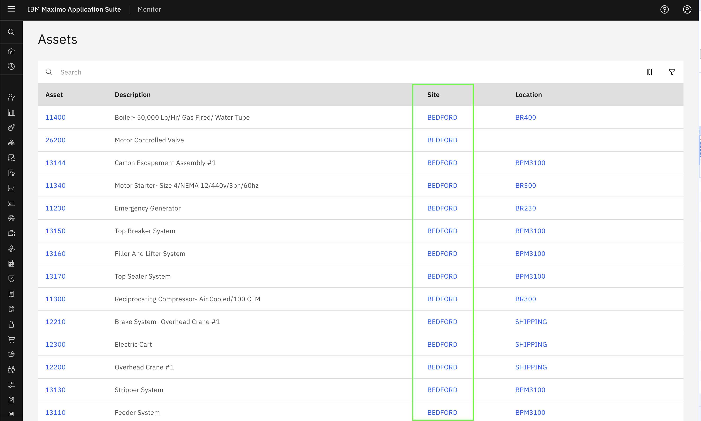

---

### Scenario 5.6: Asset by UUID

**Applications**: 
- `MONITOR_DB_ASSETS`
- `MONITOR_SETUP_ASSETS`

**Query**: `assetid in [1,104,117,123]`

**Description**:
This restriction uses internal asset UUIDs (assetid) instead of asset numbers. Users can access only the assets with the specified UUID values: 1, 104, 117, and 123. This approach is more stable than using asset numbers because UUIDs don't change even if the asset number is modified. In the Dashboard application, users can view dashboards created for assets with these UUIDs. In the Setup application, the assets list page will only display assets with these UUIDs, and users can view their details in overview page. This is particularly useful for system integrations or when asset numbers might be renumbered.


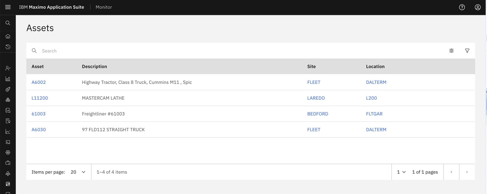

---

### Scenario 5.7: Asset with Multiple Filters

**Applications**: 
- `MONITOR_DB_ASSETS`
- `MONITOR_SETUP_ASSETS`

**Query**: `siteid="BEDFORD" and location="BR%" and assetnum="11%"`

**Description**:
This complex restriction combines multiple criteria: assets must be at BEDFORD site, in locations starting with "BR", and have asset numbers starting with "11". Users will only see assets that meet all three conditions. For example, asset 11200 at location BR200 in BEDFORD site will be visible. Asset 11200 at a different site or location will be hidden. This allows for very precise filtering of assets based on multiple business rules. In the Dashboard application, users can view dashboards created for matching assets. In the Setup application, the assets list page will only display matching assets, and users can view their details in overview page.


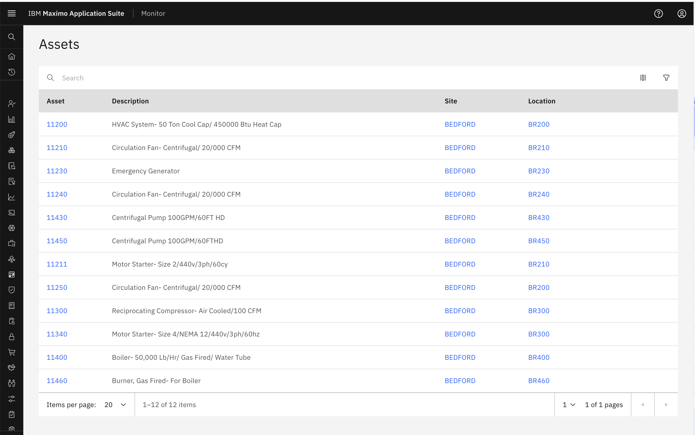

---

## 6. Device Type Restrictions

### Scenario 6.1: Single Device Type Access

**Applications**: 
- `MONITOR_DB_DEVICE_TYPES`
- `MONITOR_SETUP_DEVICE_TYPES`

**Query**: `name="ROBOT"`

**Description**:
Users with this restriction can only access the "ROBOT" device type. In the Dashboard application (`MONITOR_DB_DEVICE_TYPES`), users will see dashboards created for the ROBOT device type and all devices of this type. In the Setup application (`MONITOR_SETUP_DEVICE_TYPES`), users can view ROBOT device type details in overview page. The Device Types list page will only display the ROBOT device type. Users cannot see or access any other device types in the system.


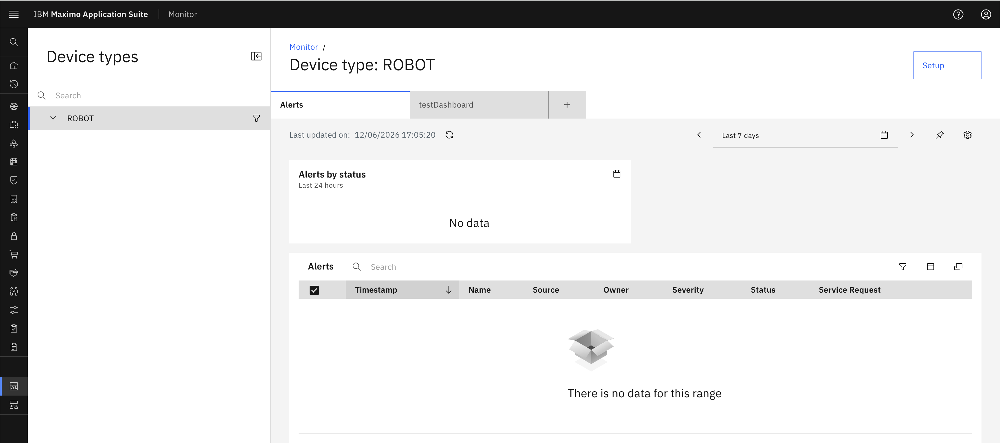

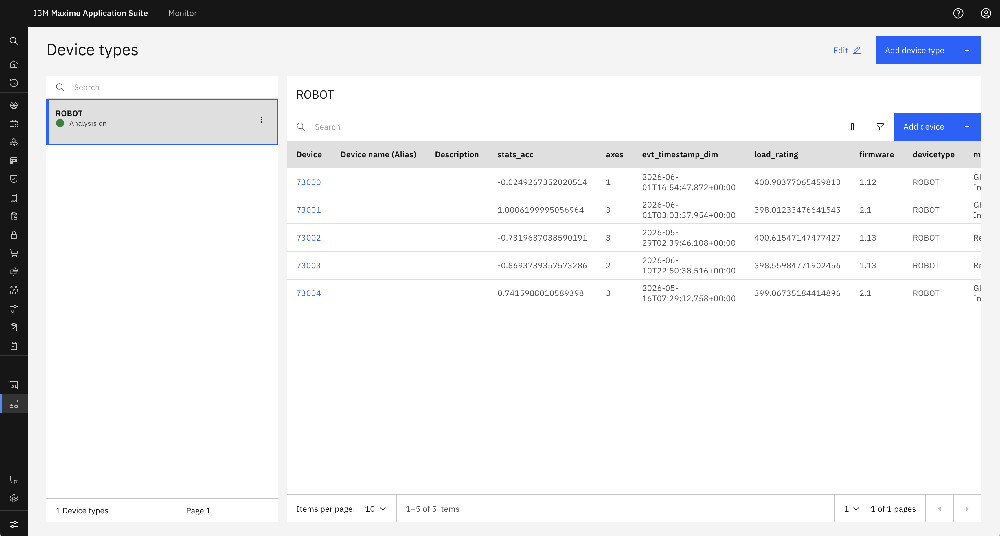


---

### Scenario 6.2: Multiple Device Type Access

**Applications**: 
- `MONITOR_DB_DEVICE_TYPES`
- `MONITOR_SETUP_DEVICE_TYPES`

**Query**: `name in ["ROBOT","Pump"]`

**Description**:
This restriction grants access to both "ROBOT" and "Pump" device types. In the Dashboard application, users can view dashboards created for both ROBOT and Pump device types and all their associated devices. In the Setup application, the Device Types list page will only display ROBOT and Pump device types, and users can view their details in overview page. All other device types in the system will be hidden.


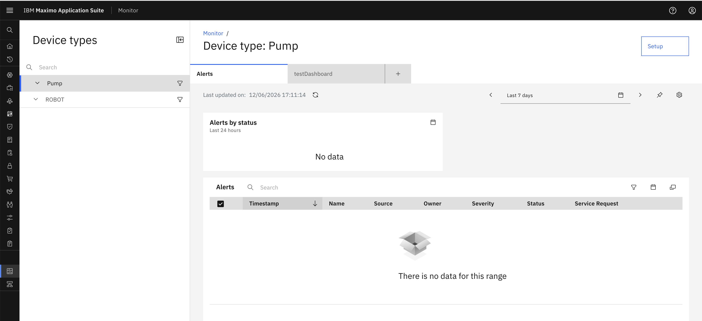

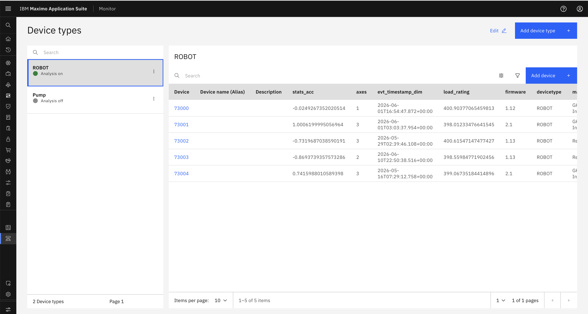


---

### Scenario 6.3: Device Type Pattern Matching

**Applications**: 
- `MONITOR_DB_DEVICE_TYPES`
- `MONITOR_SETUP_DEVICE_TYPES`

**Query**: `name like "PU%"`

**Description**:
This pattern-based restriction allows access to all device types whose names start with "PU" (such as "Pump_AFM_VV", "Pump_AFM_DD", "Pump_AFM_IOT_R1"). In the Dashboard application, users can view dashboards created for all matching device types and their devices. In the Setup application, the Device Types list page will display all device types matching this pattern, and users can view their details in overview page. This is useful for managing device families or product lines with similar naming conventions.


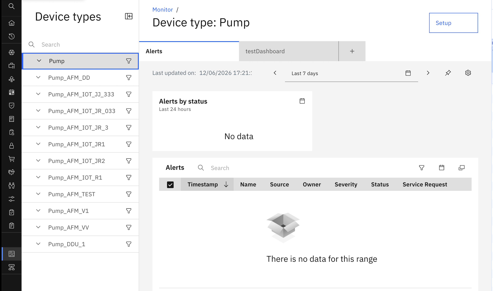

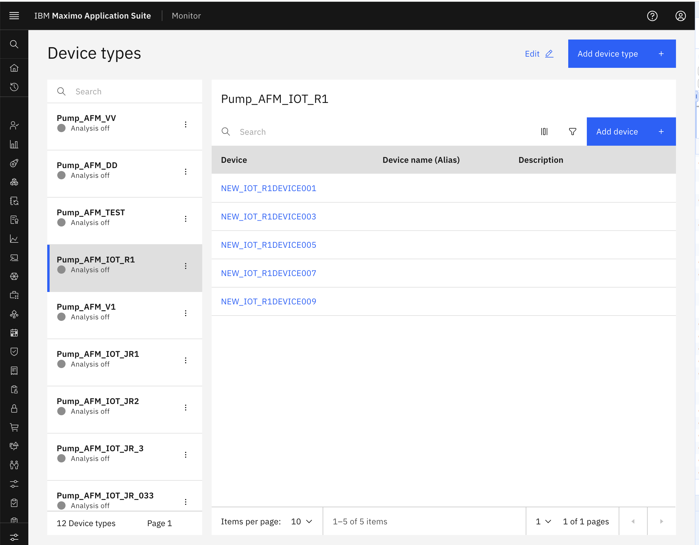


---

### Scenario 6.4: Device Type by UUID

**Applications**: 
- `MONITOR_DB_DEVICE_TYPES`
- `MONITOR_SETUP_DEVICE_TYPES`

**Query**:
- Single UUID: `uuid='410251ee-2ce9-498f-96c6-b08b3d7f6f56'`
- Multiple UUIDs: `uuid in ('2584814b-3ed8-4c13-a923-4978ba68c897','410251ee-2ce9-498f-96c6-b08b3d7f6f56')`

**Description**:
This restriction uses the device type's internal UUID for precise identification. Users can access only the device type(s) with the specified UUID(s). For a single device type, use the exact match format. For multiple device types, use the `in` operator with a list of UUIDs. This approach is more stable than using device type names because UUIDs don't change even if the device type name is modified. In the Dashboard application, users can view dashboards created for device type(s) matching the specified UUID(s). In the Setup application, the Device Types list page will only display device type(s) matching the specified UUID(s), and users can view their details in overview page. This is particularly useful for system integrations or when device type names might be renamed.


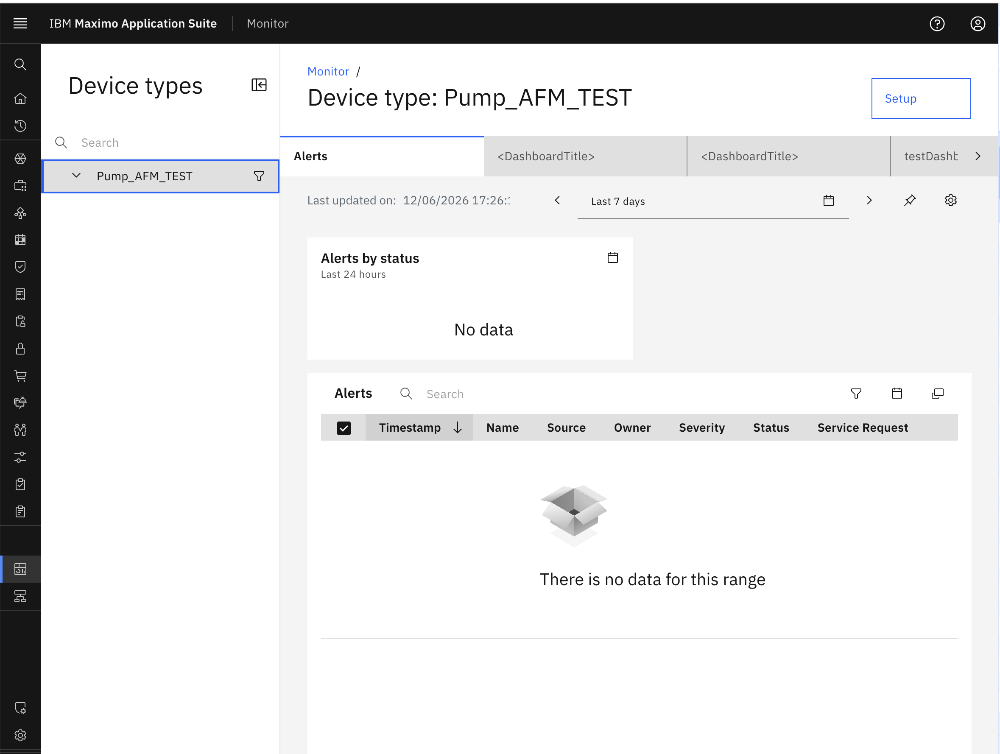

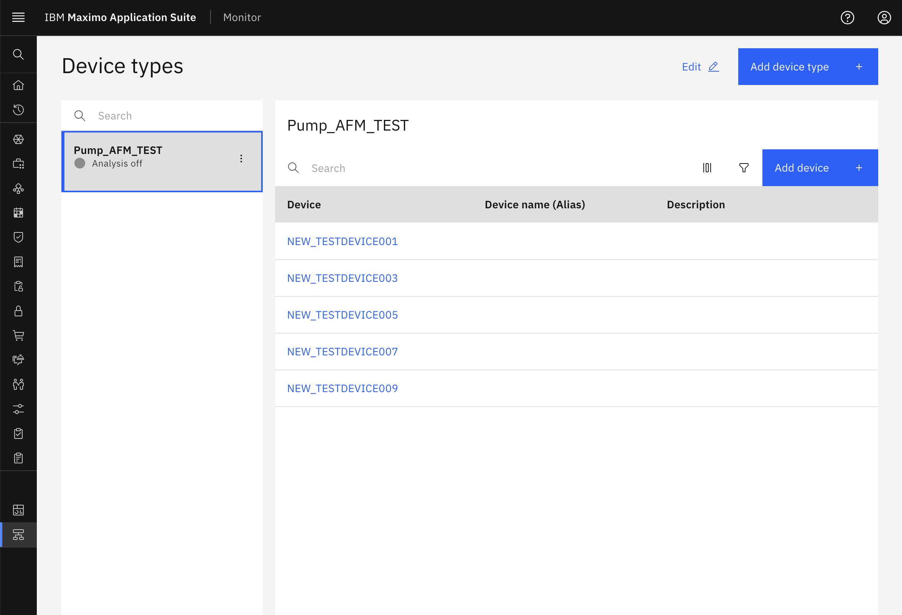


---

### Scenario 6.5: Exclude Device Types (NOT LIKE)

**Applications**:
- `MONITOR_DB_DEVICE_TYPES`
- `MONITOR_SETUP_DEVICE_TYPES`

**Query**: `name NOT LIKE 'E2E%'`

**Description**:
This exclusion pattern allows access to all device types EXCEPT those starting with "E2E". Users can view all device types whose names do not start with "E2E". For example, if you have device types "ROBOT", "Pump", "Engine", and "Electric Motor", users will see "ROBOT" and "Pump" but NOT "Engine" or "Electric Motor". In the Dashboard application, users can view dashboards created for all device types except those matching the exclusion pattern. In the Setup application, the Device Types list page will display all device types except those matching the exclusion pattern, and users can view their details in overview page. This is useful when you want to grant broad access while excluding specific categories.


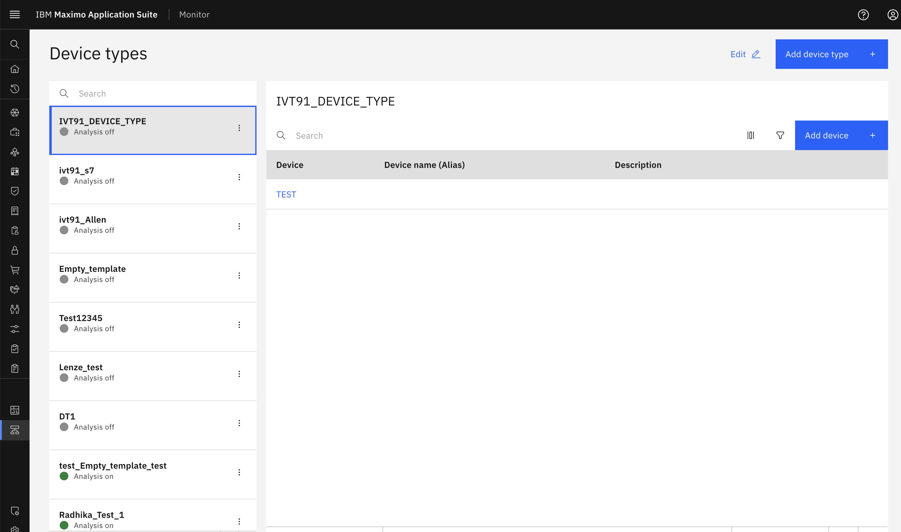

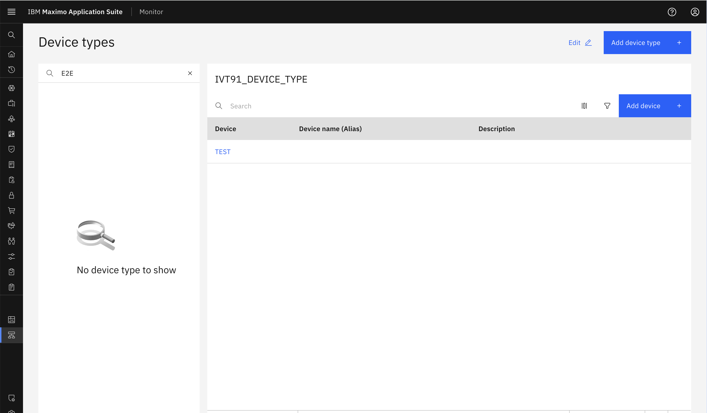


---

### Scenario 6.6: Multiple Pattern Matching (OR)

**Applications**:
- `MONITOR_DB_DEVICE_TYPES`
- `MONITOR_SETUP_DEVICE_TYPES`

**Query**: `name like 'E2E%' or name like 'DT%'`

**Description**:
This OR-based pattern allows access to device types starting with either "E2E" or "DT". Users can view all device types whose names start with "E2E" (like "E2E_Test", "E2E_Robot") OR start with "DT" (like "DT1", "DT_Sensor", "DT_Monitor"). In the Dashboard application, users can view dashboards created for all device types matching either pattern. In the Setup application, the Device Types list page will display all device types matching either pattern, and users can view their details in overview page. Users cannot see device types that don't match either pattern (like "ROBOT" or "Pump"). This is useful for managing multiple device families with different naming conventions.


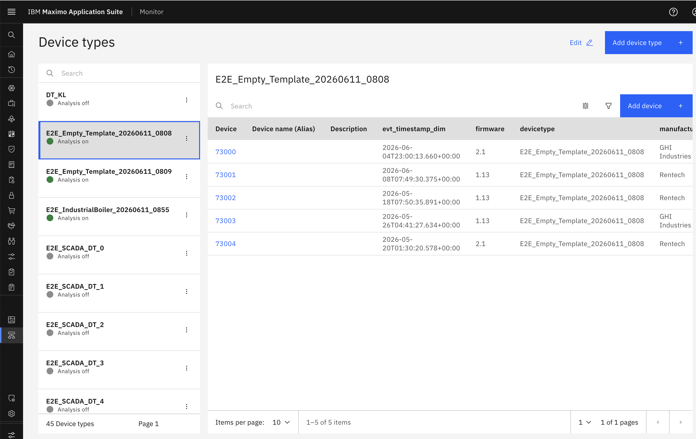

---

### Scenario 6.7: Name and Description Combined (AND)

**Applications**:
- `MONITOR_DB_DEVICE_TYPES`
- `MONITOR_SETUP_DEVICE_TYPES`

**Query**: `name='DT1' and description='Device details'`

**Description**:
This combined restriction requires both the device type name to be exactly "DT1" AND the description to be exactly "Device details". Users can only access device types that match both criteria. This provides very precise filtering when you need to identify device types by multiple attributes. In the Dashboard application, users can view dashboards created for the device type with name "DT1" and description "Device details". In the Setup application, the Device Types list page will only display the device type matching both criteria, and users can view its details in overview page. If a device type named "DT1" has a different description, it will not be accessible.


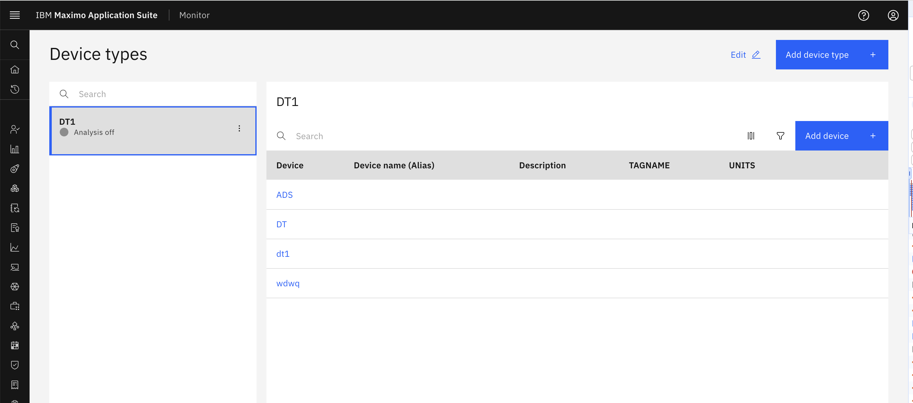

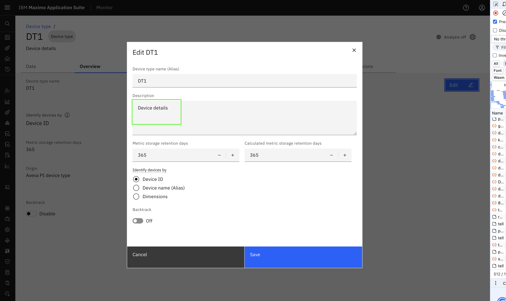

---

### Direct Access Behavior

**What happens when users try to access restricted device types directly?**

If a user tries to access a device type that is not included in their data restrictions (via direct URL or link), they will receive an **access denied message**. This applies to:

- **Direct URL access**: Typing or pasting a device type URL directly in the browser
- **Bookmarked links**: Clicking on previously saved bookmarks to restricted device types
- **Shared links**: Following links shared by other users who have access
- **Navigation from other pages**: Clicking links from search results or other applications

**Example Scenarios**:

1. **User has access to "ROBOT" device type only** (`name="ROBOT"`)
   - Accessing ROBOT device type URL: ✅ **Allowed**
   - Accessing Pump device type URL: ❌ **Access Denied**

2. **User has access to device types starting with "PU"** (`name like "PU%"`)
   - Accessing ROBOT device type URL: ✅ **Allowed**
   - Accessing Robotic Arm device type URL: ✅ **Allowed**
   - Accessing Pump device type URL: ❌ **Access Denied**

This ensures that data restrictions are enforced consistently across all access methods, not just through the UI navigation.

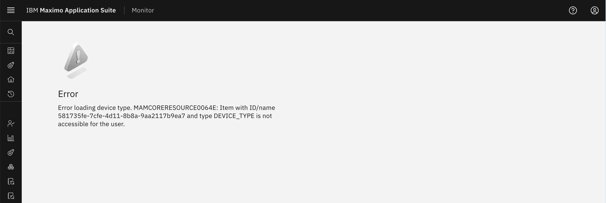

---

## 7. Device Restrictions

!!! note
    Device restrictions are applied using **Device Type queries**, not device-specific queries. The `MONITOR_SETUP_DEVICES` application is **not used** for applying restrictions. Devices are filtered based on their device type restrictions.

### Scenario 7.1: Single Device Type - All Devices

**Applications**:
- `MONITOR_DB_DEVICE_TYPES` (applies device type query to filter devices)

**Query**: `name="ROBOT"`

**Description**:
When you apply a device type restriction with `name="ROBOT"`, users can only see devices that belong to the "ROBOT" device type. In the Dashboard application, the Devices list page will show only devices of type "ROBOT". When viewing an asset's detail page, only ROBOT devices associated with that asset will be visible. When viewing the ROBOT device type detail page, all its devices will be shown. This restriction works by filtering device types, and devices are automatically filtered based on their type.


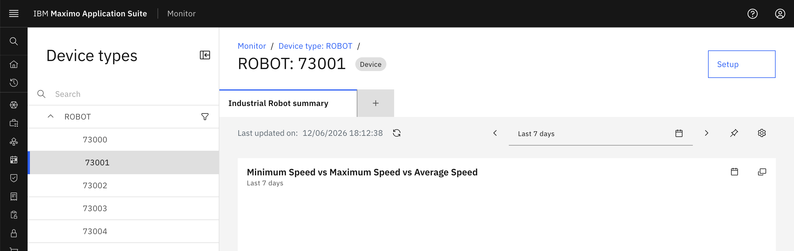

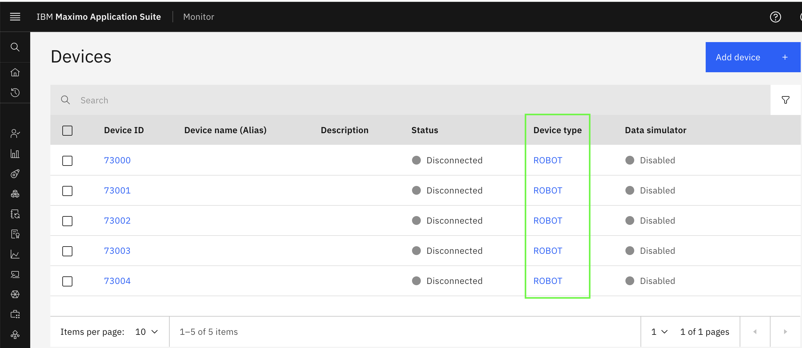


---

### Scenario 7.2: Multiple Device Types - All Their Devices

**Applications**:
- `MONITOR_DB_DEVICE_TYPES` (applies device type query to filter devices)

**Query**: `name in ("ROBOT","Pump")`

**Description**:
With this restriction, users can see devices belonging to either "ROBOT" or "Pump" device types. The Devices list page will show all devices of these two types. When viewing asset detail pages, only ROBOT and Pump devices will be visible. When viewing location detail pages, only ROBOT and Pump devices at that location will appear. The device type restriction automatically filters which devices are accessible.


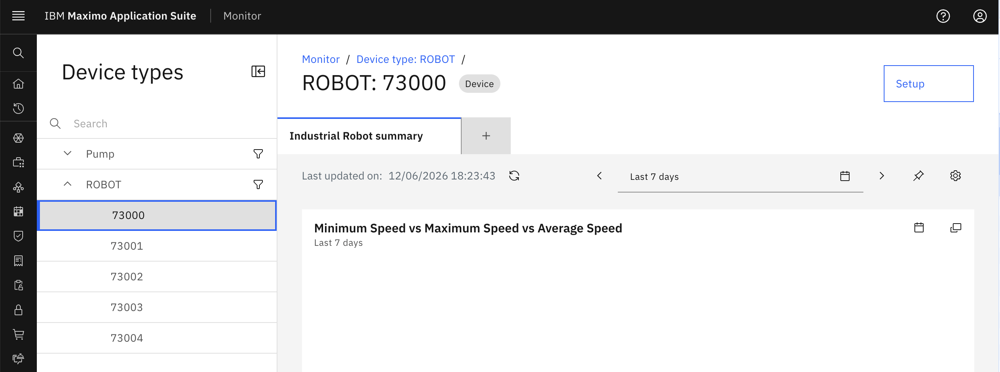

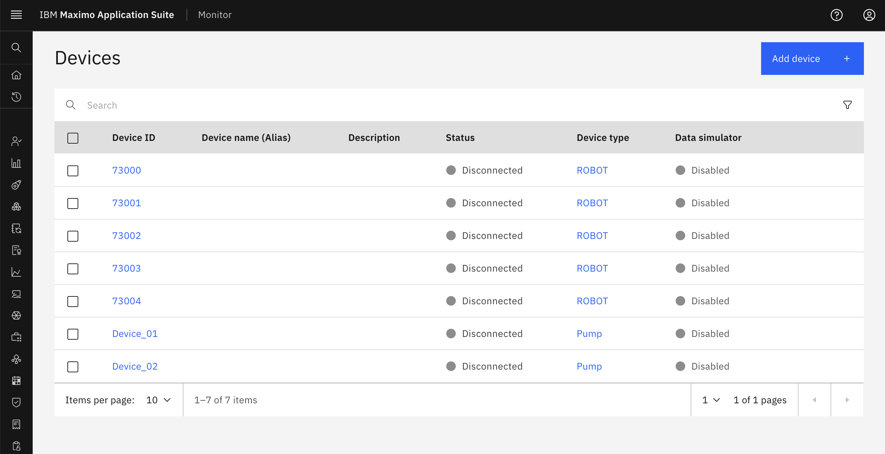


---

### Scenario 7.3: Device Type Pattern - All Matching Devices

**Applications**:
- `MONITOR_DB_DEVICE_TYPES` (applies device type query to filter devices)

**Query**: `name like "PU%"`

**Description**:
This pattern-based device type restriction allows access to all devices whose types start with "PU" (such as "ROBOT", "Robotic Arm", "Robotic Welder"). The Devices list page will show all devices belonging to any device type matching this pattern. When navigating through the hierarchy or viewing asset detail pages, only devices of matching types will be visible. This is useful for managing device families with similar naming conventions.


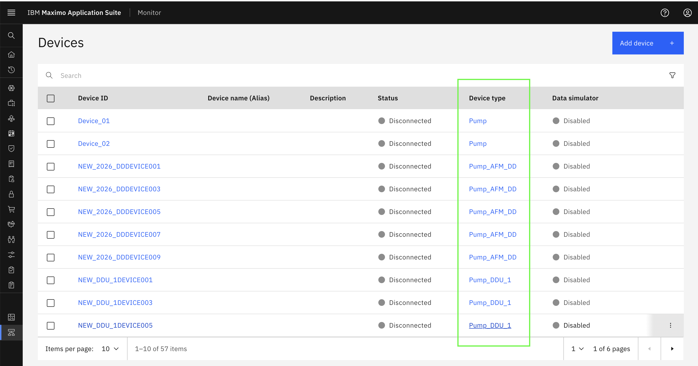

---

### Scenario 7.4: Device Type by UUID - All Its Devices

**Applications**:
- `MONITOR_DB_DEVICE_TYPES` (applies device type query to filter devices)

**Query**:
- Single UUID: `uuid='410251ee-2ce9-498f-96c6-b08b3d7f6f56'`
- Multiple UUIDs: `uuid in ('2584814b-3ed8-4c13-a923-4978ba68c897','410251ee-2ce9-498f-96c6-b08b3d7f6f56')`

**Description**:
This restriction uses the device type's internal UUID. Users can only see devices belonging to the device type(s) with the specified UUID(s). For a single device type, use the exact match format. For multiple device types, use the `in` operator with a list of UUIDs. The Devices list page will show only devices of the specified device type(s). This approach is more stable than using device type names because UUIDs don't change even if the device type name is modified. All devices of the specified type(s) will be accessible regardless of where they are in the hierarchy.


Single UUID Example:

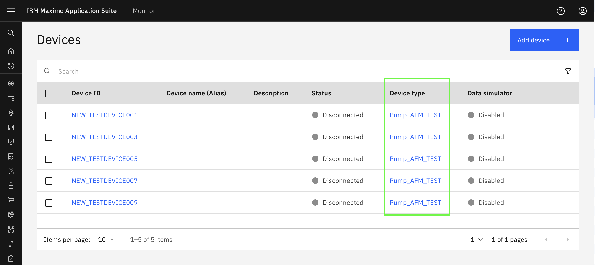

Multiple UUID Example:

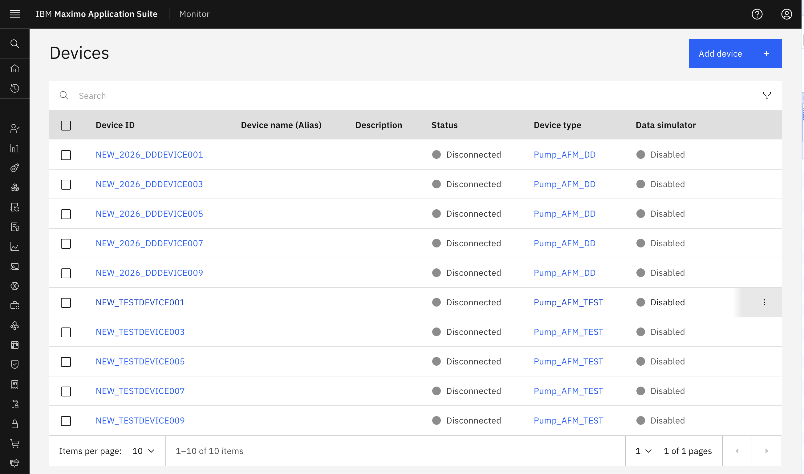


---

### Direct Access Behavior

**What happens when users try to access restricted devices directly?**

If a user tries to access a device that belongs to a device type not included in their data restrictions (via direct URL or link), they will receive an **access denied message**. Remember that device access is controlled through device type restrictions, not individual device restrictions.

This applies to:

- **Direct URL access**: Typing or pasting a device URL directly in the browser
- **Bookmarked links**: Clicking on previously saved bookmarks to restricted devices
- **Shared links**: Following links shared by other users who have access
- **Navigation from other pages**: Clicking links from search results or other applications

**Example Scenarios**:

1. **User has access to "ROBOT" device type only** (`name="ROBOT"`)
   - Accessing any ROBOT device URL: ✅ **Allowed**
   - Accessing any Pump device URL: ❌ **Access Denied**

2. **User has access to device types starting with "PU"** (`name like "PU%"`)
   - Accessing ROBOT device URL: ✅ **Allowed**
   - Accessing Robotic Arm device URL: ✅ **Allowed**
   - Accessing Pump device URL: ❌ **Access Denied**

3. **User has access to specific device type UUID** (`uuid='410251ee-2ce9-498f-96c6-b08b3d7f6f56'`)
   - Accessing devices of that device type: ✅ **Allowed**
   - Accessing devices of any other device type: ❌ **Access Denied**

**Important Note**: Since device restrictions are applied through device type queries, there is no way to restrict access to individual devices within an allowed device type. If a user has access to a device type, they have access to ALL devices of that type.

This ensures that data restrictions are enforced consistently across all access methods, not just through the UI navigation.

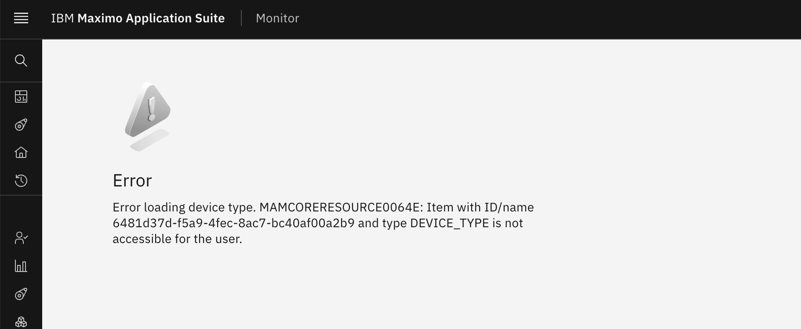

---

## 8. Pin Dashboard Restrictions

Pin Dashboard allows users to pin dashboards from any resource type (organizations, sites, systems, locations, assets, device types, devices) for quick access. When data restrictions are applied, users will only see pinned dashboards for resources they have access to.

### How Pin Dashboard Restrictions Work

Pin Dashboard restrictions are automatically enforced based on the underlying resource restrictions. The system validates that users can only see pins for resources they have permission to access through their `MONITOR_DB_*` application restrictions.

**Key Principles**:

1. **Automatic Filtering**: Pinned dashboards are automatically filtered based on user's data restrictions
2. **Resource-Based Access**: If a user doesn't have access to a resource, they won't see its pinned dashboard
3. **Workspace Validation**: The system validates DB pins for workspace and displays only accessible pins
4. **No Separate Application**: Pin Dashboard uses existing `MONITOR_DB_*` applications (no separate `MONITOR_DB_PINS` application)

### Scenario 8.1: Pin Dashboard with Location Restrictions

**Applications**:
- `MONITOR_DB_LOCATIONS` (controls which location dashboards can be pinned/viewed)

**Query**: `location="BR200"`

**Description**:
When a user has location restrictions, they can only pin and view dashboards for locations they have access to. If a user with `location="BR200"` restriction tries to view their Pin Dashboard:

- **Visible Pins**: Only pinned dashboards for location BR200 will appear
- **Hidden Pins**: Pinned dashboards for other locations (BR210, BR430, etc.) will not appear, even if they were pinned by other users or shared
- **Workspace Validation**: The system validates all DB pins in the workspace and filters them based on the user's location restrictions


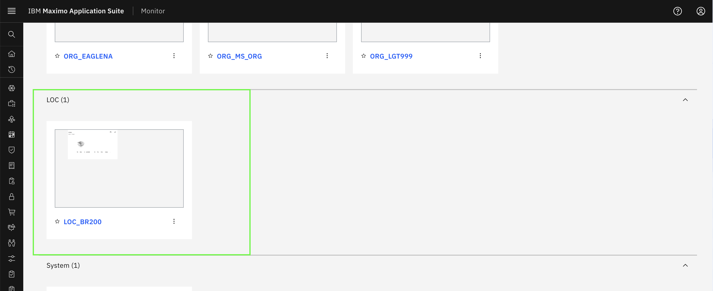

---

### Scenario 8.2: Pin Dashboard with Asset Restrictions

**Applications**:
- `MONITOR_DB_ASSETS` (controls which asset dashboards can be pinned/viewed)

**Query**: `assetnum in ["13170","11400","1004"]`

**Description**:
When a user has asset restrictions, they can only pin and view dashboards for assets they have access to. If a user with this restriction views their Pin Dashboard:

- **Visible Pins**: Only pinned dashboards for assets 13170, 11400, and 1004 will appear
- **Hidden Pins**: Pinned dashboards for other assets will not appear
- **Cross-Location Access**: If these assets are at different locations, the user can see pins for all three assets regardless of location


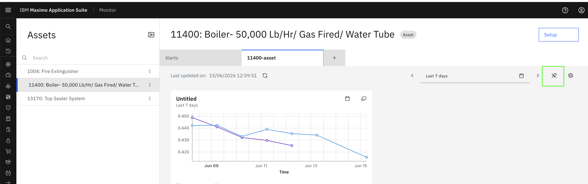

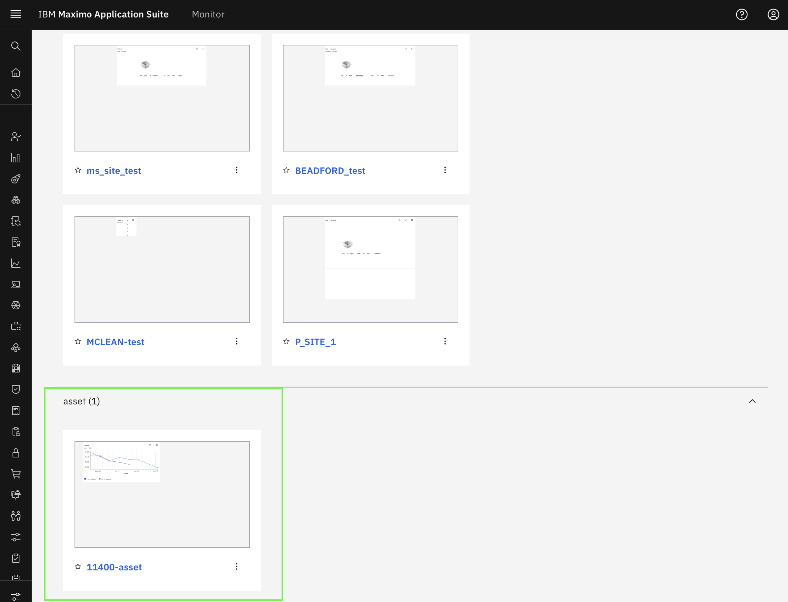


---

### Scenario 8.3: Pin Dashboard with Device Type Restrictions

**Applications**:
- `MONITOR_DB_DEVICE_TYPES` (controls which device type dashboards can be pinned/viewed)

**Query**: `name like "PU%"`

**Description**:
When a user has device type restrictions, they can only pin and view dashboards for device types they have access to. If a user with this restriction views their Pin Dashboard:

- **Visible Pins**: Only pinned dashboards for device types starting with "PU" (like Pump_AFM_VV, Pump_AFM_DD) will appear
- **Hidden Pins**: Pinned dashboards for other device types (ROBOT, etc.) will not appear
- **Device Dashboard Access**: This also affects pinned dashboards for individual devices - only devices of allowed types will be visible


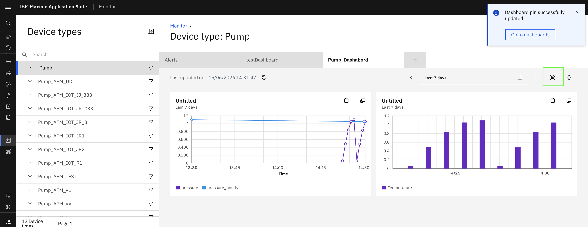


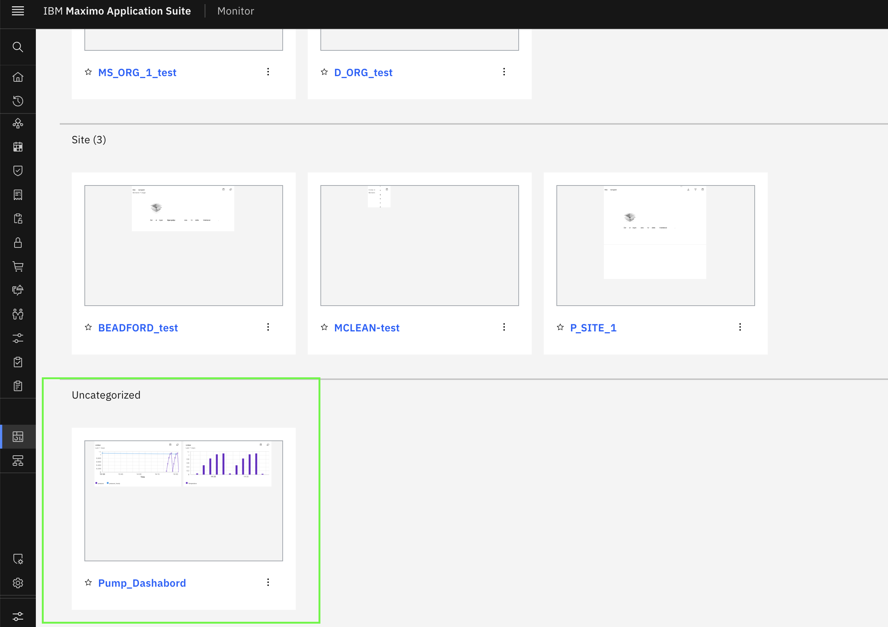

---

### Scenario 8.4: Pin Dashboard with Multiple Resource Restrictions

**Applications**:
- `MONITOR_DB_SITES` (controls site dashboard pins)
- `MONITOR_DB_LOCATIONS` (controls location dashboard pins)
- `MONITOR_DB_ASSETS` (controls asset dashboard pins)

**Query**:
- Sites: `siteid="BEDFORD"`
- Locations: `location="BR%"`
- Assets: `assetnum="11%"`

**Description**:
When a user has multiple resource restrictions, their Pin Dashboard will show pins for all resources they have access to across different resource types:

- **Visible Pins**:
  - BEDFORD site dashboard (if pinned)
  - Location dashboards for BR200, BR210, BR430, etc. (if pinned)
  - Asset dashboards for assets starting with "11" (if pinned)
- **Hidden Pins**:
  - Other site dashboards
  - Locations not starting with "BR"
  - Assets not starting with "11"
  - Any device type or device dashboards (no device type restrictions applied)


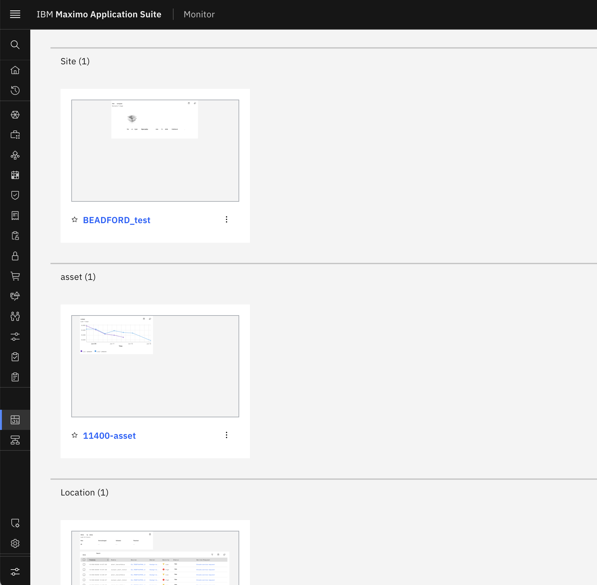

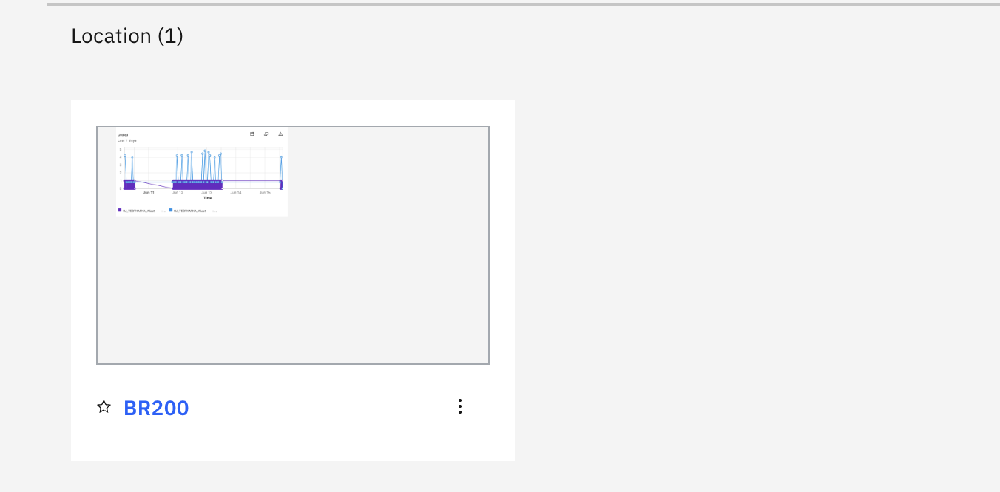


---

## Using Multiple Security Groups for Data Restrictions

Instead of creating complex combined restrictions in a single security group, you can create multiple security groups with different restrictions and assign users to multiple groups. This provides more flexible and manageable access control.

### How Multiple Security Groups Work

When a user is assigned to multiple security groups with different data restrictions:

- **The restrictions are combined automatically using OR logic**
- **The user will have access to resources allowed by ANY of their assigned security groups**
- **This is an OR operation, not an AND operation**

### Example: Regional Manager with Multiple Responsibilities

**Scenario**: A regional manager needs access to:
- BEDFORD site and all its resources
- All assets starting with "13" across all sites
- All ROBOT device types and their devices

**Solution**: Create three separate security groups:

#### Security Group 1: BEDFORD Site Access
```
Application: MONITOR_DB_SITES, MONITOR_SETUP_SITES
Query: siteid="BEDFORD"
```

#### Security Group 2: Asset Category 13 Access
```
Application: MONITOR_DB_ASSETS, MONITOR_SETUP_ASSETS
Query: assetnum="13%"
```

#### Security Group 3: ROBOT Devices Access
```
Application: MONITOR_DB_DEVICE_TYPES, MONITOR_SETUP_DEVICE_TYPES
Query: name="ROBOT"
```

**Result**: The user assigned to all three groups can:
- View BEDFORD site details and all its resources
- View all assets starting with "13" at any site (not just BEDFORD)
- View all ROBOT devices at any location (not just BEDFORD or with asset 13)

### Example: Multi-Site Operator

**Scenario**: An operator needs access to:
- BEDFORD and TEXAS sites
- Locations starting with "BR" or "TX"

**Solution**: Create two security groups:

#### Security Group 1: Multi-Site Access
```
Application: MONITOR_DB_SITES, MONITOR_SETUP_SITES
Query: siteid in ["BEDFORD","TEXAS"]
```

#### Security Group 2: Specific Location Access
```
Application: MONITOR_DB_LOCATIONS, MONITOR_SETUP_LOCATIONS
Query: location="BR%" or location="TX%"
```

**Result**: The user can:
- View both BEDFORD and TEXAS site details
- View all locations starting with "BR" or "TX" at any site
- Navigate through the hierarchy seeing only these sites and locations

### Benefits of Multiple Security Groups

1. **Flexibility**: Easy to add or remove access by assigning/unassigning security groups
2. **Reusability**: Same security groups can be assigned to multiple users
3. **Maintainability**: Update one security group to affect all assigned users
4. **Clarity**: Each security group has a clear, single purpose
5. **Scalability**: Easy to manage as organization grows

### Best Practices for Multiple Security Groups

1. **Create Purpose-Specific Groups**: Each security group should have a clear, single purpose (e.g., "BEDFORD Site Access", "Asset Category 13")
2. **Use Descriptive Names**: Name security groups clearly to indicate what access they provide
3. **Document Group Purpose**: Keep documentation of what each security group is meant to accomplish
4. **Test Combinations**: Always test how multiple security groups work together before deploying to production
5. **Review Regularly**: Periodically review user assignments to ensure they still need all assigned groups

---


## Key Takeaways

After reviewing all the scenarios in this exercise, here are the important concepts to remember:

### Independent Restrictions
- Each resource type restriction works independently at its hierarchy level
- Organization restriction controls org details, site restriction controls site details, etc.
- Child resource lists on detail pages are controlled by the child resource's restriction, not the parent's

### Application Coverage
- Most restrictions apply to both `MONITOR_DB_*` (Dashboard) and `MONITOR_SETUP_*` (Setup) applications
- Device restrictions are an exception - they use device type queries and `MONITOR_SETUP_DEVICES` is not used


### Multiple Security Groups Strategy
- Create separate security groups for different access needs
- Assign users to multiple groups for flexible access control
- Restrictions combine using OR logic - users get access allowed by ANY assigned group
- This approach is more maintainable and scalable than complex single-group restrictions


## Next Steps

Now that you understand how different restriction scenarios work across applications and hierarchy levels, proceed to [Exercise 5: Verify User Data Restrictions](verify_data_restrictions.md) to test your configured restrictions.