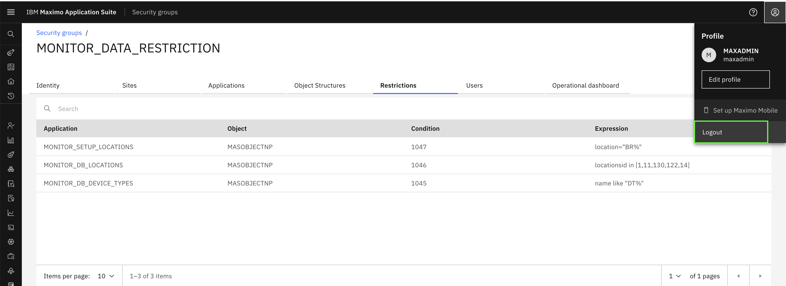
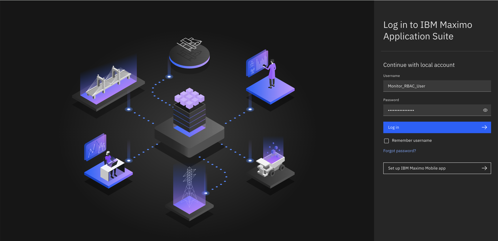
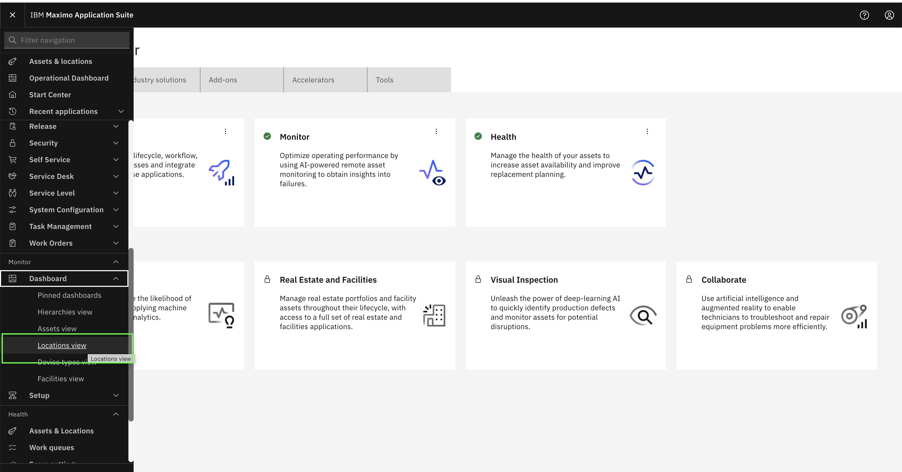
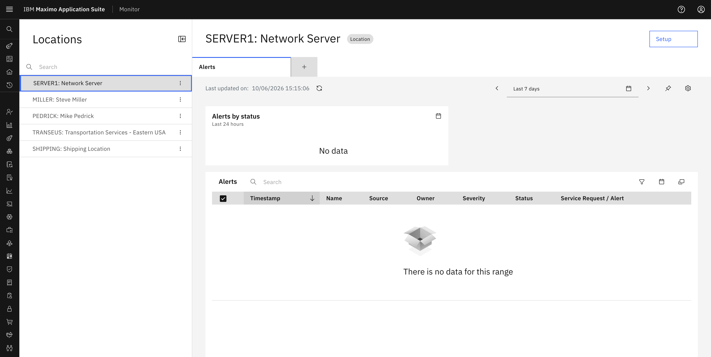
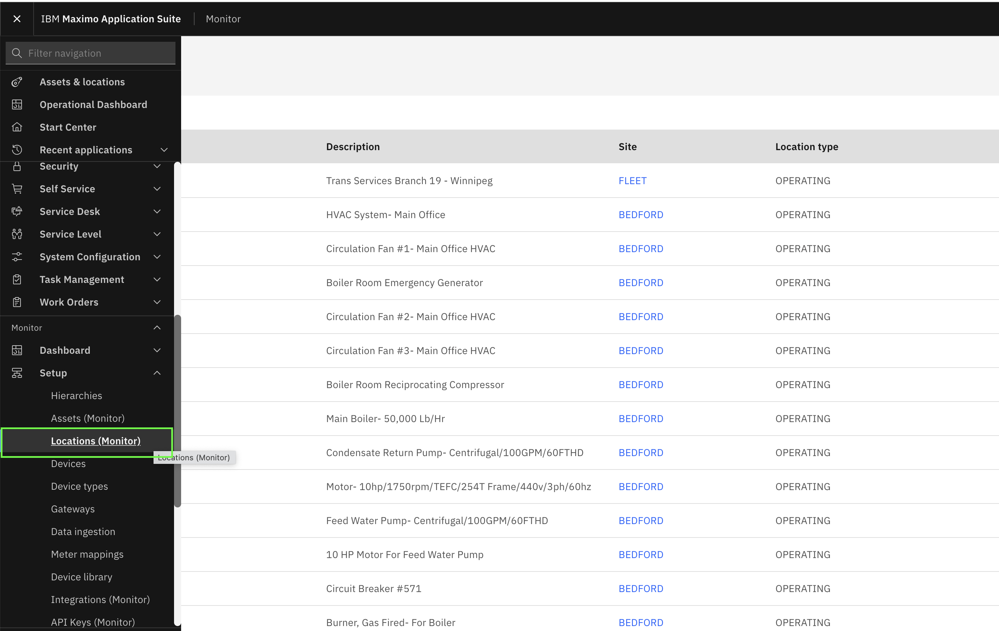
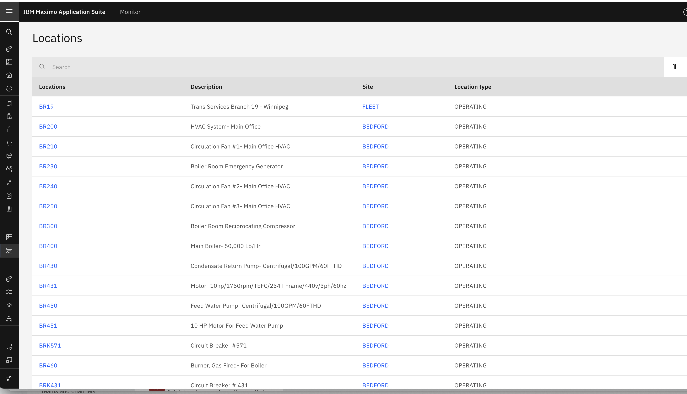
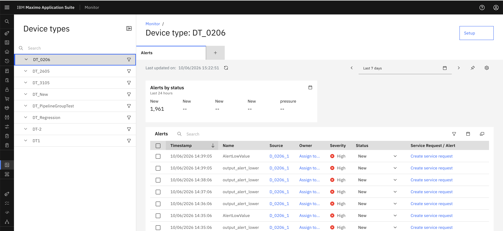
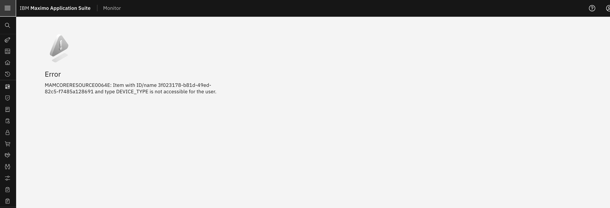

# Verify User Data Restrictions

## Objectives
In this exercise, you will learn how to:

* Test data restrictions by logging in as a restricted user
* Verify that only filtered resources are visible
* Understand how data restrictions work in practice
* Confirm that restrictions are applied correctly across Dashboard and Setup applications

---

*Before you begin:*  
This exercise assumes that you have:

1. Completed [Creating Security Groups](create_security_groups.md)
2. Completed [Creating Users and Assigning Groups](create_users.md)
3. Completed [Add Data Restrictions in Security Group](data_restriction_update.md)
4. Reviewed [Resource Restriction Scenarios](resource_restriction_scenarios.md)

---

## Understanding Data Restriction Verification

After configuring data restrictions in Security Groups, it's important to verify that they work as expected. Users assigned to restricted security groups should only see resources that match the configured filter conditions.

---

## Step 1: Log Out from Admin Account

1. Log out from your current admin session
2. Close the browser or use an incognito/private window for testing

 

---

## Step 2: Log In as Restricted User

1. Open the Maximo Application Suite login page
2. Enter the credentials for the user you created with data restrictions
   - Example: User assigned to `MONITOR_DATA_RESTRICTION` security group

 

---

## Step 3: Navigate to Dashboard Application

1. After logging in, navigate to the Monitor application
2. Go to the Dashboard page for the resource type you restricted
   - Example: If you added restrictions for `MONITOR_DB_LOCATIONS`, go to the Locations Dashboard

   Go to **Monitor → Dashboard -> Locations view**

 

---

## Step 4: Verify Filtered Resources in Dashboard

1. Observe the list of resources displayed
2. Verify that only resources matching your filter condition are visible
   - Example: our condition was `locationsid in [1,11,130,122,14]`, only locations with those specific IDs should appear

 

!!! success
    If you see only the filtered resources, your data restriction is working correctly in the Dashboard application!

---

## Step 5: Navigate to Setup Application

1. Navigate to the Setup page for the same resource type
   - Example: Go to **Setup → Locations**

 

---

## Step 6: Verify Filtered Resources in Setup

1. Observe the list of resources in the Setup page
2. our condition was location="BR%", only locations starting with "BR" should appear.
   - Verify that the Setup page should show the same restricted set of resources as filtering is applied

 

!!! success
    Data restrictions should be consistent across both Dashboard and Setup applications!

---

## Step 7: Test with Different Resource Types

If you added restrictions for multiple resource types, test each one:

1. Navigate to Assets Dashboard/Setup (if restricted)
2. Navigate to Device Type Dashboard/Setup (if restricted)
3. Navigate to Organizations Dashboard/Setup (if restricted)
4. Verify that each shows only the filtered resources

 

---

## Step 8: Verify No Access to Unrestricted Resources

1. Try to access resources that don't match your filter condition
2. Confirm that they are not visible in the list
3. If you try to access them directly (via URL or link), you should get an access denied message

 

---

## Understanding Combined Restrictions

!!! note
    If a user is assigned to multiple security groups with different data restrictions:
    
    - The restrictions are **combined automatically**
    - The user will have access to resources allowed by **ANY** of their assigned security groups
    - This is an **OR** operation, not an **AND** operation
    
    **Example:**
    - Security Group A: `location="BR%"` (locations starting with BR)
    - Security Group B: `location="NY%"` (locations starting with NY)
    - User assigned to both groups will see locations starting with **BR OR NY**

---

## Troubleshooting

If data restrictions are not working as expected:

### Issue: User sees all resources instead of filtered ones

**Possible Causes:**

- User is assigned to a security group without restrictions
- User has admin privileges that override restrictions
- Restrictions were not saved properly
- User sync has not completed yet (changes may take a few minutes to propagate)

**Solution:**

1. Verify the user's security group assignments
2. Check that the security group has the correct data restrictions configured
3. Ensure you clicked "Save & exit" after adding restrictions
4. Wait a few minutes for user sync to complete, or manually re-sync the user from the user list (Suite > Access and usage > Users > Select user > Sync user)
5. Log out and log back in to refresh the session

---

### Issue: User sees no resources at all

**Possible Causes:**

- Filter condition doesn't match any existing resources
- Syntax error in the filter condition
- Wrong application selected for the restriction

**Solution:**

1. Verify that resources matching your filter condition exist in the system
2. Check the filter syntax for errors
3. Ensure the restriction is added to the correct Monitor application

---

### Issue: Restrictions work in Dashboard but not in Setup

**Possible Causes:**

- Restrictions were only added to Dashboard applications (`MONITOR_DB_*`)
- Setup applications (`MONITOR_SETUP_*`) were not configured

**Solution:**

1. Go back to the Security Group
2. Add restrictions for both Dashboard and Setup applications
3. Use the same filter condition for consistency

---

## Verification Checklist

Use this checklist to ensure your data restrictions are working correctly:

- [ ] User can log in successfully
- [ ] Dashboard shows only filtered resources
- [ ] Setup shows only filtered resources
- [ ] Resources not matching the filter are not visible
- [ ] Restrictions are consistent across Dashboard and Setup
- [ ] Multiple resource types are filtered correctly (if applicable)
- [ ] User cannot access unrestricted resources directly
- [ ] Combined restrictions work correctly (if user has multiple groups)

---

Congratulations!  
You have successfully verified that data restrictions are working correctly. Your users will now only see the resources they are authorized to access based on the configured filter conditions.

---