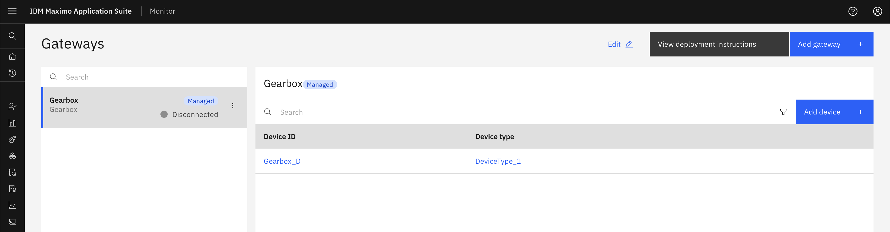
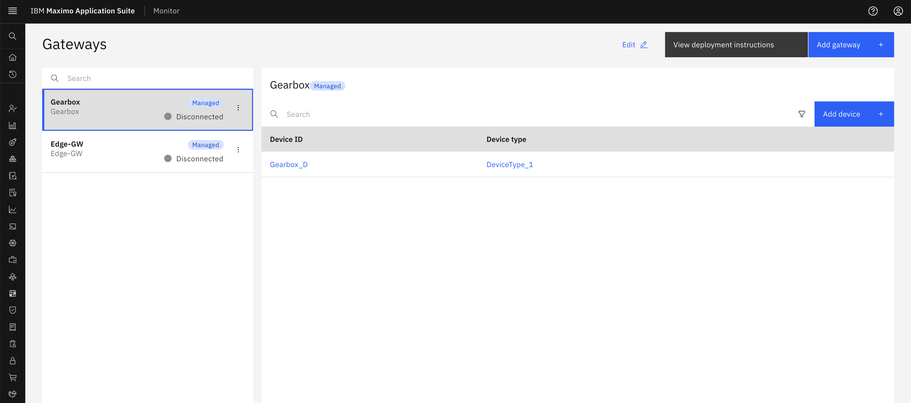
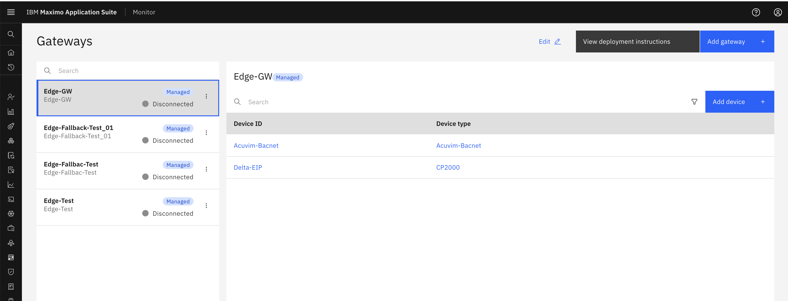
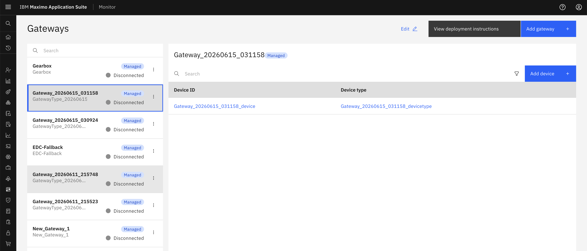
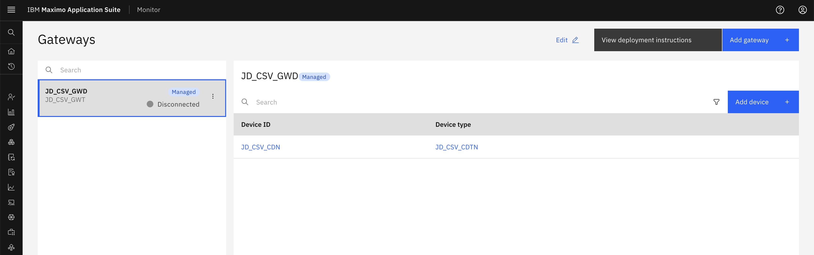
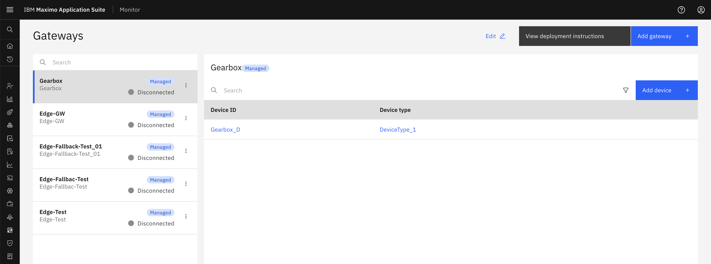
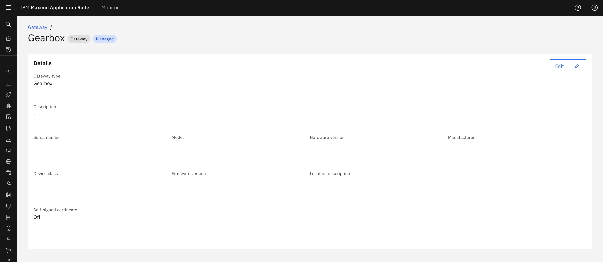
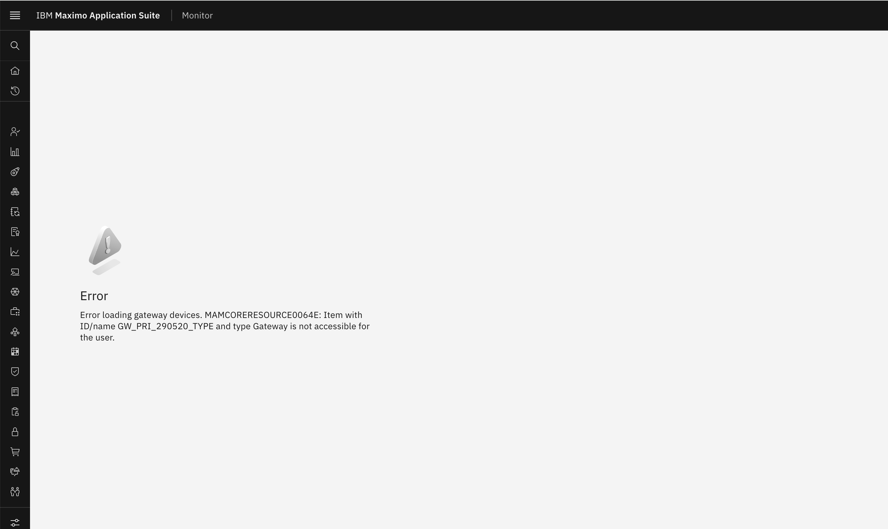

# Exercise 1: Gateway Restrictions

## Overview

Gateway restrictions in Maximo Application Suite 9.2 allow you to control which gateways users can access based on gateway type names. This exercise demonstrates how to apply gateway restrictions using different query patterns.

## Gateway Restriction Basics

Gateway restrictions are applied through the `MONITOR_SETUP_GATEWAYS` application using the `gatewayTypeName` field. The system filters gateways based on the query you define in the Security Group's data restrictions.

### Supported Query Patterns

#### Gateway Type Name Patterns

| Pattern | Description | Example |
|---------|-------------|---------|
| Exact Match | Match a specific gateway type name | `gatewayTypeName='Gearbox'` |
| Exact Match | Match a specific gateway type name | `gatewayTypeName="GatewayType_20260615_030408"` |
| Pattern Matching | Match gateway types using LIKE operator | `gatewayTypeName like 'Ge%'` |
| Pattern Matching | Match gateway types using LIKE operator | `gatewayTypeName Like "GatewayType_20260615_030408"` |
| Exclusion Pattern | Exclude gateway types using NOT LIKE | `gatewayTypeName NOT LIKE 'Test%'` |
| Exclusion Pattern | Exclude gateway types using NOT LIKE | `gatewayTypeName NOT Like "GatewayType_20260615_030408"` |
| Multiple Values | Match multiple gateway type names | `gatewayTypeName in ('Gearbox','Edge-GW')` |

#### Gateway Device ID Patterns

| Pattern | Description | Example |
|---------|-------------|---------|
| Exact Match | Match a specific gateway device ID | `gatewayDeviceId="JD_CSV_GWD"` |
| Pattern Matching | Match gateway device IDs using LIKE operator | `gatewayDeviceId Like "JD_CSV_GWD"` |
| Exclusion Pattern | Exclude gateway device IDs using NOT LIKE | `gatewayDeviceId NOT Like "JD_CSV_GWD"` |
| Multiple Values | Match multiple gateway device IDs | `gatewayDeviceId in ("JD_CSV_GWD","DEVICE_002")` |

---

## How to Apply Gateway Restrictions

All gateway restriction scenarios follow the same steps. Only the query changes based on your requirements:

1. Navigate to **Administration** > **Security** > **Security Groups**
2. Select or create a Security Group
3. Go to the **Data Restrictions** tab
4. Click **Add Data Restriction**
5. Select Application: `MONITOR_SETUP_GATEWAYS`
6. Enter the appropriate Query (see scenarios below)
7. Click **Save**

!!! tip
    After applying a restriction, assign users to the Security Group and have them log in to verify the restriction works as expected.

---

## Scenario 1: Single Gateway Type Access

### Applications
- `MONITOR_SETUP_GATEWAYS`

### Query
```
gatewayTypeName='Gearbox'
```

### Description

Users with this restriction can only access gateways of type "Gearbox". In the Setup application's Gateways page, only gateways with gateway type name "Gearbox" will be visible. All other gateway types will be hidden from the user's view.

### Expected Result

- **Visible**: Gateways with gateway type name "Gearbox"
- **Hidden**: All other gateway types (Edge-GW, Pump, etc.)



---

## Scenario 2: Multiple Gateway Type Access

### Applications
- `MONITOR_SETUP_GATEWAYS`

### Query
```
gatewayTypeName in ('Gearbox','Edge-GW')
```

### Description

This restriction grants access to gateways of two specific types: "Gearbox" and "Edge-GW". Users can view and manage gateways of both types in the Setup application. The Gateways list page will show only gateways matching these two types.

### Expected Result

- **Visible**: Gateways with gateway type names "Gearbox" or "Edge-GW"
- **Hidden**: All other gateway types (Pump, Compressor, etc.)



---

## Scenario 3: Gateway Type Pattern Matching

### Applications
- `MONITOR_SETUP_GATEWAYS`

### Query
```
gatewayTypeName like 'Ed%'
```

### Description

This pattern-based restriction allows access to all gateway types whose names start with "Ge" (such as  "Edge-GW", "EDC_Opcua"). Users can view and manage all matching gateway types in the Setup application. This is useful when gateway types follow a naming convention.

### Expected Result

- **Visible**: Gateways with gateway type names starting with "Ed" ( Edge-GW, EDC_Opcua, etc.)
- **Hidden**: Gateway types not matching the pattern (Pump, Compressor, Motor, etc.)



---

## Scenario 4: Exclude Gateway Types (NOT LIKE)

### Applications
- `MONITOR_SETUP_GATEWAYS`

### Query
```
gatewayTypeName NOT LIKE 'Test%'
```

### Description

This exclusion pattern allows access to all gateway types EXCEPT those starting with "Test". Users can view and manage all gateway types whose names do not start with "Test". This is useful for hiding test or experimental gateways from production users.

### Expected Result

- **Visible**: All gateway types except those starting with "Test"
- **Hidden**: Gateway types starting with "Test" (Test_Gateway, Test_Gearbox, etc.)



---

## Scenario 5: Gateway Device ID Access

### Applications
- `MONITOR_SETUP_GATEWAYS`

### Query
```
gatewayDeviceId="JD_CSV_GWD"
```

### Description

This restriction grants access to a specific gateway based on its device ID. Users can only view and manage the gateway with device ID "JD_CSV_GWD". This is useful when you need to restrict access to individual gateways rather than gateway types, providing more granular control over gateway access.

### Expected Result

- **Visible**: Gateway with device ID "JD_CSV_GWD"
- **Hidden**: All other gateways regardless of their type



---

## Scenario 6: Multiple Pattern Matching (OR)

### Applications
- `MONITOR_SETUP_GATEWAYS`

### Query
```
gatewayTypeName like 'Ge%' or gatewayTypeName like 'Ed%'
```

### Description

This OR-based pattern allows access to gateway types starting with either "Ge" or "Ed". Users can view and manage all gateway types whose names start with "Ge" (like "Gearbox", "Generator") OR start with "Ed" (like "Edge-GW", "Edge-Gateway"). This is useful for managing multiple gateway families with different naming conventions.

### Expected Result

- **Visible**: Gateway types starting with "Ge" or "Ed" (Gearbox, Generator, Edge-GW, Edge-Gateway, etc.)
- **Hidden**: Gateway types not matching either pattern (Pump, Motor, Compressor, etc.)



---

## Scenario 8: Direct URL Access Behavior

### Applications
- `MONITOR_SETUP_GATEWAYS`

### Query
```
gatewayTypeName='Gearbox'
```

### Description

This scenario demonstrates the security behavior when users attempt to access restricted gateways directly via URL. Even if a user has the URL to a specific gateway that doesn't match their data restrictions, the system will deny access and display an "Access Denied" or "Not Found" message. This ensures that data restrictions are enforced at all access points, not just in list views.

### Testing Direct Access

1. **Apply Restriction**: Set up a restriction allowing only "Gearbox" gateway types
2. **Get Restricted Gateway URL**: Obtain the direct URL to a gateway of type "Generator" (which is restricted)
3. **Attempt Direct Access**: Try to access the restricted gateway by pasting the URL directly in the browser
4. **Verify Denial**: System should show "Access Denied" or "Not Found" error

### Expected Result

- **List View**: Only gateways with type "Gearbox" appear in the Gateways list
- **Direct URL Access to Allowed Gateway**: Successfully opens the gateway details page
- **Direct URL Access to Restricted Gateway**: Shows "Access Denied" or "Not Found" error
- **Security**: Data restrictions are enforced regardless of how the user attempts to access the gateway






## Summary

Gateway restrictions in Maximo Application Suite 9.2 provide flexible control over gateway access using the `gatewayTypeName` and `gatewayDeviceId` fields. By combining different query patterns (exact match, pattern matching, multiple values, exclusions), you can create precise access control policies that match your organizational structure and security requirements.

For information about restrictions on other resource types (Organizations, Sites, Systems, Locations, Assets, Device Types, Devices), see [Resource-Based Access Control in Maximo Monitor 9.1](../../monitor_resource_based_access_control_9.1/).

---