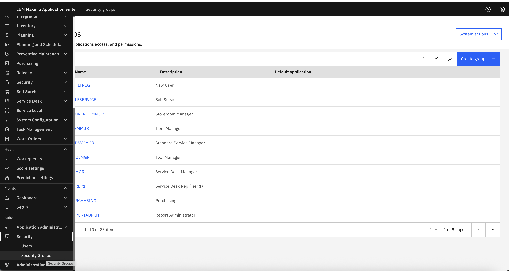
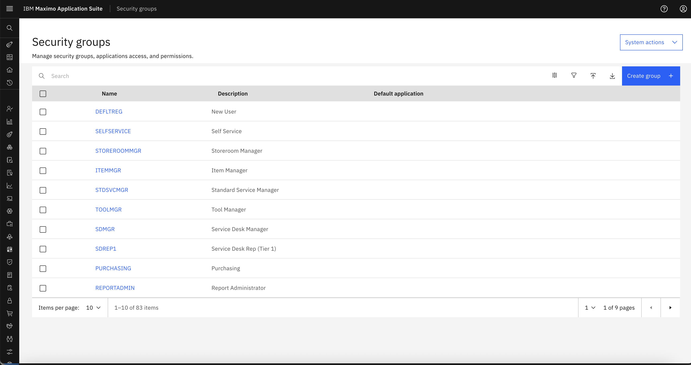
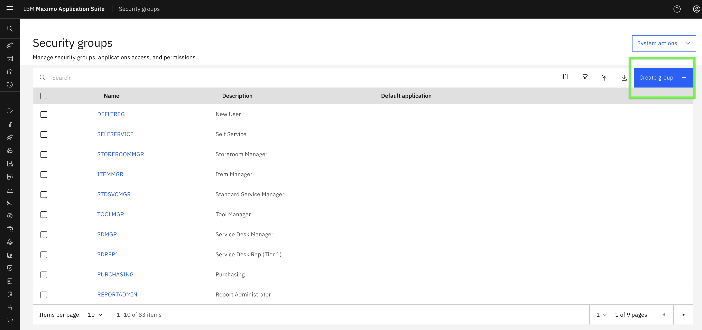
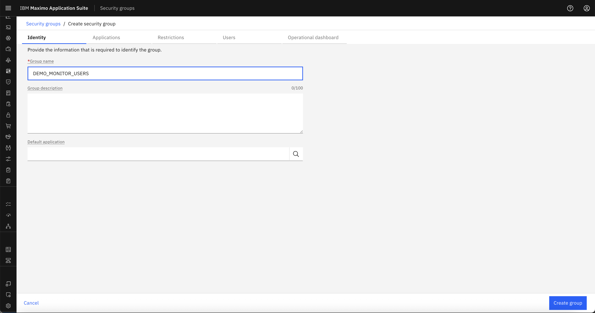
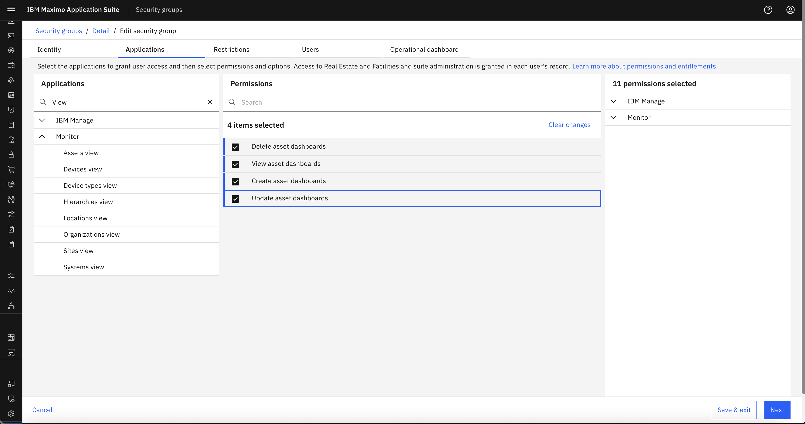
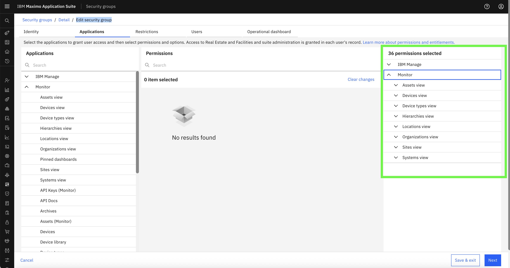

# Objectives
In this exercise, you will learn how to:

* Create new Security Groups in Monitor
* Define role-based permissions for users

---

*Before you begin:*  
This exercise assumes that you have:

1. Admin access to Maximo Monitor  
2. Completed the RBAC Overview in the [Introduction section](./index.md)

---

Security Groups in Monitor define which pages and functionalities users can access. By creating Security Groups, you can enforce role-based permissions like admin, viewer, or limited dashboard access.

---

### Step 1: Navigate to Security Groups

1. Login to Monitor with an Admin user
2. Go to **Suite → Security → Security Groups**

 
 

---

### Step 2: Create a New Security Group

1. Click **Create group**    
 

2. Enter a name for the group, e.g., `DEMO_MONITOR_USERS` and Click **Create group**  
 

3. Provide a brief Group description (optional)

---

### Step 3: Assign Permissions

1. Select the features/modules that this group should have access to  
   Example:  
   – Enable Dashboard access  
   – Enable CRUD operations on Dashboard  
   – Disable Setup page access
2. Save the group once permissions are configured

3. Search for View and All the View Pages Shall Appear. Select all the permissions to enable the Security Group to view and Access Only Dashboard Pages.

 

- The Assigned permissions can be viewed in Details / Edit Security group section  
   
    

 

---

### Example of Out of the Box Security Groups  

MONITOR_ADMIN, MONITOR_USERS & MONITOR_READ_ONLY are out-of-box security groups and customers can change them and also able to create new security groups for their needs.

| Group Name          | Purpose                                 | Access Scope                      |
|---------------------|------------------------------------------|------------------------------------|
| MONITOR_ADMIN       | Full Admin Access                       | All pages (Dashboard + Setup)      |
| MONITOR_USERS       | Standard User                           | Dashboard only (CRUD allowed)      |
| MONITOR_READ_ONLY   | Readonly Role                           | Dashboard view only (no CRUD)      |

---

Congratulations!  
You have successfully created a Security Group. Next, you can proceed to [Create Users and Assign Groups](create_users.md)

---
