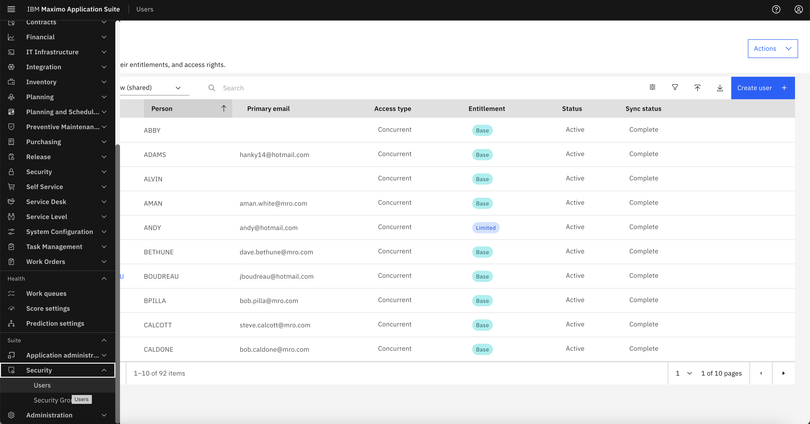
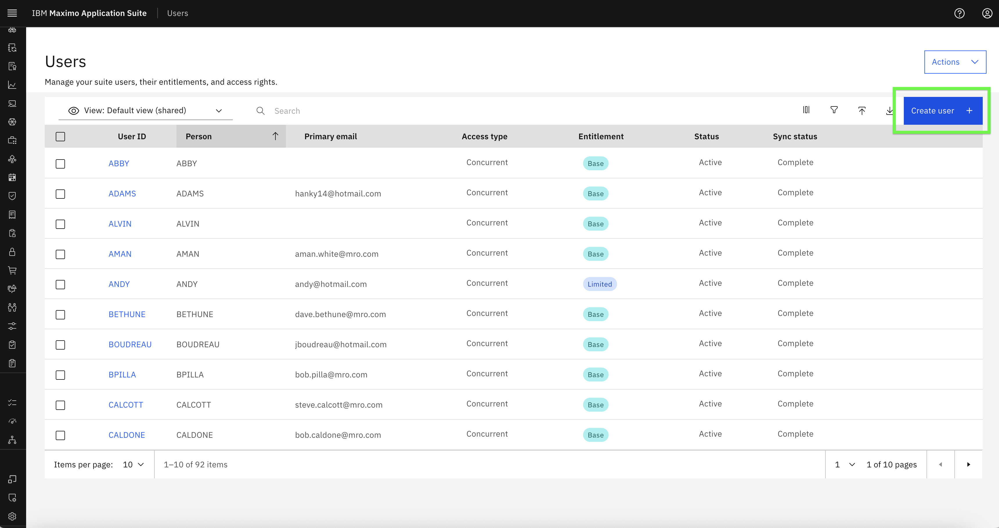
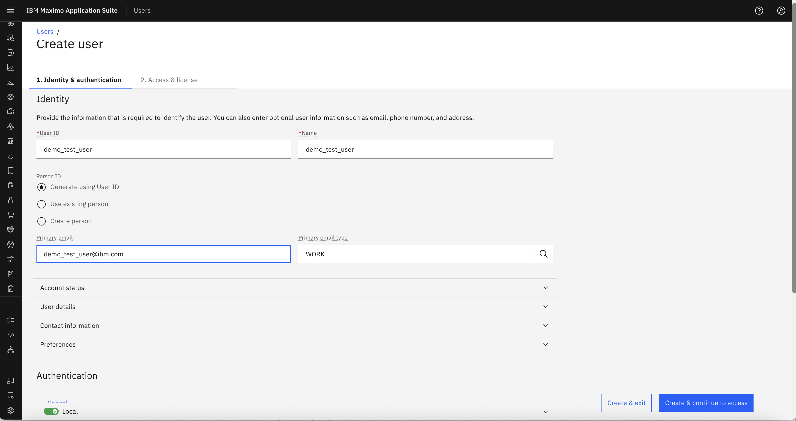
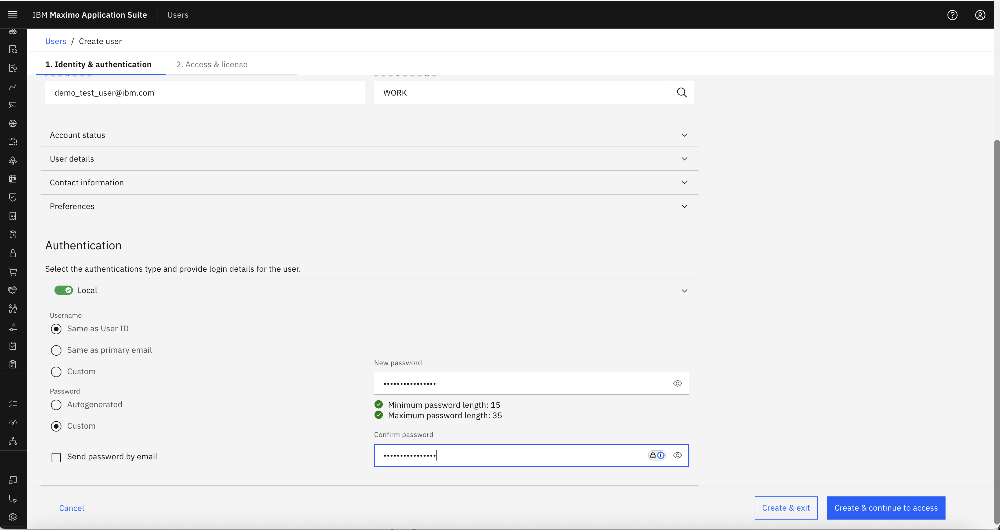
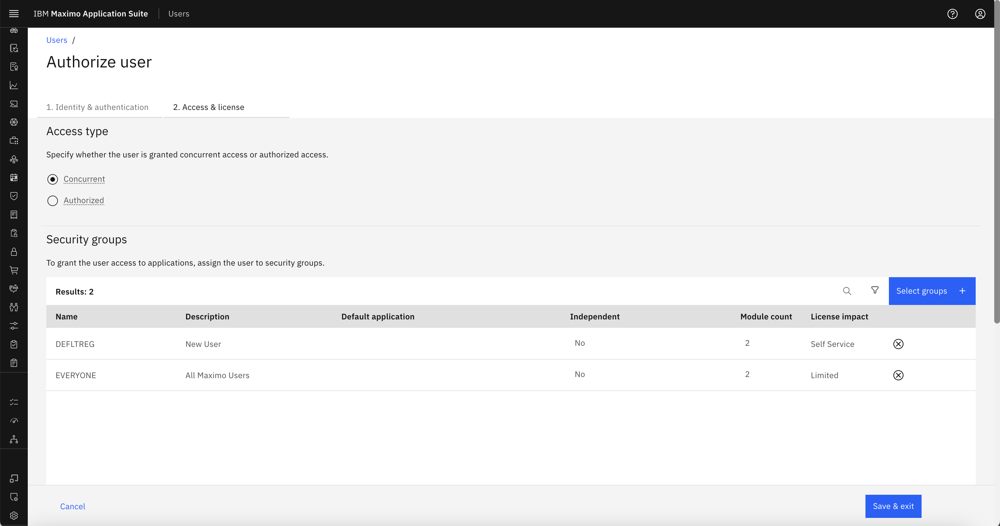
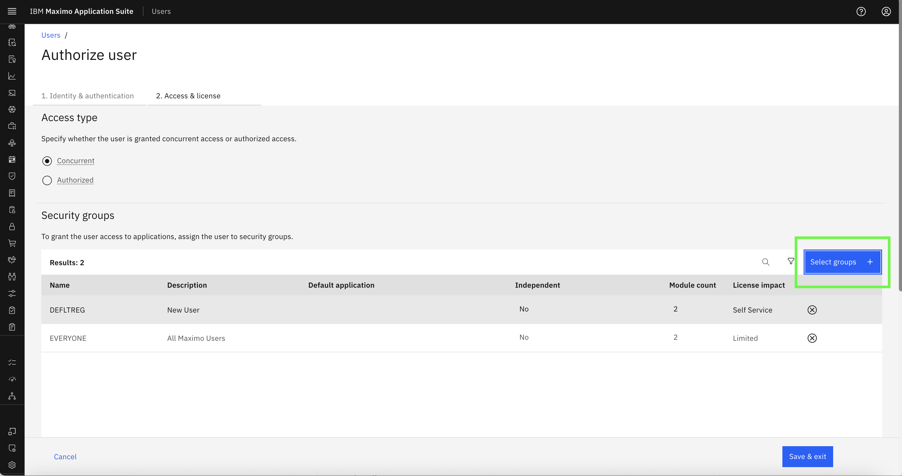
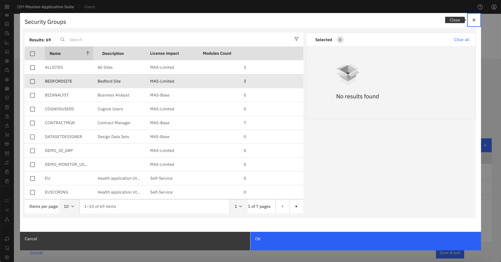
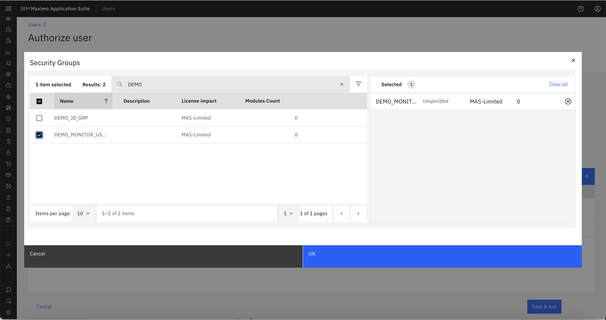
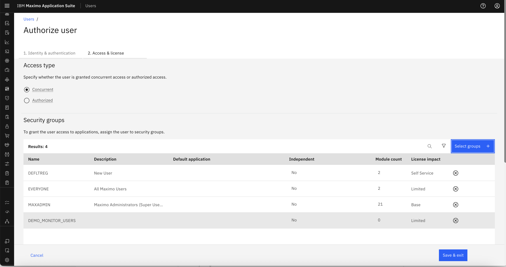
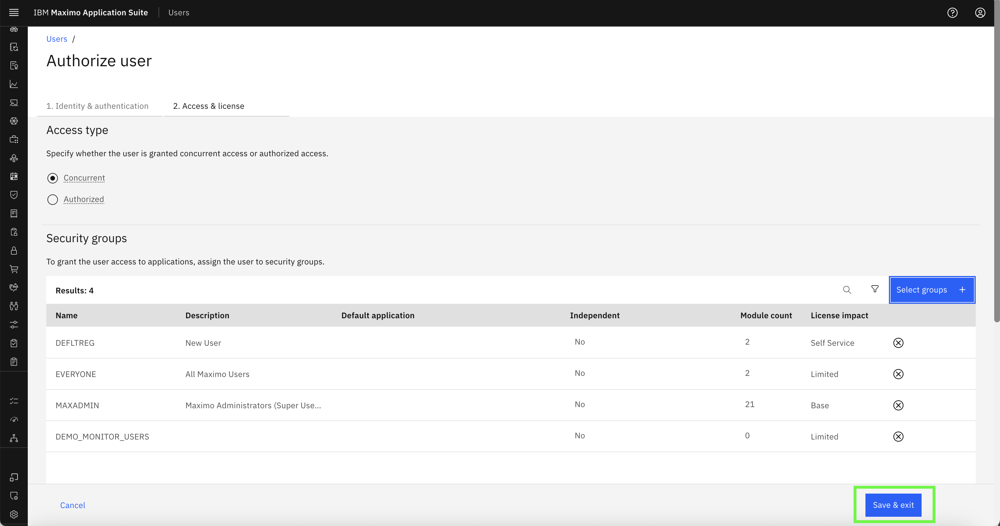

# Objectives
In this exercise, you will learn how to:

* Create users in Monitor
* Assign users to appropriate Security Groups
* Understand the effect of multiple group assignments

---

*Before you begin:*  
This exercise assumes that you have:

1. Completed the steps in [Creating Security Groups](create_security_groups.md)  
2. Admin access to Maximo Monitor

---

Users in Monitor must be assigned to one or more Security Groups to determine their access rights. The combination of these groups defines what features the user can see and interact with.

---

### Step 1: Navigate to User Management

1. Login to Monitor with an Admin user
2. Go to **Suite → Security → Users**

 

---

### Step 2: Create a New User

1. Click **Create User**

 

2. Fill in the required fields: **User ID**,  **Name**, **Primary email**
    

   - **Password** Select Custom Password to create password of your choice. 
    

3. Click **Create & Continue to access** to proceed to Security Group assignment  

    

---

### Step 3: Assign Security Groups

1. In the "Authorize User" section, and Click on Selects groups: 
   
    

    

   - For a **readonly user**, choose:  
     - `MONITOR_READ_ONLY`  
     - `MAXADMIN` *(to view the pages getting data from Manage)*
   - For a **normal user**, choose:  
     - `MONITOR_USERS`  
     - `MAXADMIN` *(to view the pages getting data from Manage)*
   - For a **full admin**, choose:  
     - `MONITOR_ADMIN`
     - `MAXADMIN` *(to view the pages getting data from Manage)*

- Search for DEMO_MONITO_USERS (Having Access Similar to MONITOR_USERS) security group greated in the previous section and tick the selection  

 

- Search for MAXADMIN security Group to enable the user to get the data from Manage and Tick the Selection  
 

2. Click **Save & exit**

 

!!! tip
    Users can be assigned **multiple groups**. Permissions from all assigned groups are combined automatically.

---

### Example User Assignments

| Username       | Security Groups Assigned          | Effective Permissions                         |
|----------------|------------------------------------|------------------------------------------------|
| `readonly_user` | MONITOR_READ_ONLY, MAXADMIN       | View-only Dashboard, no setup access           |
| `normal_user`   | MONITOR_USERS, MAXADMIN           | Full Dashboard CRUD, no setup access           |
| `admin_user`    | MONITOR_ADMIN, MAXADMIN                     | Full access to Dashboard and Setup             |

---

Congratulations!  
You’ve successfully created users and mapped them to appropriate Security Groups. Continue to the next step to [Verify User Access Behavior](user_access_behavior.md)

---
