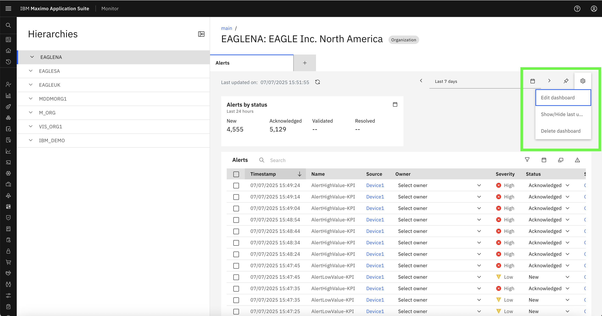

# Objectives
In this exercise, you will learn how to:

* Login as users with different roles
* Observe and compare UI behavior based on assigned Security Groups
* Understand how RBAC enforces access control in Monitor

---

*Before you begin:*  
This exercise assumes that you have:

1. Completed [Creating Security Groups](create_security_groups.md)  
2. Completed [Creating Users and Assigning Groups](create_users.md)  

---

RBAC controls how a user experiences the Monitor application. Based on their assigned Security Groups, users will see a **different UI**, and **different levels of functionality** will be enabled.

---

### Scenario 1: Readonly User Access

**User Info:**
- Username: `readonly_user`  
- Groups: `MONITOR_READ_ONLY`, `MAXADMIN`

**Expected Behavior:**
- Can **view the Dashboard pages**
- Cannot **create**, **edit**, or **delete** entries
- **Setup pages** like Security, Device Types, etc. are **not visible**

 

!!! info
    Notice that CRUD buttons (like Add/Edit/Delete) are not available, and Setup is hidden from the left menu.

---

- The User Can Only View The Dashboard and cannot make any changes:  

 
 

### Scenario 2: Normal User Access

**User Info:**
- Username: `normal_user`  
- Groups: `MONITOR_USERS`, `MAXADMIN`

**Expected Behavior:**
- Can access **Dashboard pages**
- Can perform **CRUD operations** on dashboards
- Cannot access Setup pages

 

!!! tip
    This role is ideal for operational users who manage dashboard data but should not modify system configurations.

---

- The user can access as well as Edit Dashboard  
 

### Scenario 3: Admin User Access

**User Info:**
- Username: `admin_user`  
- Groups: `MONITOR_ADMIN`, `MAXADMIN`

**Expected Behavior:**
- Full access to **Dashboard and Setup**
- Can create/edit/delete dashboards and setup pages.

 

!!! note
    Admins see all modules and can manage both users and system-level configurations.

---

- The User can perfrom CRUD operations on the Dashboard :  
 

- The User can access all the setup pages like Device Types, Integrations etc :  
   

- Integrations: 
 

### Summary Comparison of out of the Box security groups.

| Role           | Dashboard Access | CRUD Operations | Setup Access | Assigned Groups                    |
|----------------|------------------|-----------------|--------------|------------------------------------|
| Readonly User  | ✅ View only      | ❌ No            | ❌ No         | MONITOR_READ_ONLY, MAXADMIN        |
| Normal User    | ✅ Full access    | ✅ Yes           | ❌ No         | MONITOR_USERS, MAXADMIN            |
| Admin User     | ✅ Full access    | ✅ Yes           | ✅ Full       | MONITOR_ADMIN, MAXADMIN            |

---

Congratulations!  
You have successfully verified how user access behavior changes based on assigned RBAC roles.

---
