You should now have a good understanding of how alerts happen in Maximo Asset Monitor.  Now you will learn how to create acknowledge alert and create service requests to further investigate and resolve alerts in Maximo.  In this Exercise you will:

1.  Create a Maximo Service Connection so that Monitor knows which Maximo service to open service requests in.
2.  Acknowledge an Alert and create Service Request in Maximo so that the alert can be investigated and resolved.
3.  Resolve Service Request in Maximo.
4.  Resolve Alerts in Monitor.

You can create service request in IBM Maximo Enterprise Asset Management Service from an alert in Maximo Asset Monitor. In Maximo, a service request indicates that an asset or location in your enterprise needs some sort of attention. Once a service request has been created, there is a ticket associated with that request. If the service request has been validated and the asset requires a particular task, you can assign the service request a work order to specify the Exerciseor, materials, services, and tools to complete the particular task. In this Exercise exercise, you will learn how to connect a Maximo service to your Maximo Asset Monitor instance, create a service request, and assign that service request a work order.

#  Create Maximo Service Connection

1.  After logging into Maximo Asset Monitor, open up the hamburger menu and click on `Services.`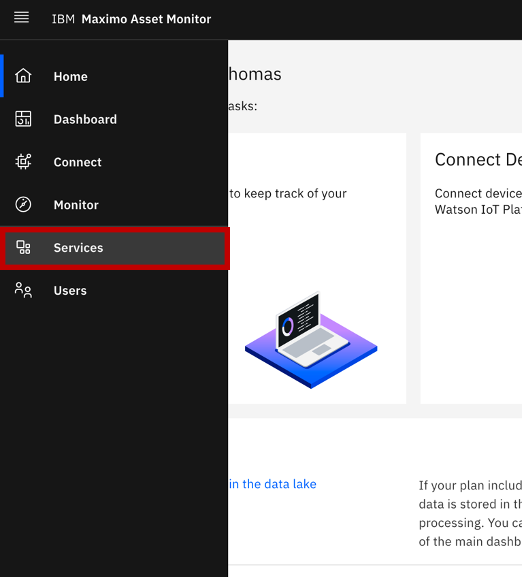 &nbsp;
2.  Once you reach the services page, click on the `Add Service` button.
3.  The page pictured below will pop up. In the `Service Name` field, name your Maximo service something easily identifiable. In the drop-down menu titled `Service Type`, choose Maximo. You will also need the host URL, the username, and the password you use to login to your Maximo service.  If you do not have this information, contact your system administrator. In the `Site dimension` and `Asset dimension` fields, use the prepopulated values `SITEID` and `ASSETID`, respectively. 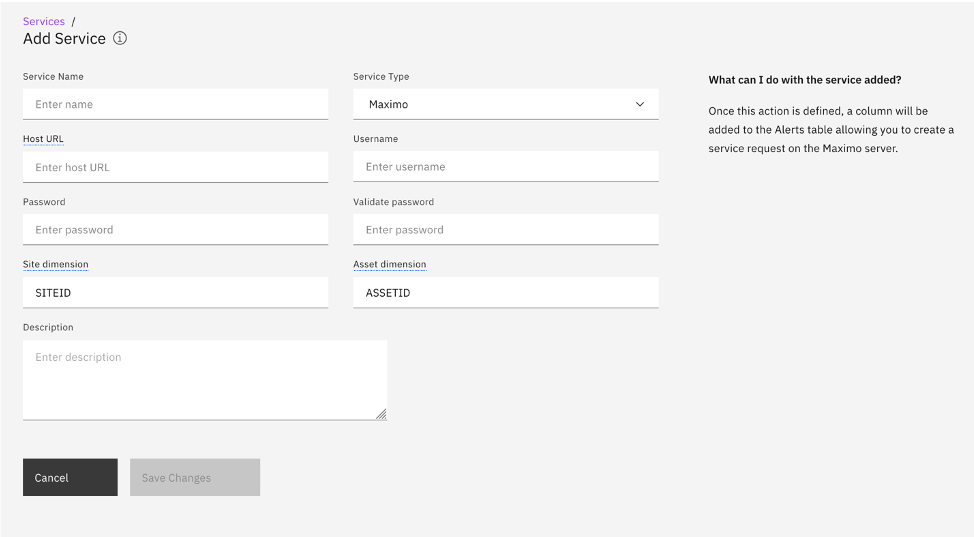 &nbsp;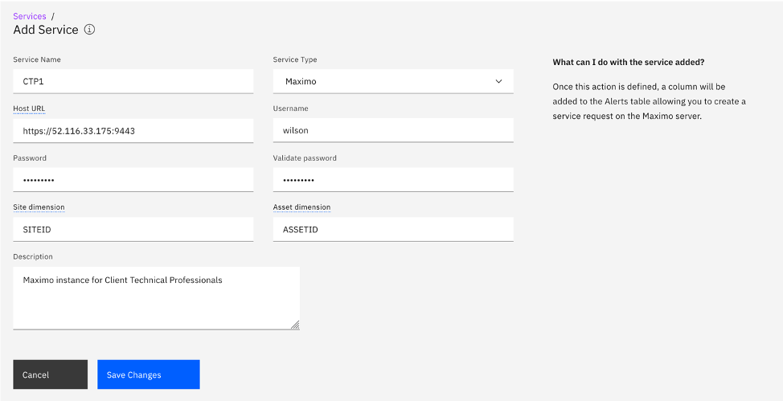 &nbsp;
4.  Next, click `Save Changes`. Your Maximo service should pop up underneath the title `Other Services` on the `Services` page.

#  Create Service Request from an Alert

In this section, you will need to have some alerts that have already been triggered for your Entity Type. If you have not yet learned how to create an alert in Monitor, please see the `Alerts` section in Exercise 2: Monitor Assets. You will also need to have an asset/assets with the same name as your entity/entities already set up in your Maximo service. If you do not know how to create an asset in Maximo, please see Appendix 1: Creating an Asset in Maximo.

1.  Select `Monitor` from the hamburger menu and go to your Entity Type.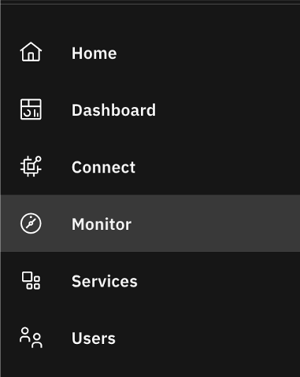 &nbsp;
2.  You are able to access a list of your alerts from your Entity Type homepage two different ways:
3.  You can see all of your alerts in a list on the `Alerts` tab of your Entity Type homepage. If you want to see all of your alert types together, choose this route to see your alerts.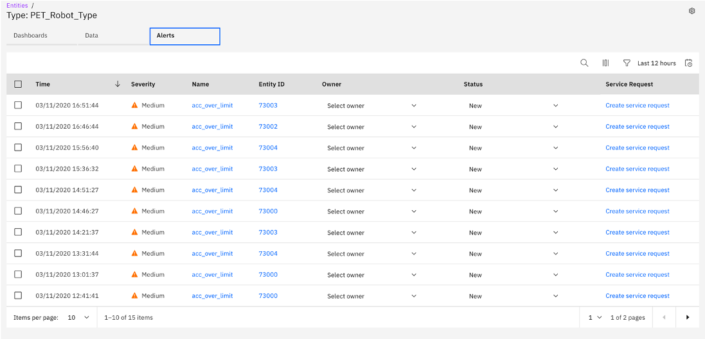 &nbsp;
4.  You can also go to the `Data` tab of your homepage, click on the carrot next to `Alerts` to see a list of your individual alerts. Click on one of your listed alerts. If you would rather see your alerts separated by alert type, choose this route to see your alerts.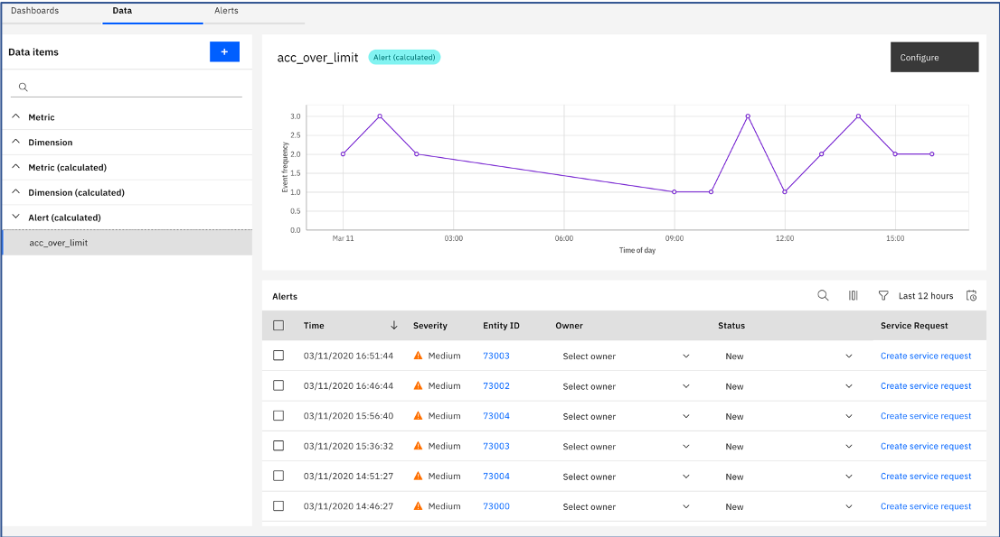 &nbsp;
5.  Choose an alert for which you would like to create a service request and assign yourself the owner. To assign yourself the owner, you will click the carrot next to `Select owner` and select yourself. Next, click the `Create service request` button on the row corresponding to the alert you have selected.
6.  The window shown below will pop up. Select the Maximo service you named in step three of the previous section from the dropdown menu titled `Maximo service`. Make sure the `Asset number` matches the asset name you created in Maximo. (It does not necessarily have to be a number like the name suggests.) In the `Site` field, enter the SITE corresponding with your asset in Maximo. 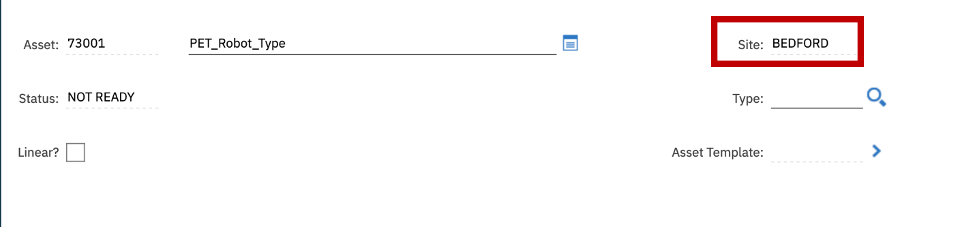 &nbsp;
If you would like to change the description or details, you are welcome to. Instead, use the prepopulated options. Finally, click `Create`. 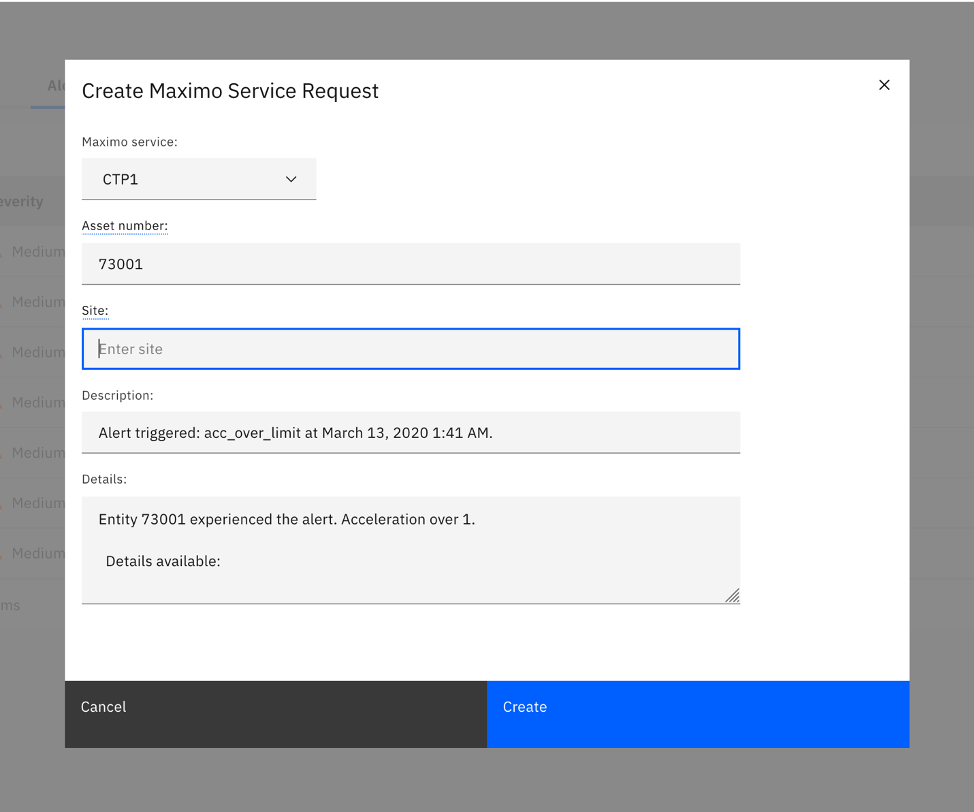 &nbsp;
7.  You will now see that a number has replaced the `Create service request` button. If you click on that number you will be directed to the service request you just created. You may be prompted to log in to your Maximo service. Use the username and password you were given by your system administrator. 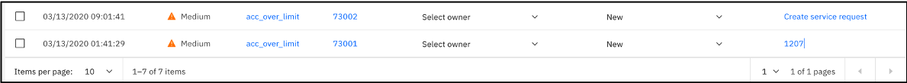 &nbsp;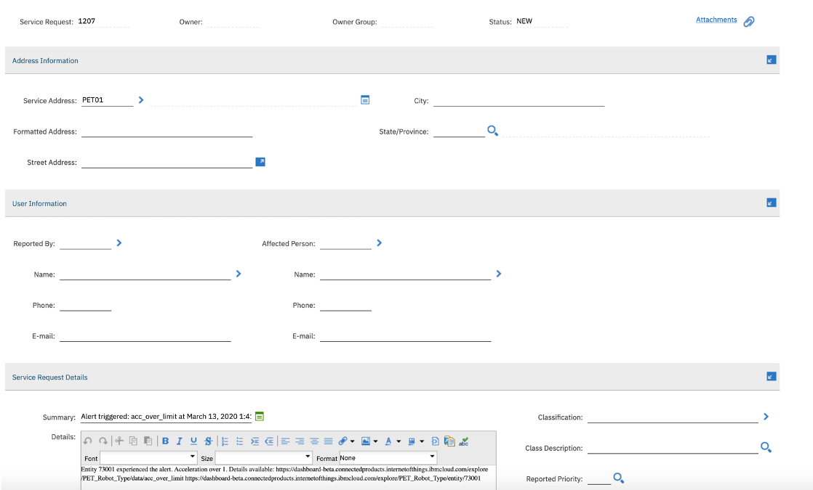 &nbsp;

#  Escalate Service Request to a Work Order"

1.  Escalate Service Request to Work Order.  Inside of the page for the Service Request you just created, you will see on the left side there is a list menu. Find `Create`. Hover over `Create` and click on `Work Order`.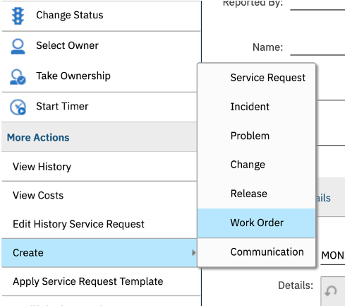 &nbsp;
2.  Select the repair facility of your choice when prompted and click `OK`.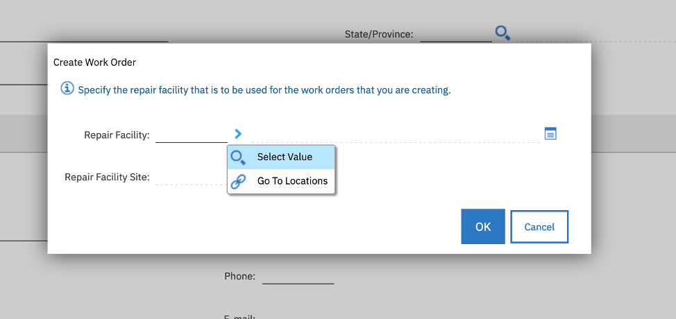 &nbsp;
3.  You have created a Work Order! On the top of the Service Request window, click `Related Records`. The Work Order you just created will be on this page. 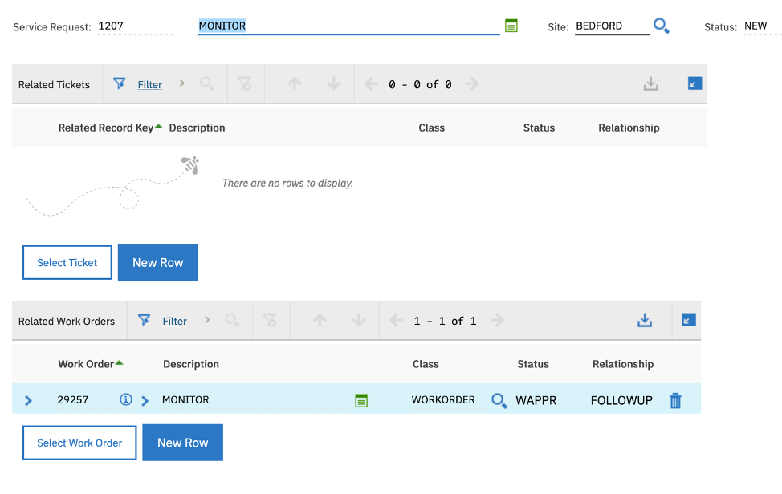 &nbsp;

#  Resolve Alert

1.  Go back to your Alert page in your Entity type and find the alert for which you made the service request and work order.
2.  Click on the drop down menu selected in the picture below. The menu should currently read `New`. 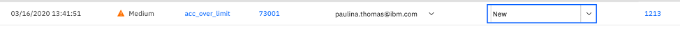 &nbsp;
3.  Change `New` to `Resolved`. 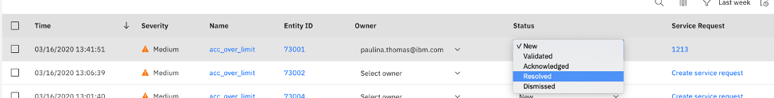 &nbsp;

Congratulations! You have successfully connected a Maximo service to Maximo Asset Monitor, created a Service Request in Maximo, assigned that service request to a Work Order, and finally resolved the alert in Monitor.
