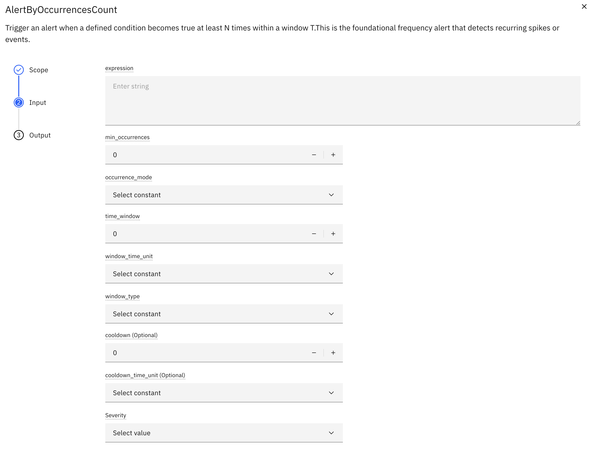
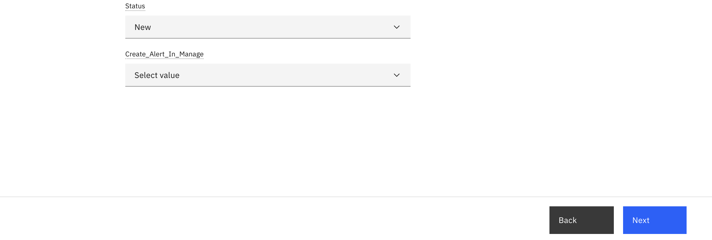

# AlertsByOccurrencesCount

## Objective

In this exercise, you will configure an AlertByOccurrencesCount to detect when a condition becomes true **N times within a time window T**. This frequency-based alert converts intermittent noise into meaningful pattern alerts.

---

## What is an AlertByOccurrencesCount?

An **AlertByOccurrencesCount** triggers when a defined condition becomes true at least **N times** within a sliding or tumbling window **T**. This is the foundational frequency alert that detects recurring spikes or events.

#### Goals

- **Convert Noise to Patterns**: Transform intermittent events into meaningful alerts
- **Reduce False Positives**: Filter out one-off anomalies
- **Detect Recurring Issues**: Identify persistent problems requiring attention

---
#### Execution Modes Supported

- **Sliding window**
- **Tumbling window**

---

#### Occurrence Mode 

- **RISING EDGE**
- **EVERY TYPE EVALUATION**

#### Occurrence Detection:

An **occurrence** represents a discrete event where the configured condition becomes true.

---

## Configuration Parameters

| Parameter             | Type | Required | Default | Description                                  |
|-----------------------|------|----------|---------|----------------------------------------------|
| **condition**         | string | Yes | -       | Boolean expression (e.g., `df['temp'] > 80`) |
| **min_occurrence**(N) | int | Yes | -       | Minimum number of breaches required          |
| **occurrence_mode**   | string | Yes | -       | `RISING_EDGE` or `EVERY_TYPE_EVALUATION`     |
| **time_window(T)**    | int | Yes | -       | Time window in minutes/hours/days            |
| **window_type**       | string | Yes | -       | `SLIDING` or `TUMBLING`                      |
| **cooldown**          | int | No | -       | Minimum time between consecutive alerts      |
| **cooldown_unit**          | String  | No       | Minute  | Cooldown Unit in minutes/hours/days                                  |

</br></br>

### UI Configuration

</br></br>


### Configuration Steps

### Step 1: Configure AlertsByOccurrencesCount

1. Navigate to device type from left menu
2. Select your device type and click **Edit**
3. Navigate to the **Calculated Metrics** tab
4. Click **Create Calculated Metric**
5. Select **AlertByOccurrencesCount** from the KPI catalog

### Step 2: Configure Alert Parameters

**Expression:**

```python
# Temperature threshold
df['temp'] > 80

# Multiple conditions
(df['temp'] > 80) & (df['humidity'] > 70)
```

**Occurrence Mode:**</br>

- **RISING_EDGE**: Record an occurrence only when the condition transitions from `false → true`.</br>
- **EVERY_EVALUATION**: Record every occurrences.

**Threshold(min_occurrences) (N):**
```
Example: 5 occurrences
```
- Higher N = fewer false positives, slower detection
- Lower N = faster detection, more sensitive

**Time Window (T):**
```
Example: 10 minutes
```
- Duration for counting occurrences within the evaluation window

**Window Type:**

- **Sliding Window:** </br>
   Continuous evaluation </br>
   More responsive </br>
   Better for real-time monitoring </br>
</br>
- **Tumbling Window:**  </br>
   Fixed intervals  </br>
   Better for reporting  </br>
   Clearer time boundaries  </br>

**Cooldown Period:**

```
Example: 15 minutes
```
- Prevents alert fatigue
- Allows time for corrective action

**Alert Actions:**

1. select alert severity (Critical, High, Medium, Low)
2. select alert creation status(New, Resolved, Acknowledge, validated) 
3. select create alert in manage(True, False)

---

## Example Timeline

### Occurrences Mode:

#### 1. RISING_EDGE:

Record an occurrence **only** when the condition transitions from `false → true`.

**Behavior:**
- If condition stays `true` across multiple data points, do **not** count additional occurrences
- A new occurrence is recorded only after condition becomes `false` and then `true` again

**Example:**

| Time | Condition | Occurrence | Notes |
|------|-----------|------------|-------|
| t1 | false | | |
| t2 | true | ✅ | First transition: false → true |
| t3 | true | | Still true, no new occurrence |
| t4 | false | | |
| t5 | true | ✅ | Second transition: false → true |


#### 2. EVERY_TYPE_EVALUATION:

At each event in the batch, if the condition is `true`, count as an occurrence.

**Example:**

| Time | Condition | Occurrence | Notes |
|------|-----------|------------|-------|
| t1 | false | | |
| t2 | true | ✅ | Condition is true |
| t3 | true | ✅ | Condition is true |
| t4 | false | | |
| t5 | true | ✅ | Condition is true |

---

### Execution Modes

**Sliding Window:**
- Continuously evaluates occurrences within a moving time window
- Window moves with each batch run
- More responsive to recent events

**Example:**

**Configuration:** </br>
- Condition: `temp > 80` </br>
- N = 3 occurrences </br>
- T = 10 minutes (window size) </br>
- Mode: EVERY_TYPE_EVALUATION </br>

**Example Timeline:**

| Time | temp | Condition | Occurrence | Window (10 min) | Count | Alert |
|------|------|-----------|------------|-----------------|-------|-------|
| 12:00 | 75   | false | | | 0 | |
| 12:02 | 85   | true | ✅ #1 | 11:52-12:02 | 1 | |
| 12:04 | 78   | false | | 11:54-12:04 | 1 | |
| 12:06 | 88   | true | ✅ #2 | 11:56-12:06 | 2 | |
| 12:08 | 72   | false | | 11:58-12:08 | 2 | |
| 12:10 | 90   | true | ✅ #3 | 12:00-12:10 | 3 | 🚨 **Alert** (Count resets to 0) |
| 12:12 | 79   | false | | 12:02-12:12 | 0 | |
| 12:14 | 86   | true | ✅ #1 | 12:04-12:14 | 1 | |
| 12:16 | 77   | false | | 12:06-12:16 | 1 | |
| 12:18 | 89   | true | ✅ #2 | 12:08-12:18 | 2 | |
| 12:20 | 91   | true | ✅ #3 | 12:10-12:20 | 3 | 🚨 **Alert** (Count resets to 0) |

**Key Characteristics:**
- Window continuously slides forward </br>
- At 12:10: Window is 12:00-12:10, contains 3 occurrences → Alert fires, **count resets to 0**</br>
- At 12:12: Window is 12:02-12:12, count is 0 (reset after alert)</br>
- At 12:14: New occurrence #1 detected, count = 1</br>
- At 12:20: Window is 12:10-12:20, contains 3 new occurrences → Alert fires, **count resets to 0**</br>
- After each alert, occurrence count clears and starts from 0</br>
- More responsive to recent patterns</br>

**Tumbling Window:**
- Fixed, non-overlapping time windows
- Better for reporting-like use cases
- Resets at window boundaries

**Example:**

**Configuration:**
- Condition: `temp > 80`
- N = 3 occurrences
- T = 10 minutes (window size)
- Mode: RISING_EDGE

**Example Timeline:**

**Window 1: 12:00-12:10**

| Time | temp | Condition | Occurrence | Count in Window |
|------|------|-----------|------------|-----------------|
| 12:00 | 75   | false | | 0 |
| 12:02 | 85   | true | ✅ #1 | 1 |
| 12:04 | 78   | false | | 1 |
| 12:06 | 88   | true | ✅ #2 | 2 |
| 12:08 | 72   | false | | 2 |
| 12:10 | 90   | true | ✅ #3 | 3 |

**Result:** Window closes at 12:10 with 3 occurrences → 🚨 **Alert Fired**

---

**Window 2: 12:10-12:20** (New window starts, count resets)

| Time | temp | Condition | Occurrence | Count in Window |
|------|------|-----------|------------|-----------------|
| 12:12 | 79 | false     | | 0 |
| 12:14 | 86 | true      | ✅ #1 | 1 |
| 12:16 | 77 | false     | | 1 |
| 12:18 | 89 | true      | ✅ #2 | 2 |
| 12:20 | 84 | true      | | 2 |

!!! note
      The temperature exceeded 80 at 12:20, this occurrence was not counted because the window type is rising edge. Only transitions where the condition changes from **false → true** are considered valid events

**Result:** Window closes at 12:20 with 2 occurrences → ❌ **No Alert** (< 3)

---

**Window 3: 12:20-12:30** (New window starts, count resets)

| Time | temp | Condition | Occurrence | Count in Window |
|------|------|-----------|------------|-----------------|
| 12:22 | 87   | true | ✅ #1 | 1 |
| 12:24 | 78   | false | | 1 |
| 12:26 | 91   | true | ✅ #2 | 2 |
| 12:28 | 75   | false | | 2 |
| 12:30 | 88   | true | ✅ #3 | 3 |

**Result:** Window closes at 12:30 with 3 occurrences → 🚨 **Alert Fired**

**Key Characteristics:**</br>
- Fixed, non-overlapping windows</br>
- Count resets at window boundaries</br>
- Occurrences from previous windows don't carry over</br>
- Better for periodic reporting</br>
- Clearer time boundaries</br>
- Less frequent alerts compared to sliding window</br>

---

### Comparison: Sliding vs Tumbling

| Aspect | Sliding Window | Tumbling Window |
|--------|----------------|-----------------|
| **Window Movement** | Continuous, moves with each evaluation | Fixed intervals, resets at boundaries |
| **Occurrence Carryover** | Yes, occurrences can span multiple evaluations | No, count resets each window |
| **Responsiveness** | High, detects patterns quickly | Lower, waits for window to close |
| **Alert Frequency** | Can be higher | Typically lower |
| **Use Case** | Real-time monitoring, immediate detection | Periodic reporting, scheduled analysis |

### When to Use Each Mode

**Use Sliding Window When:**
- You need immediate detection of recurring issues
- Real-time monitoring is critical
- Pattern detection should be continuous
- Example: Detecting repeated API failures, monitoring critical sensors

**Use Tumbling Window When:**
- You need periodic summaries or reports
- Clear time boundaries are important
- You want to avoid alert overlap
- Example: Hourly quality checks, daily performance reports, shift-based monitoring

---

## Backtrack Support

AlertsByOccurrencesCount supports backtracking to handle historical data scenarios, including data corrections and retroactive alert resolution.

### Use Case 1: Resolving Alerts After Data Correction

**Scenario:**</br>
1. Sensor sends incorrect high values, triggering an alert</br>
2. AlertsByOccurrencesCount fires (Status: **New**)</br>
3. Corrected data is uploaded via CSV file upload</br>
4. Pipeline runs in backtrack mode</br>
5. Alert status automatically updates from **New** to **Resolved**</br>

### How It Works

When you upload corrected historical data:

1. **Upload Corrected Data**: Use CSV file upload to replace incorrect values
2. **Run Pipeline in Backtrack**: Execute the pipeline in backtrack mode for the affected time range
3. **Re-evaluation**: The system re-evaluates the condition with corrected data
4. **Alert Status Update**: If occurrences no longer meet threshold N, alert status changes to **Resolved**

### Example: Data Value Correction

**Configuration:**
- Condition: `temp > 80`
- N = 3 occurrences
- T = 10 minutes
- Mode: RISING_EDGE

**Original Data (Incorrect):**

| Time | Original temp | Condition | Occurrence | Count |
|------|---------------|-----------|------------|-------|
| 12:00 | 75 | false | | 0 |
| 12:02 | 95 | true | ✅ #1 | 1 |
| 12:04 | 92 | true | | 1 |
| 12:06 | 88 | true | | 1 |
| 12:08 | 78 | false | | 1 |
| 12:10 | 91 | true | ✅ #2 | 2 |
| 12:12 | 77 | false | | 2 |
| 12:14 | 89 | true | ✅ #3 | 3 |

**Result:** Alert fires at 12:14 (Status: **New**)

---

**Corrected Data (After CSV Upload):**

| Time | Corrected temp | Condition | Occurrence | Count |
|------|----------------|-----------|------------|-------|
| 12:00 | 75 | false | | 0 |
| 12:02 | 85 | true | ✅ #1 | 1 |
| 12:04 | 76 | false | | 1 |
| 12:06 | 79 | false | | 1 |
| 12:08 | 78 | false | | 1 |
| 12:10 | 77 | false | | 1 |
| 12:12 | 77 | false | | 1 |
| 12:14 | 79 | false | | 1 |

**Result:** After backtrack, count = 1 (< N=3), Alert status changes to **Resolved**

---

### Use Case 2: Creating Alerts After Adding Missing Events

**Scenario:** </br>
1. Some sensor readings were not captured initially </br>
2. No alert was triggered </br>
3. Missing events are added via CSV file upload </br>
4. Pipeline runs in backtrack mode </br>
5. New alert is created (Status: **New**) </br>

### Example: Adding Missing Events

**Original Data (Incomplete):**

| Time | temp | Condition | Occurrence | Count |
|------|------|-----------|------------|-------|
| 12:00 | 75 | false | | 0 |
| 12:10 | 77 | false | | 0 |
| 12:20 | 79 | false | | 0 |

**Result:** No alert (insufficient data points)

---

**After Adding Missing Events:**

| Time | temp | Condition | Occurrence | Count |
|------|------|-----------|------------|-------|
| 12:00 | 75 | false | | 0 |
| 12:02 | 85 | true | ✅ #1 | 1 |
| 12:04 | 78 | false | | 1 |
| 12:06 | 88 | true | ✅ #2 | 2 |
| 12:08 | 77 | false | | 2 |
| 12:10 | 90 | true | ✅ #3 | 3 |
| 12:12 | 77 | false | | 3 |
| 12:14 | 79 | false | | 3 |
| 12:16 | 78 | false | | 3 |
| 12:18 | 79 | false | | 3 |
| 12:20 | 79 | false | | 3 |

**Result:** After backtrack, count = 3 (≥ N), **New alert created** at 12:10

---

### Benefits

- **Data Integrity**: Alerts reflect accurate data after corrections
- **Retroactive Analysis**: Historical patterns are correctly identified
- **Automatic Management**: No manual alert closure needed
---

## Summary

You have learned:

✅ occurrence-based alert concepts  
✅ Configure condition expressions and occurrence modes  
✅ Set appropriate N, T, and cooldown parameters  
✅ Handle sliding window evaluations  
✅ Handle Tumbling window evaluations  
✅ Understand post-alert reset events counts  
✅ Support backtrack scenarios  

---

## Next Steps

Proceed to [Exercise 3: Create Alert in Manage](create_alert_in_manage.md).

---

**Congratulations!** You have successfully configured AlertsByOccurrencesCount for frequency-based monitoring.
