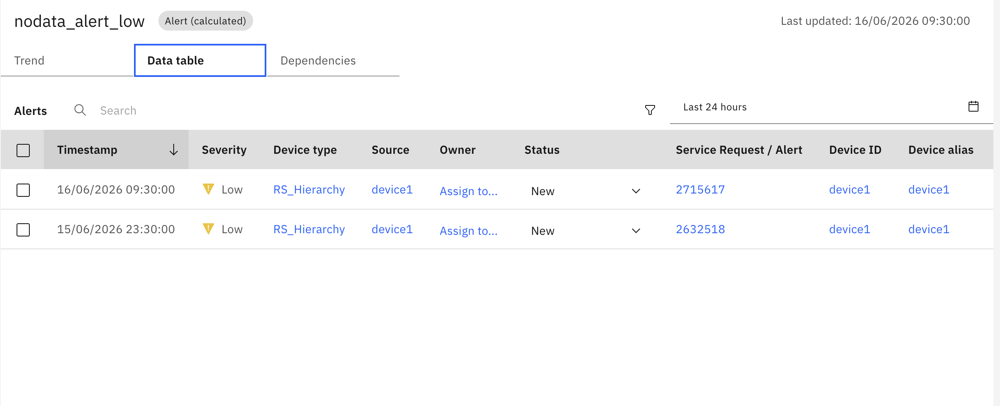

# Create Alert in Manage

## Objective

In this exercise, you will see Smart Alerts with Maximo Manage by enabling the **Create Alert in Manage** option. This integration automatically creates alerts in Maximo Manage, allowing you to view detailed alert information.

---

## What is Create Alert in Manage?

**Create Alert in Manage** is a configuration option available in both NoData Alerts and AlertsByOccurrencesCount that automatically creates corresponding alerts in Maximo Manage when triggered in Monitor.

### Key Features

- **Automatic Alert Creation**: Alerts are automatically created in Maximo Manage when triggered
- **Detailed Alert Information**: View comprehensive alert parameters and metrics
- **Status Synchronization**: Alert status updates in Monitor automatically sync with Manage
- **Direct Navigation**: Click alert action ID to navigate directly to Manage alert page

---

## Configuration

### Enabling Create Alert in Manage

When configuring either NoData Alert or AlertByOccurrencesCount, set the following parameter:

```
Create_Alert_In_Manage: True
```

This option is available in the UI configuration for both alert types.

---

## Alert Information in Data Table

Once an alert is triggered, you can view the created alert ID in the Data Table tab at any resource level under column name **Service Request/Alert** as shown below.

</br></br>

### Accessing Alert Details

1. Navigate to the Data Table tab for your device or device type
2. Locate the **Service Request/Alert** column
3. Click on the alert action ID
4. You will be redirected to the Maximo Manage alert page

---

## Alert Summary Details

When an alert is created in Maximo Manage, it includes comprehensive information about the alert configuration and current state.

### Common Alert Information

The summary is shown for every alert in Manage:

- **Alert Name**: Identifies the specific alert configuration
- **Resource Name**: Shows which Resource triggered the alert.
- **Status**: Current alert status (New, Resolved, etc.)
- **Severity**: Alert severity level (Critical, High, Medium, Low)
- **Relevant Metrics**: Current values of monitored data items

---

**Congratulations!** You have successfully configured Smart Alerts integration with Maximo Manage for comprehensive alert management.