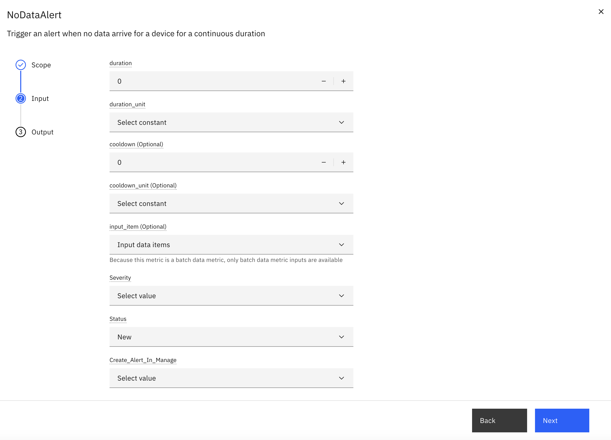

# NoData Alerts

## Objective

In this exercise, you will configure a NoData Alert to detect when devices stop sending data for a specified duration. This alert type is essential for identifying device offline conditions, connectivity issues, and sensor failures.

---

## What is a NoData Alert?

A **NoData Alert** triggers when data not arrive from a device for a continuous duration **D**. Unlike occurrence-based alerts that count condition breaches, NoData Alerts are **time-gap based** and detect silent periods in data streams.

### Use Cases

- **Device Offline Detection**
- **Sensor Heartbeat Monitoring**
- **Connectivity Outage**

---


## Configuration Parameters

| Parameter                  | Type    | Required | Default | Description                                                          |
|----------------------------|---------|----------|---------|----------------------------------------------------------------------|
| **duration**               | int     | Yes      | -       | Minimum time period without data before the first alert is triggered |
| **duration_unit**          | int     | Yes      | -       | Duration threshold in minutes/hours/days                             |
| **cooldown**               | int     | No       | -       | Minimum time between consecutive alerts                              |
| **cooldown_unit**          | String  | No       | Minute  | Cooldown Unit in minutes/hours/days                                  |
| **input_item**             | String  | No       | None    | Optional specific data item to monitor                               |
| **create_alert_in_manage** | boolean | Yes      | -       | Create Alert in Manage                                               |

---
</br></br>

### UI Configuration

</br></br>

---

### Configuration Steps

### Step 1: Configure NoData Alert

1. Navigate to 
2. Select your device type and click **Edit**
3. Navigate to the **Calculated Metrics** tab
4. Click **Create Calculated Metric**
5. Select **NoData Alert** from the KPI catalog

### Step 2: Set Alert Parameters

Configure the following parameters:

**Duration (D):**
```
Example: 5 hours
```
- How long to wait before triggering an alert
- Consider normal data transmission intervals
- Account for expected maintenance windows

**Cooldown Period:**
```
Example: 1 day
```
- Prevents alert spam during prolonged outages

**Data Item (Optional):**
```
Example: temperature_sensor
```
- Monitor specific data item instead of all device data

**Alert Actions:**

1. select alert severity (Critical, High, Medium, Low)
2. select alert creation status(New, Resolved, Acknowledge, validated) 
3. select create alert in manage(True, False)

---

## Example Timeline

### Scenario 1: Device Stops Sending Data

When no specific data item is configured, the alert monitors **all device data**.

**Configuration:**
- Duration (D) = 2 hours
- Cooldown = 3 hours
- Data Item = None (monitors all metrics)

| Time | Pressure | Temperature | Event |
|------|----------|-------------|-------|
| 12:00 | ✓ | ✓ | Data received |
| 12:04 | ✓ | ✓ | Data received |
| 12:05 | ✓ | ✓ | Data received |
| 14:05 | - | - | **Alert fires** (12:05 to 14:05 → 2 hours, no data for ALL metrics) |
| 17:05 | - | - | **Alert fires** (cooldown expired, still no data) |

**Key Points:**
- Alert triggers when **data not** arrives for **all metric**
- Both Pressure and Temperature must be missing
- If either metric sends data, the gap resets

</br></br>

### Scenario 2: Monitoring Specific Data Item

When a specific data item is configured, the alert monitors **only that data item**.

**Configuration:**
- Duration (D) = 2 hours
- Cooldown = 3 hours
- Data Item = Temperature

| Time | Pressure | Temperature | Event |
|------|----------|-------------|-------|
| 12:00 | ✓ | ✓ | Data received |
| 12:04 | ✓ | ✓ | Data received |
| 12:05 | ✓ | ✓ | Data received |
| 13:00 | ✓ | - | Pressure continues, Temperature stops |
| 14:05 | ✓ | - | **Alert fires** (12:05 to 14:05 → 2 hours, no Temperature data) |
| 14:30 | ✓ | - | No new alert (cooldown active) |
| 17:05 | ✓ | - | **Alert fires** (cooldown expired, still no Temperature) |

**Key Points:**
- Alert triggers when **Temperature** data is missing for 2 hours
- Only Temperature gaps are monitored

---

## Backtrack Support

NoData Alerts support backtracking to handle historical data scenarios and resolve alerts retroactively.

### Use Case: Resolving Alerts After Data Upload

**Scenario:** </br>
1. Device experiences an outage and stops sending data</br>
2. NoData Alert is triggered (Status: **New**)</br>
3. Missing data is uploaded via CSV file upload</br>
4. Pipeline runs in backtrack mode</br>
5. Alert status automatically updates from **New** to **Resolved**</br>

### How It Works

When you upload historical data that fills a data gap:

1. **Upload Missing Data**: Use CSV file upload to add data for the missing time period
2. **Run Pipeline in Backtrack**: Execute the pipeline in backtrack mode for the affected time range
3. **Automatic Resolution**: The system detects that data now exists for the previously missing period
4. **Alert Status Update**: Alert status changes from **New** to **Resolved**

### Example Timeline

| Time | Event | Alert Status |
|------|-------|--------------|
| 12:00 | Device stops sending data | - |
| 14:00 | NoData Alert fires (2-hour gap) | **New** |
| 15:00 | Upload CSV with data for 12:00-14:00 | **New** |
| 15:05 | Run pipeline in backtrack mode | **Resolved** |

### Benefits

- **Retroactive Resolution**: Alerts are automatically resolved when missing data is provided
- **Accurate History**: Alert records reflect the actual data availability
- **No Manual Intervention**: No need to manually close alerts after data upload


---

## Summary

You have learned how to:

✅ Understand NoData Alert concepts and use cases  
✅ Configure duration and cooldown parameters  
✅ Set up alerts for device offline detection  
✅ Handle backtrack scenarios  

---

## Next Steps

Proceed to [Exercise 2: Alerts by Occurrences Count](alerts_by_occurrences_count.md) to learn about frequency-based alerting.

---


**Congratulations!** You have successfully configured NoData Alerts for proactive device monitoring.
