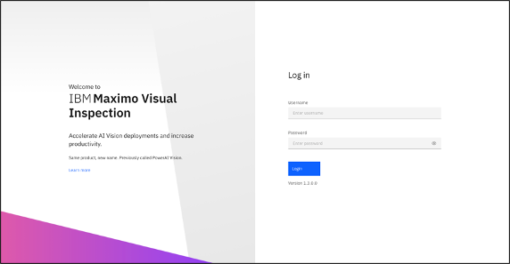
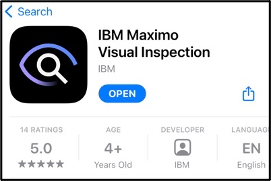
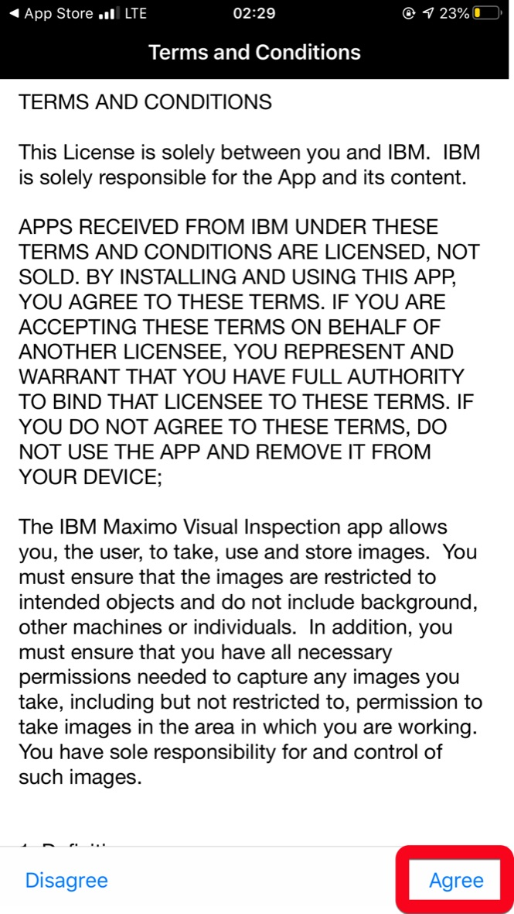
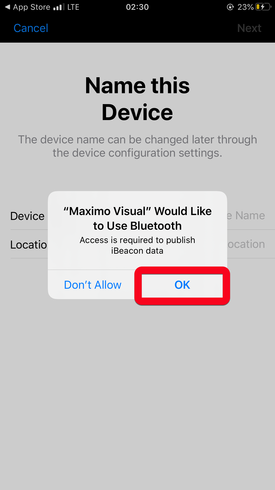
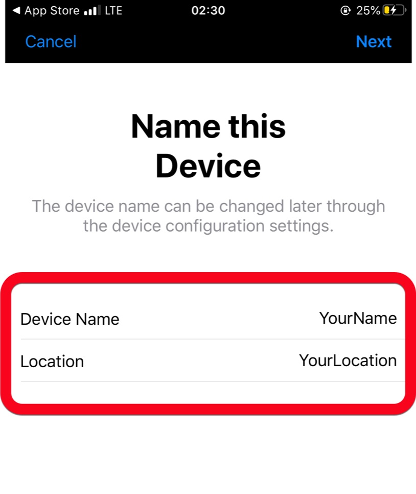
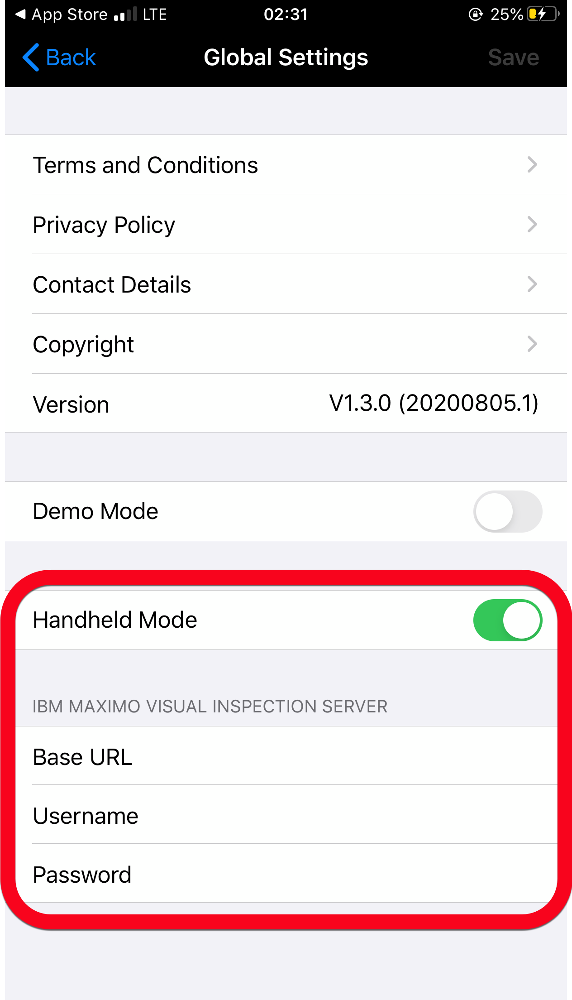

<h1><u>Before you begin</u></h1>

1. Please use the url and the credentials you were given to login.

    - <b>username</b>: See instructor.
    - <b>password</b>: See instructor.

    {: style="height:400px;width:600px"}

      

2. Bring two aluminum cans if possible. We have also provided pictures of aluminum cans not trained in the model if you do not have physical cans, which you can download in step 4.
    - 1-Dented
    - 1-Not Dented

     

3. Bring an <b>iOS</b> device with iOS 13 or later installed.

     

4. Download the contents in the Box folder and store the model and images in an easily accessible place. 

        Box url-> https://ibm.box.com/s/x6b81fphpqn4pctmejpvk29zlfgpvxqq

<u> Download Maximo Visual Inspection Mobile </u>

1. Go to the App Store. (Only available on iOS 13 or later.          
2. Type <b>IBM Maximo Visual Inspection</b> in the search bar.

    {: style="height:150px;width:250px;margin-left:40px"}

3. Download the app. 

4. Open the app and click on each of the buttons in red. 

    - <b>Terms and Conditions:</b>

    {: style="height:400px;width:250px;margin-left:40px"}

    - Allow MVI to access your camera, bluetooth, and photos.
    -  `Select` I already have an account:

    {: style="height:410px;width:200px;"}
    {: style="height:410px;width:200px;margin-left:5px"}
    {: style="height:410px;width:200px;"}

    - Enter your information in the `Name` and `Location` fields.

    {: style="height:300px;width:250px;margin-left:40px"}

5. Select the settings symbol {: style="height:30px;width:30px"} in the top left corner of your screen. Have `Handheld Mode` switched on and upload your credentials. 
    - <b>username:</b> See instructor.
    - <b>password:</b> See instructor.
    - <b>Base URL:</b> https://xxx.xxx.xx/visual-inspection/api 
    
See instructor for your base url - make sure <b>/api</b> is at the end.

    {: style="height:400px;width:250px;margin-left:40px"}
    
!!! tip
    Copy and Paste the information into an email you can access on the device, then Copy and Paste the information into MVI Mobile.  This will help avoid typos preventing you from connecting.

- Click `Save`.

    <h1>You are ready to <u>begin!</u></h1>

