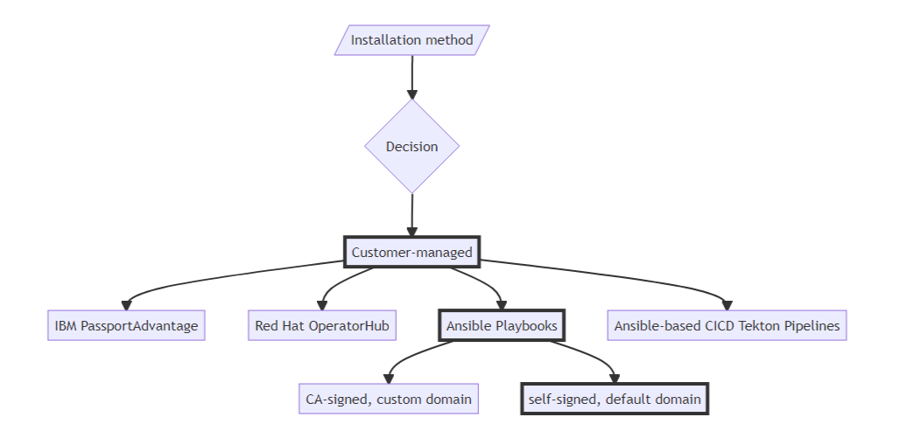

# Deployment

In this Exercise you will learn how to:

* Log in to the OpenShift using command line interface.
* Provide needed information for Ansible to store as variables.
* Install MAS using Ansible playbooks.

## Factors to Consider

This recipe employs self-signed certificates and Ansible playbooks to deploy MAS with the default OpenShift domain (suitable for sandbox and learning purposes with limited mobile support). If you want to use valid SSL (CA-signed) certificates with a domain name of your own, contact the author with your sales opportunity (suitable for production, proof-of-concept, and MVPs with full mobile support).



## Steps

!!! note

    [Watch demo video](https://ibm.box.com/s/1jvi1dwky5c7s33ckeizp9f5j4i7kpn2)

1\. OpenShift login. Locate your `oc login` token of the day and log in to OpenShift from inside the docker.  

```shell
oc login ...
```

2\. Update `env.sh` file. Use vi editor to fill out the `env.sh` file with the required information. Don't forget to save the file: `Esc+:wq!`

```
#------------------------------------------------
#▁ ▂ ▄ ▅ ▆ ▇ █ Fill in the blanks █ ▇ ▆ ▅ ▄ ▂ ▁
#------------------------------------------------
export IBM_ENTITLEMENT_KEY=
export UDS_CONTACT_EMAIL=
export UDS_CONTACT_FIRSTNAME=
export UDS_CONTACT_LASTNAME=
export SLS_LICENSE_ID=
```

3\. Deploy MAS. Run playbook (MAS Core) ⏰ 40 minutes.

```shell
./1_core.sh
```

4\. Deploy Manage (with Health). Run playbook (Manage) ⏰ 3+ hours. 

!!! bug

    Please note that this command will exit with error after about 30 minutes. When it happens, re-run the same command to resume.

```shell
./2_manage.sh
```

5\. Deploy Monitor. Run playbook (Monitor) ⏰ 1+ hours. 

!!! note

    Monitor script will provision Watson IoT and AMQ Kafka as part of its dependency.

```shell
./3_monitor.sh
```

6\. OPTIONAL: Install Cloud Pak for Data (for Watson Studio & ML). Run playbook (cp4d) ⏰ 4+ hours.

```shell
./cp4d.sh
```
