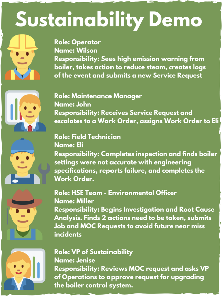

# Welcome to the IBM Maximo Sustainability Labs

These Sustainability Labs will walk through different use cases. Use Cases will be continually added, therefore stay tuned for more!

<!-- Use Case 1 - [MAS Environmental Monitoring](/sustain_mas/usecase1.md)  -->
# IBM Maximo Sustainability Use Case 1

Emission monitoring & regulatory compliance: Frequently record measured environmental data (Example: Nitrogen Oxides from Boiler) and monitor for deviation, dispatch service requests, managing the workflow, completing remediation work and long term corrective actions.

# Story

Managing and reducing emissions is one of the top priorities of the VP sustainability. His company sets some ambitious sustainability goals, and he wants to make sure their emissions are managed and reduced to meet their corporate goals. The Operations team has a responsibility to ensure that the operation of the process plant for which they are responsible meets all regulatory emission requirements. Emission events can result in fines, complaints from the local population and damage corporate reputation. The HSE team tracks environmental incidents as a leading indicator of potential sustainability issues and reports on these to the VP Sustainability. Plant operations personnel are tasked to report both incidents and near miss events as part of the incident management system in place at the plant. They will generate Service Requests to maintenance for follow up work associated with an incident. The Maintenance Manager assigns a high priority to work associated with safety and environmentally critical assets. All incidents on environmentally critical equipment require mandatory root cause failure analysis. A corrective action process is in place to address issues identified by the analysis process. This feeds into the plant's management of change process. Operations, HSE and Maintenance collaborate closely to review and manage changes. One of the recommended changes arising from the incident involves investment in new equipment to reduce emissions. The VP Operations and VP sustainability are included in the review process.

# Personas

{:style="height:800px;width:400px;margin-left:100px"}

---

**Updated: 2021-11-07**

---