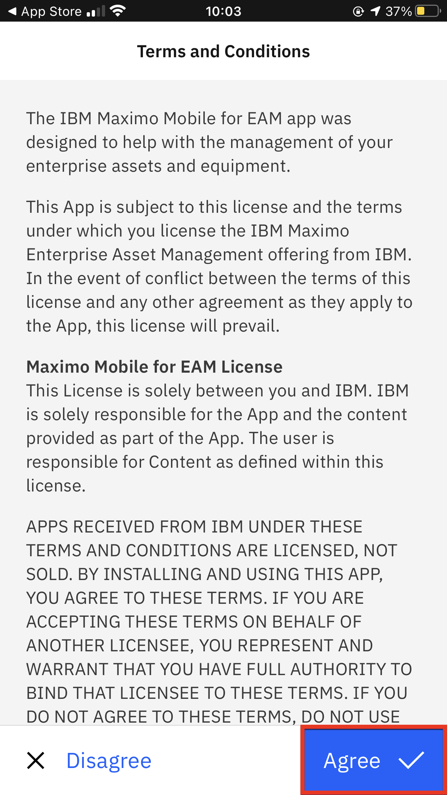
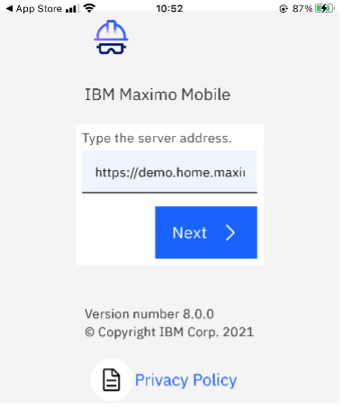
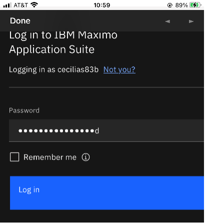
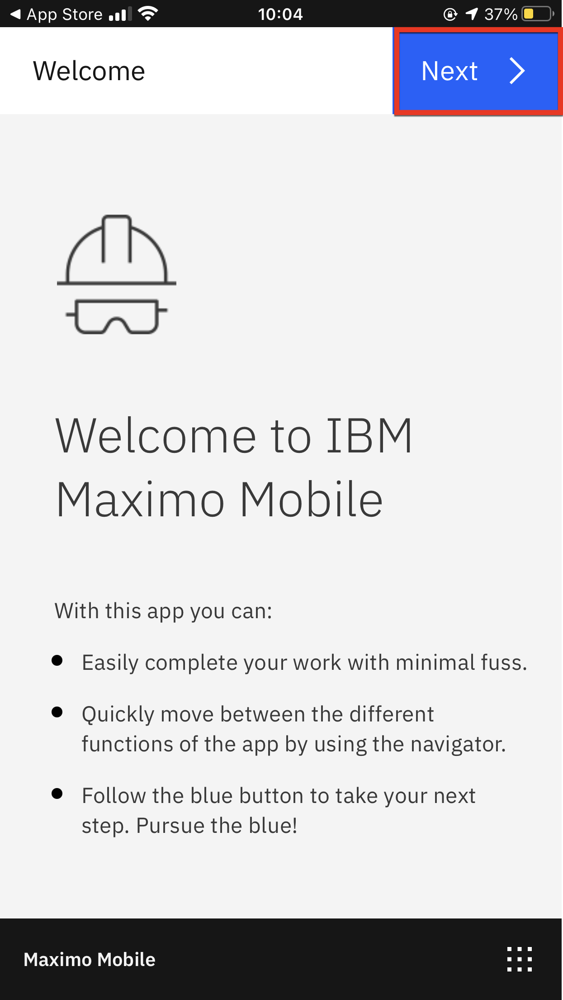
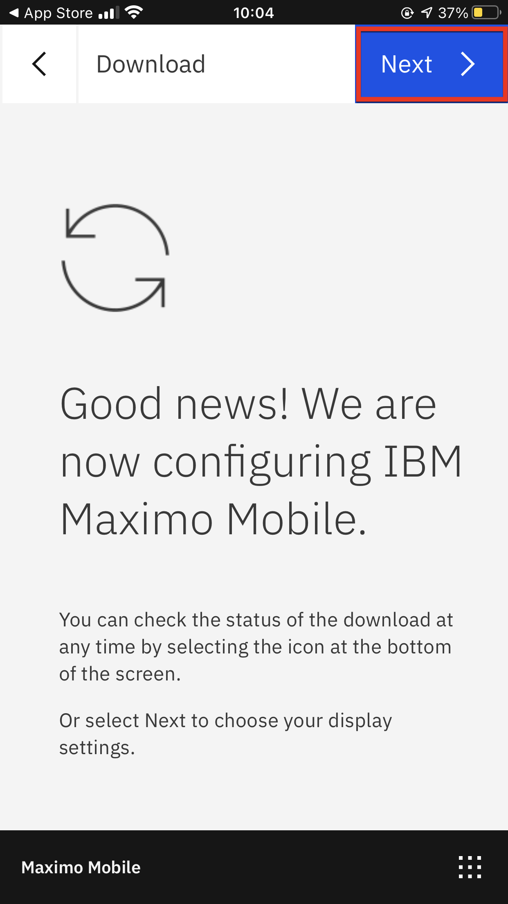
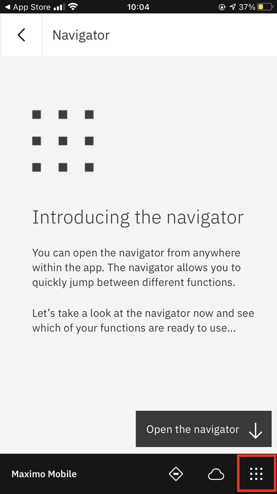
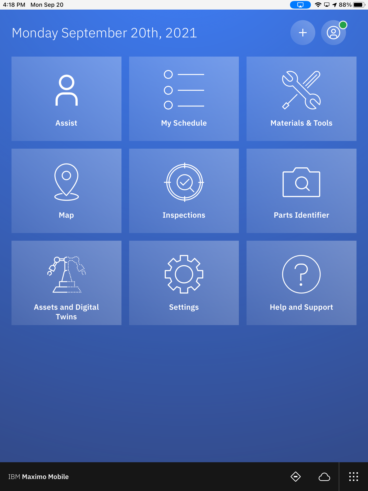

# Pre-Requisite Instructions

Here are the required pre-requisites for this lab.

# All Exercises

All Exercises require that you have:

1.  A computer with a Chrome browser and internet connectivity.

2.  User access to a Maximo Application Suite environment. 
Your Exercise facilitator should have provided you with the information on your access.

3.  Test your access to the Maximo Application Suite environment.

4. A mobile device.

# Mobile

<b>Get the following:</b>

1. Download <b>Maximo Mobile</b> application in your application store, accept all the terms and conditions and allow the app to send you notifications.

    {: style="height:200px;width:250px;margin-left:40px"}

     
2. After you finish downloading the app from your app store Select `Agree` to the terms and conditions.

    {: style="height:400px;width:250px;margin-left:40px"}

      
3. Upload URL and credentials into the app. After you upload the URL, the login for MAS will pop up. 

    {: style="height:200px;width:250px;margin-left:40px"}
    {: style="height:200px;width:250px;margin-left:40px"}

      
4. Select `Next` for the next two screens.

    {: style="height:400px;width:250px;margin-left:40px"}
    {: style="height:400px;width:250px;margin-left:40px"}

      
5. Open the navigator.

    {: style="height:400px;width:250px;margin-left:40px"}

      
6. Wait for data to finishing loading. The tiles will build and the labels will go from grey to white as the data loads.  Wait until all the tiles appear white before proceeding. 

{: style="height:350px;width:250px;margin-left:40px"}

!!! note
    If you would like to show this software on your computer you can use [Quicktime for macOS](https://support.apple.com/guide/quicktime-player/welcome/mac) or [Reflector](https://www.airsquirrels.com/reflector) as software to reflect your phone screen.

