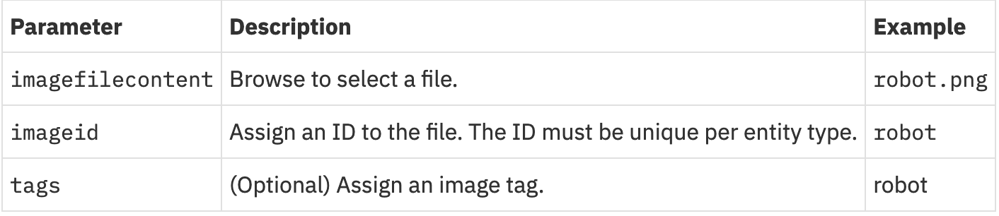

# Create Image Card

**Please complete the Value Cards Lab before attempting this lab. Some of the JSON configuration you will use here is flushed out in that section.**

In Maximo Asset Monitor, images can add a tremendous amount of value to data visualization when paired with graphs, tables, and value cards. Using a REST API call, you are able to push an image of your choosing into the Monitor data lake and display this image on your dashboards. You are also able to place icons which called hotspots on the image cards. These icons are tied to data from individual sensors or an aggregate of all of the sensors on a summary dashboard. Inside of the JSON configuration for the image card, you are able to set alert conditions that change the icon on the hotspot.
 &nbsp;

**Here is what you see when you click on one of the hotspots.**

 &nbsp;

The image card above displays an occupancy use case. Individual occupancy sensors have been tied to each hot spot to indicate whether seats in a meeting room in the Munich IoT center are occupied. The image above shows a much more complicated image card with hotspots than you will be creating in this lab, but this example is something that you could use eventually in the real world.

In this lab, you will learn how to select a photo for your image card, push your image into the Monitor data lake using a REST API call, and finally display your image card on a dashboard in Monitor. You will need Postman for this section. Please download the application at this link if you have not already: https://www.getpostman.com/
## Upload Image to Monitor Datalake
### Choose Image
1. Choose an image that allows you to use hotspots to tell a meaningful story. For example, choosing a floor plan of a factory floor where you can tie hotspots to assets on the floor would tell an important and meaningful story.
2. Choose an image that is **smaller than 1MB**. Your API call will not be successful if you try to push a larger file.
3. These are the types of files that you can push into the Monitor data lake.
 &nbsp;
### Obtain API Key
1. Open up your Maximo Asset Monitor tenant.
2. Open up the hamburger menu on the left side and select `Services`.
 &nbsp;
3. Next to `Watson IoT Platform Service`, click `View Details` and then click  `View More`.
 &nbsp;
4. Copy and paste the `API Key`and `API Token` into a Notes application of your choosing. It is good to save this information in a place that is easy to access. You will most likely use this API Key and Token again.
 &nbsp;
### Push Image to Data Lake using Postman
1. Open up your `Postman` application.
2. In the top left corner you will see a button that says `+New`. Click on the `Request` button. Name your Request and create a Collection to place the Request.  Click the dropdown menu inside the red box in Postman to classify this API Call as a `POST` Request.
 &nbsp;
3. Copy and paste this link into the field where it says “Enter request URL”: `https://api-{{geo_country_code}}.connectedproducts.internetofthings.ibmcloud.com/api/images/v1/{{tenantID}}/entityType/{{entityTypeName}}` You will need to replace the text in double curly braces `{{}}` with data associated with your Monitor workspace. First, you will need to replace `{{geo_country_code}}` with your specific country code. You can find your country code in your Monitor URL. The beginning of your URL will be `https://dashboard-{{geo_country_code}}`, either `us`,`uk`,`de`, or `beta`. Next, you will need to replace `{{tenantID}}` with your Maximo Asset Monitor Tenant ID. You can find your tenant ID in the top right corner of your Monitor webpage underneath your IBMiD. Last, you will need to enter the name of your Entity Type in place of `{{entityTypeName}}`.

 &nbsp;
 &nbsp;

4. Now that you have modified the request URL, we will add the header. Please have handy the API Key and Token you obtained earlier. Add this information into the `Header` tab, :

 &nbsp;
 &nbsp;

5. Now, navigate to the `Body` tab and the select `form-data` radio button.

 &nbsp;

6. Enter the form data specified below. Make sure to select `File` from the drop down button next to your `imagefilecontent`. This option will allow you to select the image file you chose in the first section of this lab.

 &nbsp;
 &nbsp;
 &nbsp;

7. Click the blue `Send` button to send your request. You should receive a `200 OK` message. If you do not, make sure that everything in this section has been entered correctly. If this work is to no avail, contact your administrator.

 &nbsp;
## Display Image Card on Dashboard
Now that you have pushed the image of your choice into the Monitor data lake, you will now need to create a JSON object for the image card you wish to display. In this JSON code, you will tell Monitor what data to show, where to show that data, and how you want the data to be shown. The JSON code that will be shown in the later steps corresponds with the summary dashboard shown below:

 &nbsp;
### Export Dashboard JSON
1.
### Create Image Card JSON Object
1. Please copy and paste the JSON code block below into the top of your `cards` array.
 &nbsp;
``` yaml
{
            "id": "starter-image-card",
            "size": "LARGE",
            "title": "Sourdough Starter Environment",
            "type": "IMAGE",
            "content": {
                "alt": "Sourdough Starter Environment",
                "zoomMax": 1,
                "image": "starter",
                "hotspots": [
                    {
                        "icon": "icon--info--solid",
                        "color": "'#0F0",
                        "content": {
                            "title": "Ambient Temperature",
                            "description": "Curent Reading",
                            "attributes": [
                                {
                                    "dataSourceId": "ambient_temp",
                                    "label": "Temperature",
                                    "unit": "C"
                                }
                            ]
                        },
                        "locations": [
                            {
                                "x": "66",
                                "y": "50"
                            }
                        ],
                        "thresholds": [
                            {
                                "dataSourceId": "ambient_temp",
                                "comparison": ">=",
                                "value": 27,
                                "color": "red",
                                "icon": "icon--warning--solid"
                            }
                        ]
                    }
                ]
            },
            "dataSource": {
                "attributes": [
                    {
                        "aggregator": "last",
                        "attribute": "ambient_temp",
                        "id": "ambient_temp"
                    }
                ],
                "range": {
                    "type": "rolling",
                    "count": -24,
                    "interval": "hour"
                }
            }
        },
```
### Upload Your Image Card JSON
