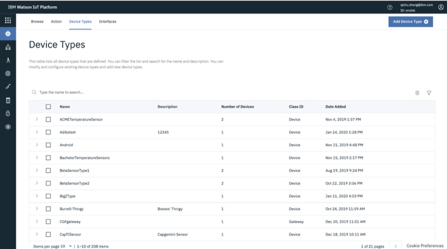
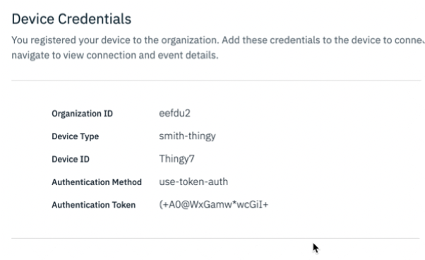
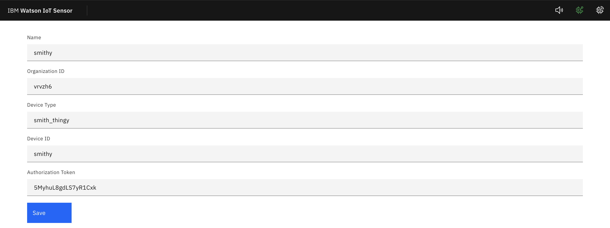
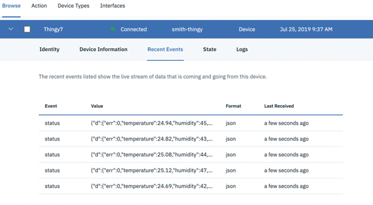
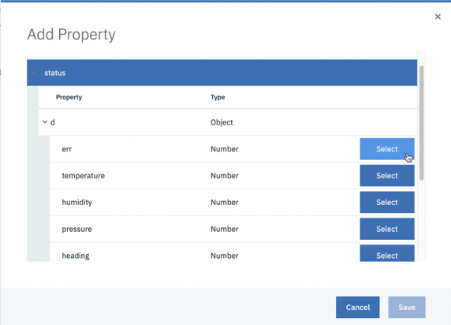
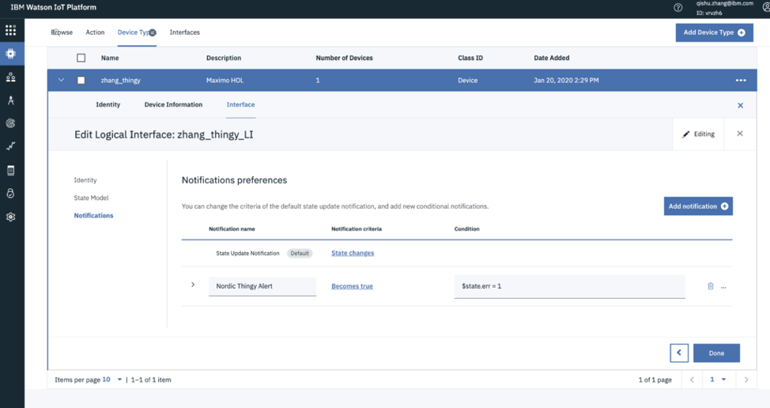
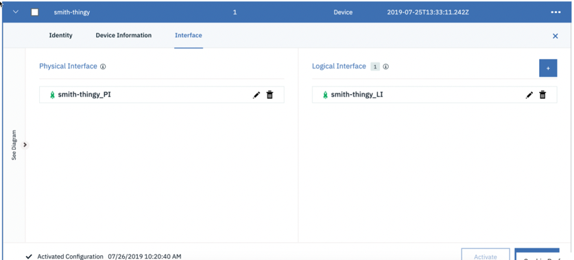

# Objectives
In this lab you will learn how to:

* Connect physical devices to Monitor
* Map device Physical Interfaces to Logical Interfaces
* Create realtime Rules and Actions on device events
* Understand how device data is stored
---
*Before you begin:*  
This lab requires that you:

1.  Have a Nordic Thingy. You can [purchase](../facilitator_instructions) Nordic Thingy.  
2.  Have completed the pre-requisites required for [all labs](../facilitator_instructions)
---
#  Connect a Physical Device
Now that you have done some initial exploring of the IoT Platform and you have connected a simulated device, it’s time to connect a real, physical device. For this exercise you will use a Nordic Thingy.  Learn more about the Nordic Thingy and its various sensors [here](https://www.nordicsemi.com/Software-and-tools/Prototyping-platforms/Nordic-Thingy-52)

## Connect Nordic Thingy to the Internet
Let’s connect the a Nordic Thingy to the internet using Google Chrome on your computer. We are using Google Chrome because it has a built in Bluetooth listener.  Using the connectivity page below you can connect your Nordic Thingy device to the internet and the Maximo Asset Monitor Cloud Service. You first need to pair the Thingy via Bluetooth to your computer.    

1.  Carefully remove the rubber overlay to find the power switch next to the micro-usb port.  A blue light should illuminate when the device is powered up.
2.  Power on the Nordic Thingy. Push the tiny switch to the left of the micro-web port
3.  Use Bluetooth in the Google Chrome Browser to connect your device to the internet.  Open a tab with this web address:  [https://nrf52t-v2.mybluemix.net/](https://nrf52t-v2.mybluemix.net/).
4.  This method will only work on Google Chrome as it has a built in Bluetooth listener. Below is the connectivity page you’ll need to revisit if you get disconnected at any point. you’ll need to revisit if you get disconnected at any point. Click `Connect` button.
&nbsp;
5. In the list of devices, find the one matching your device, select it and click `Pair`. You may need to rename the Thingy if you are in close range with others also using their own Thingy.

6. 	Once paired, a form will pop up. The form's presence indicates that the Thingy is connected to your computer via Bluetooth. In order to connect the Thingy to the IoT Platform, we will need to obtain the information to fill in missing fields in the form. We will obtain this information in the next section.

## Connect Nordic Thingy to Maximo Asset Monitor
The Nordic Thingy has connectivity to the internet.  You must first register device types and then devices with the IOT Platform service included with Maximo Asset Manager before they can securely send and persist data there.

1.  Navigate to and bookmark the Maximo Asset Monitor Dashboard page.  You will use this throughout the lab. [https://dashboard-beta.connectedproducts.internetofthings.ibmcloud.com/preauth?tenantid=Monitor-Demo&APM=true](https://dashboard-beta.connectedproducts.internetofthings.ibmcloud.com/preauth?tenantid=Monitor-Demo&APM=true)  You are put on the Home screen
2.	Log in to the Monitor.  Click `Login` button.  See `Before You Begin` section in this lab if you don't have an IBM ID to login or having trouble accessing the environment.
&nbsp;
3.  After logging in, you’ll land in Home Screen.”
&nbsp;
4.  Click `Services` tab (fifth icon in the side menu)
 &nbsp;
5.  Next to the `Watson IoT Platform Service` title, click `View Details`. A new window will open. &nbsp;
 &nbsp;
6. Click `View More`. Copy and paste the link of the `Source URL` into a new tab in your browser.
 &nbsp;
 &nbsp;
7.  A new page will open. Navigate to the `Device Types` tab
 &nbsp;
8.  Click `Add Device Type` button in the top right corner.
 &nbsp;
9.  Now create a new device type and name it `<your last name>_thingy`. For example, `smith_thingy.` In the figures below, you will see that the device type name has a dash in it. DO NOT PUT A DASH OR PERIOD IN YOUR DEVICE TYPE NAME. There is an issue in Monitor right now where the pipeline will break if there is a dash or period in your device type name.
 &nbsp;  
 &nbsp;
10.  Click `Next` until you get past `Finish`. You’ve finished creating a device type.
11.  Now you will register a new device using the `Device Type` you just created. Make sure to name the device the same name as your Thingy from the earlier step.  Navigate back to the `Browse` tab and `Add Device`
 &nbsp;
 &nbsp;
 &nbsp;
12.  Once you finish creating the device, make sure you copy and make note of the device credentials!  Your device must provide device credentials to connect to the IOT Platform Service.
 &nbsp;
13.  A Nordic Thingy also needs the IOT Platform tenant organization ID to connect to the IOT Platform Service.   To find the `Org ID` look in the top right of the screen to see your `Org ID` or the browser URL. Make note of the `Org ID` for use in the next step.
 &nbsp;
14.  Navigate back to the Thingy page within your Chrome Browser showing the sensor values and place the `Organization ID` and the `Authorization Token` into the corresponding fields in the form.
 &nbsp;
15.  Click the `Save` button to write the token to the Thingy. You should see the IoT Platform service connection status indicator will turn green if successful.
 &nbsp;
16.  You should also now see data flowing from the Thingy to your corresponding Device ID in the IoT Platform service back in the `Devices` tab.
&nbsp;
17.  Flip the Thingy upside down to create an error condition. It will beep and the light will turn red. Click on one of the rows to see the vent payload json file. Notice the `err` value in the payload changes to 1.
&nbsp;
18.  Press the large black button on the top of the Thingy to clear the error.
---
**Note:**
This exercise demonstrated how to manually add a device to Maximo Asset Monitor.  You would most likely  programatically add devices using the included Watson IOT Platform Service [REST APIs](https://www.ibm.com/support/knowledgecenter/SSQR84_monitor/iot/references/ref_apis.html) and [Python SDK](https://ibm-watson-iot.github.io/iot-python/application/api/registry/devices/).
---

# Interfaces, Rules and Notifications
You will create an alert notification when the Nordic Thingy has an error condition.  In this next section you will learn how you can:

  *  Create [physical interfaces](https://www.ibm.com/support/knowledgecenter/SSQR84_monitor/iot/platform/GA_information_management/im_ui_flow.html#gs_web)
  *  Create [logical interfaces](https://www.ibm.com/support/knowledgecenter/SSQR84_monitor/iot/platform/GA_information_management/im_ui_flow.html#gs_web)
  *  Define conditional realtime [rules and notifications](https://www.ibm.com/support/knowledgecenter/en/SSQR84_monitor/iot/platform/reference/embeddedrules/index.html)&nbsp;
&nbsp;

## Create a Physical Interface
1.  Make sure your Nordic Thingy is turned on and actively sending sensor data to the IoTP service. You may need to reconnect the Thingy in the Chrome browser using this [web link](https://nrf52t.mybluemix.net/?edit) and steps provided earlier.
2. Check if the Thingy is connected.  Click `Browse` tab in the IoT Platform service and searching the devices list for device status and recent events.
 &nbsp;
3.  Navigate to the device type for your Thingy and click `Interfaces` tab. Make sure `Advanced Flow` is selected and click `Create Physical Interface` button.
 &nbsp;
4.  Leave the default name for the physical interface and then click `Next`.
5.  Click `+ Create event type` button on the next page. If your Nordic Thingy is still actively sending events, then you should see the `status` event show up.
6.  If the `status` event does not automatically appear, check the connectivity back in `Browse` in the device list. Select it and then click `Add.`
7.  Click `Done` to complete the creation of the physical interfaces.
 &nbsp;

## Create a Logical Interface
1.  Next, click `+ Create Logical Interface` button to begin creating the logical interface. Leave the default name as is and click `Next`
2. Click `+ Add Property` button, expand the `d` and select and save the `err` property.
 &nbsp;
 &nbsp;   
3.  Let’s do the same for “temperature”, except this time we’ll use the mapping field to convert the temperature from Celsius to Fahrenheit using [JSONData script functions](https://docs.jsonata.org/expressions).  Select `add` property  
4.  Select `temperature`
5.  Then in the mapping field, click `pencil` icon to edit
6.  Add the following equation: `d.temperature * 1.8 + 32`. Notice that to input the numbers `1.8` and `32` you have to first select the `Value` operator. Another option is to switch the `Advanced Editor` button and paste the formula.  If you mistype it may cause a syntax error so be careful.
7.  Click `green check` mark when complete
8.  Click `save`
 &nbsp;   
9.  Add the remaining properties. You should see the following before clicking `Next`
 &nbsp;   
9. Click `Next` to move onto `Notifications`. Notifications allow you to take action when certain conditions occur.
10. Change the `State Update Notification` criteria to `State Changes.` This will send data to your Logical interface only when the value changes.   Make sure to hit the `Apply` button to save changes. If you want to send the event all the time even when the values are the same as previous events select `All events`.
 &nbsp;   
 &nbsp;   
11.  Click `Add Notification` button. This will raise a notification event in IOT Platform when the Thingy’s error condition is set to `1`
12.  Enter the Name, description, criteria and condition as shown below.`$state.err = 1`
13.  Click `Apply`
14.  Click `Done`
 &nbsp;  
15.  The interface creation is almost complete. Back in the interface view, click `Activate` button and activate the interfaces. If successful, you should see a green rocket ship icon next to each interface.
 &nbsp;  
16. You can check to see if your interface is working, by browsing to your device, select the `State` tab and switch the interface to your newly created interface. Temperature should now be shown in Fahrenheit.
 &nbsp;  

# Store Data
This next exercise focuses how and what database tables your device data is stored in.  Make sure you have completed the earlier exercises in this lab. You should already have device type with an active physical and logical interface and that you have at least one device of that type sending data.

1.  You can check if your device is connected and sending data through an interface by browsing devices in the IoT Platform service and checking your devices status, recent events and state.  Look at logs tab for troubleshooting issues.  You should see values update when look at the state interface.  Make sure you Nordic Thingy is powered up and sending data through Chrome Bluetooth connection.
 &nbsp;
2. Device data flows through a physical device type, transformed into a logical interface and stored in a time series database table within DB2 Warehouse called `IOTANALYTICS_<Device Type Name>`.  To see the table go back to the Watson IoT Platform window containing Monitor then click `Services` on the hamburger menu. [tab](https://dashboard-beta.connectedproducts.internetofthings.ibmcloud.com/preauth?tenantid=Monitor-Demo).
 &nbsp;
3. Click `View Details`
 &nbsp;
---
**Note:**
If when you click on `View Details`, you see fields that say admin only, please contact an administrator on the account to give you your respective DB2 link, username, and password. If instead of DB2 Warehouse, your tenant uses PostgreSQL, download DBeaver and enter the information given in the `View Details` tab. More information on Maximo Asset Monitor and PostgreSQL can be found [here](https://www.ibm.com/support/knowledgecenter/SSQR84_monitor/iot/developing/data_access_postgres_mon.html)
---
4. Next to Db2 Warehouse on Cloud, and click `Launch`
 &nbsp;
5. Copy and paste the `username` and `password` from the `View Details` window into the Db2 login page.
 &nbsp;
5. The DB2 page opens in another tab.  You may see a second log in dialog labeled `Attention` to change your DB2 password. Ignore the second login dialog.
6. On the DB2 Click top left hamburger button.
 &nbsp;
7. Under `Explore` click `tables` -> `BLUADMIN` Find your `IOTANALYTICS_<Device Name>` table. Click `View Data` button to see the data.  
 &nbsp;

Congratulations you have successfully connected a device and have it sending and storing data in Maximo Asset Monitor.  In the next lab you will view the available dashboards and create new dashboards to monitor your Thingy.
