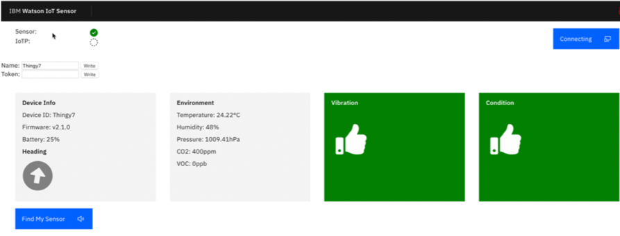
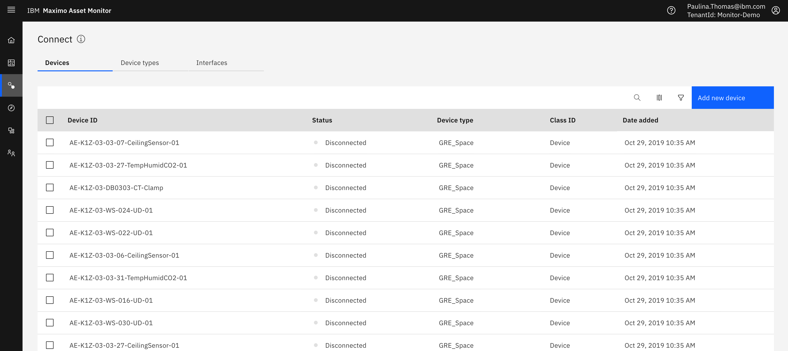
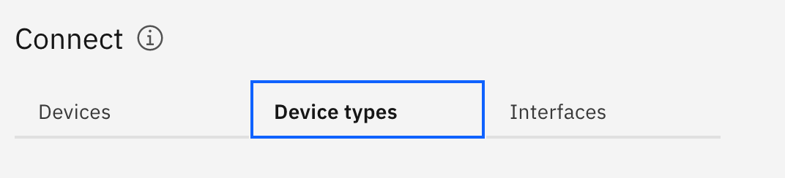
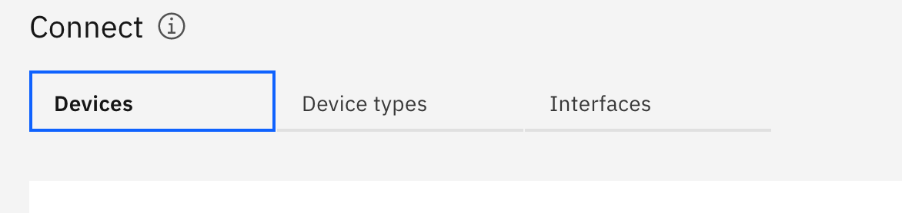

# Objectives
In this lab you will learn how to:

* Connect physical devices to Monitor
* Map device Physical Interfaces to Logical Interfaces
* Create realtime Rules and Actions on device events
* Understand how device data is stored
---
*Before you begin:*  
This lab requires that you:

1.  Have a Nordic Thingy. You can [purchase](../facilitator_instructions) Nordic Thingy.  
2.  Have completed the pre-requisites required for [all labs](../facilitator_instructions)
---
#  Connect a Physical Device
Now that you have done some initial exploring of the IoT Platform and you have connected a simulated device, it’s time to connect a real, physical device. For this exercise you will use a Nordic Thingy.  Learn more about the Nordic Thingy and its various sensors [here](https://www.nordicsemi.com/Software-and-tools/Prototyping-platforms/Nordic-Thingy-52)

## Connect Nordic Thingy to the Internet
Let’s connect the a Nordic Thingy to the internet using Google Chrome on your computer. We are using Google Chrome because it has a built in Bluetooth listener.  Using the connectivity page below you can connect your Nordic Thingy device to the internet and the Maximo Asset Monitor Cloud Service. You first need to pair the Thingy via Bluetooth to your computer.    

1.  Carefully remove the rubber overlay to find the power switch next to the micro-usb port.  A blue light should illuminate when the device is powered up.
2.  Power on the Nordic Thingy. Push the tiny switch to the left of the micro-web port
3.  Use Bluetooth in the Google Chrome Browser to connect your device to the internet.  Open a tab with this web address:  [https://nrf52t-v2.mybluemix.net/](https://nrf52t-v2.mybluemix.net/).
4.  This method will only work on Google Chrome as it has a built in Bluetooth listener. Below is the connectivity page you’ll need to revisit if you get disconnected at any point. you’ll need to revisit if you get disconnected at any point. Click `Connect` button.
&nbsp;
5. In the list of devices, find the one matching your device, select it and click `Pair`. You may need to rename the Thingy if you are in close range with others also using their own Thingy.
  
6. 	Once paired, you should see the following screen which shows IoTP connection status as well as some of the sensor values coming from the Thingy.
  
7. 	The top righthand corner button will say “connecting”. Notice the IoTP indicator does not have a checkmark. This is because it is not yet connected to the IoT Platform. To connect it up, copy or make note of the Thingy name and, in a new tab or window, you will next connect the Thingy to IoT Platform service included with Maximo Asset Monitor.

## Connect Nordic Thingy to Maximo Asset Monitor
The Nordic Thingy has connectivity to the internet.  You must first register device types and then devices with the IOT Platform service included with Maximo Asset Manager before they can securely send and persist data there.

1.  Navigate to and bookmark the Maximo Asset Monitor Dashboard page.  You will use this throughout the lab. [https://dashboard-beta.connectedproducts.internetofthings.ibmcloud.com/preauth?tenantid=Monitor-Demo&APM=true](https://dashboard-beta.connectedproducts.internetofthings.ibmcloud.com/preauth?tenantid=Monitor-Demo&APM=true)  You are put on the Home screen
2.	Log in to the Monitor.  Click `Login` button.  See `Before You Begin` section in this lab if you don't have an IBM ID to login or having trouble accessing the environment.
&nbsp;
3.  After logging in, you’ll land in Home Screen.”
&nbsp;
4.  Click `Connect` tab (third icon in the side menu)
 &nbsp;
5.  You are now inside of the IoT Platform Connection Service within Maximo Asset Monitor. 
&nbsp;
6. Navigate to the `Device Type` tab.
&nbsp;
7.  Click `Add new device type` button in the top right corner.
8.  Now create a new device type and name it `<your last name>_thingy`. For example, `smith_thingy.`Classify this device type as `Device` by selecting that radio button. In the figures below, you will see that the device type name has a dash in it. DO NOT PUT A DASH OR PERIOD IN YOUR DEVICE TYPE NAME. There is an issue in Monitor right now where the pipeline will break if there is a dash or period in your device type name. If you would like to create Metadata, you can enter a key value pair describing your device. By doing so, you can easily create dimensions, a concept described in great detail in Lab 6, for your device type.
&nbsp;
9.  Click `Create Device Type`. You’ve finished creating a device type.
10.  Now you will register a new device using the `Device Type` you just created. Navigate back to the `Devices` tab and click `Add new device`
&nbsp;
11.  Search for and select the `Device Type` you created in the previous steps. Make sure to name the device the same name as you named your physical Thingy device from the earlier step. 
&nbsp;
&nbsp;
12.  Next, you can either create your own authentication token or have the IoT Platform Service autogenerate a token for you. Make sure you remember your authentication token or you save the auto-generated token. You will need it in the upcoming steps and will not be able to retrieve the token.
&nbsp;
13. Click next, and create your new device. You will be able to copy and paste your authentication token from this screen. Please do so into a note or write it down.
&nbsp;
14.  A Nordic Thingy also needs the IOT Platform tenant organization ID to connect to the IOT Platform Service.   To find the `Organization ID` note the first item in the credentials highlighted by a red box. Make note of the `Organization ID` for use in the next step.
&nbsp;
15.  Navigate back to the Thingy page within your Chrome Browser showing the sensor values and place the following into the `Token` field: `<Auth Token>:<Device Type >:<Org ID>` For example: `+A0@WxGamw*wcGiI+:smith.thingy:eefdu2`
16.  Click `Write` button to write the token to the Thingy. You should see the IoT Platform service connection status indicator will turn green if successful.
17.  You should also now see data flowing from the Thingy to your corresponding Device ID in the IoT Platform service back in the `Devices` tab.
18.  Flip the Thingy upside down to create an error condition. It will beep and the light will turn red. Click on one of the rows to see the vent payload json file. Notice the `err` value in the payload changes to 1.
19.  Press the large black button on the top of the Thingy to clear the error.
---
**Note:**
This exercise demonstrated how to manually add a device to Maximo Asset Monitor.  You would most likely  programatically add devices using the included Watson IOT Platform Service [REST APIs](https://www.ibm.com/support/knowledgecenter/SSQR84_monitor/iot/references/ref_apis.html) and [Python SDK](https://ibm-watson-iot.github.io/iot-python/application/api/registry/devices/).
---

# Interfaces, Rules and Notifications
You will create an alert notification when the Nordic Thingy has an error condition.  In this next section you will learn how you can:

  *  Create [physical interfaces](https://www.ibm.com/support/knowledgecenter/SSQR84_monitor/iot/platform/GA_information_management/im_ui_flow.html#gs_web)
  *  Create [logical interfaces](https://www.ibm.com/support/knowledgecenter/SSQR84_monitor/iot/platform/GA_information_management/im_ui_flow.html#gs_web)
  *  Define conditional realtime [rules and notifications](https://www.ibm.com/support/knowledgecenter/en/SSQR84_monitor/iot/platform/reference/embeddedrules/index.html)&nbsp;
&nbsp;

## Create a Physical Interface
1.  Make sure your Nordic Thingy is turned on and actively sending sensor data to the IoTP service. You may need to reconnect the Thingy in the Chrome browser using this [web link](https://nrf52t.mybluemix.net/?edit) and steps provided earlier.
2. Check if the Thingy is connected.  Click `Browse` tab in the IoT Platform service and searching the devices list for device status and recent events.
3.  Navigate to the device type for your Thingy and click `Interfaces` tab. Make sure `Advanced Flow` is selected and click `Create Physical Interface` button.
4.  Leave the default name for the physical interface and then click `Next`.
5.  Click `+ Create event type` button on the next page. If your Nordic Thingy is still actively sending events, then you should see the `status` event show up.
6.  If the `status` event does not automatically appear, check the connectivity back in `Browse` in the device list. Select it and then click `Add.`
7.  Click `Done` to complete the creation of the physical interfaces.

## Create a Logical Interface
1.  Next, click `+ Create Logical Interface` button to begin creating the logical interface. Leave the default name as is and click `Next`
2. Click `+ Add Property` button, expand the `d` and select and save the `err` property.
3.  Let’s do the same for “temperature”, except this time we’ll use the mapping field to convert the temperature from Celsius to Fahrenheit using [JSONData script functions](https://docs.jsonata.org/expressions).  Select `add` property  
4.  Select `temperature`
5.  Then in the mapping field, click `pencil` icon to edit.
6.  Add the following equation: `d.temperature * 1.8 + 32`. Notice that to input the numbers `1.8` and `32` you have to first select the `Value` operator. Another option is to switch the `Advanced Editor` button and paste the formula.  If you mistype it may cause a syntax error so be careful.
7.  Click `green check` mark when complete.
8.  Click `save`.
9.  Add the remaining properties. You should see the following before clicking `Next`. 
9. Click `Next` to move onto `Notifications`. Notifications allow you to take action when certain conditions occur.
10. Change the `State Update Notification` criteria to `State Changes.` This will send data to your Logical interface only when the value changes.   Make sure to hit the `Apply` button to save changes. If you want to send the event all the time even when the values are the same as previous events select `All events`. 
11.  Click `Add Notification` button. This will raise a notification event in IOT Platform when the Thingy’s error condition is set to `1`
12.  Enter the Name, description, criteria and condition as shown below.`$state.err = 1`
13.  Click `Apply`
14.  Click `Done` 
15.  The interface creation is almost complete. Back in the interface view, click `Activate` button and activate the interfaces. If successful, you should see a green rocket ship icon next to each interface. 
16. You can check to see if your interface is working, by browsing to your device, select the `State` tab and switch the interface to your newly created interface. Temperature should now be shown in Fahrenheit. 

Congratulations you have successfully connected a device and have it sending data in Maximo Asset Monitor.  In the next lab you will view the available dashboards and create new dashboards to monitor your Thingy.
