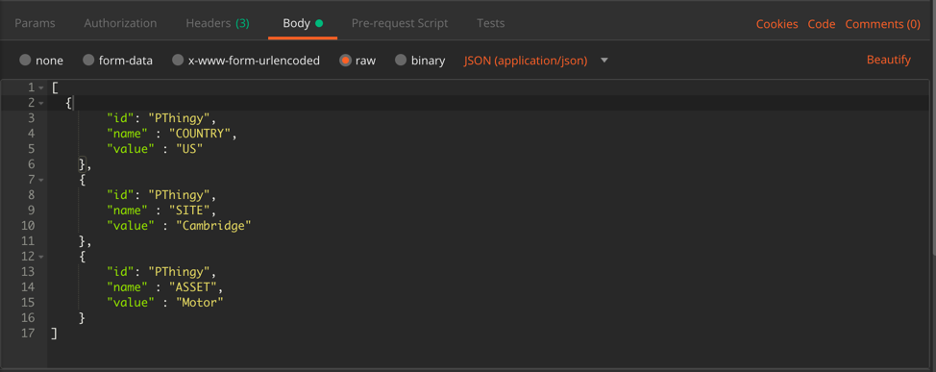

# Using Dimensions to Aggregate data in Summary Dashboard

In Maximo Asset Monitor, dimensions are metadata used for filtering or aggregating entities and their metrics. Using a REST API call, you are able to push JSON into the Monitor data lake to assign dimensions to different sensor device IDs.  

Let’s look at an application of dimensions in Monitor. Dimensions in Maximo Asset Monitor allow for rapid actionable insights. The picture below shows a dashboard monitoring the IBM IoT Center in Munich which has been outfitted with sensors to measure comfort and occupancy. Our developers added the following dimensions: Region, Building, Floor, Zone, and Workstation. On this Building Summary dashboard, you can see on the alerts table that all 120 alerts for October 10 came from the Munich HQ building on the 27th floor in Zone 3. The dimensions enable you to tie your sensors with, in this case, location metadata that allows you to be able to drill down into Zone 3 inside of the dashboard or physically go to Zone 3 and check out the problem.  
 

To set up your own dimensions, you will need to open up Postman. If you do not already have Postman downloaded, here is a link to download the software https://www.getpostman.com/. 

## Obtaining an API Key
In order to successfully push your JSON schema into the Monitor platform, you will need an API key and token to authenticate your POST request. We will obtain this API key and token by creating one in the Watson IoT Platform Service application linked to your Maximo Asset Monitor instance.

1. In the hamburger menu on the left side of the screen of your tenant of Maximo Asset Monitor, click `Connect`.
2. To the right of where it says `Watson IoT Platform Service` click `View Details`.
3. Now click the `Launch` button.
4. Sign into the organization that corresponds with your Monitor Tenant in the Watson IoT Platform Service window. You can locate the organization on the top right corner of your screen. Click in the red boxed area on your browser to change the organization if need be.  
5. On the left side pop out menu, click on `Apps`.
6. Next, click `+ Generate API Key` button.
7. Click next until you hit the `Generate API Key` button. Nothing of importance for this exercise appears before this step.
8. Make sure you copy and paste your API Key and Token in a safe place. You will not be able to retrieve the token again. You will need both the API Key and Token to push the dimensions to Monitor.
## Pushing the Dimensions using Postman

In this section, you will come up with metadata you would like to assign to your entities for the purpose of drill down and quick root cause analysis. The dimensions enable you to look at devices of a certain category or drill down to a single device.

1. Figure out the metadata you will deploy. In the example inside of the attached Postman Collection, the dimensions `Country`:US, `Site`:Cambridge, and `Asset`:Motor were used. You will be pushing key-value pairs associated with your devices into Monitor to create your dimensions.
2. Open up the Postman application. In the top left corner you will see a button that says `+New`. Click on the `Request` button. Name your Request and create a Collection to place the Request.  Click the dropdown menu inside the red box in Postman to classify this API Call as a `POST` Request. 
3. Copy and paste this link into where it says “Enter request URL”: https://api-beta.connectedproducts.internetofthings.ibmcloud.com/api/master/v1/TenantID/entity/type/EntityType/dimensional **In the Request URL in Postman, you will need to enter your Device Type/Entity Type instead of “EntityType", and you willn need to enter the name of the Tenant you are using in place of "TenantID”.**
4. Click on `Headers`. (`Params` will be the default select.) Enter the key-value pairs you see below. However, instead of the API Key and Token shown below, **enter the API Key and Token you generated in the first section of this lab.** 
5. Now click on `Body` and select `raw`. You will need to enter a JSON payload here to tie your Device ID with your chosen dimensions. In this case, `id` will always be your Nordic Thingy Device ID. `id` refers to the Device ID that you will be associating your key value pair with. `name` will be the dimension name/category that you use to drill down through, and `value` will be the value you are assigning to your Device ID in terms of your dimension. 
6. Here is an example of a JSON array you may use. Feel free to use more than three dimensions if you so choose. Please copy, paste, and modify the JSON below for the sake of easy formatting: 
```
  [
    {
        "id": "PThingy",
        "name" : "COUNTRY",
        "value" : "US"
    },
    {
        "id": "PThingy",
        "name" : "SITE",
        "value" : "Cambridge"
    },
    {
        "id": "PThingy",
        "name" : "ASSET",
        "value" : "Motor"
    }
  ] 
 ```
7. After you have finished the above steps. Click `Send`. You should receive a `200 OK` success code from Postman. If not, make sure you entered everything correctly. If you are still having issues, please contact Paulina Thomas (paulina.thomas@ibm.com), or post a comment in the #ask-as_monitor Slack channel in the AI Applications workspace. 
