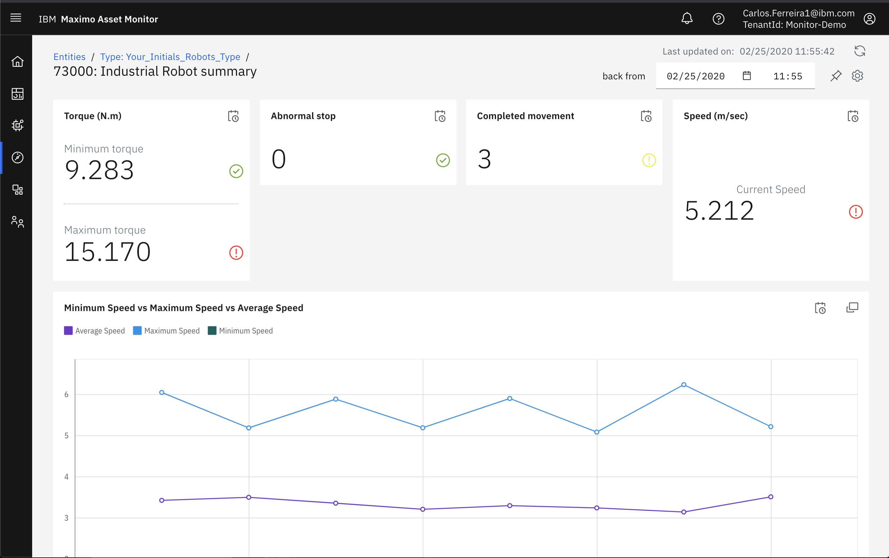
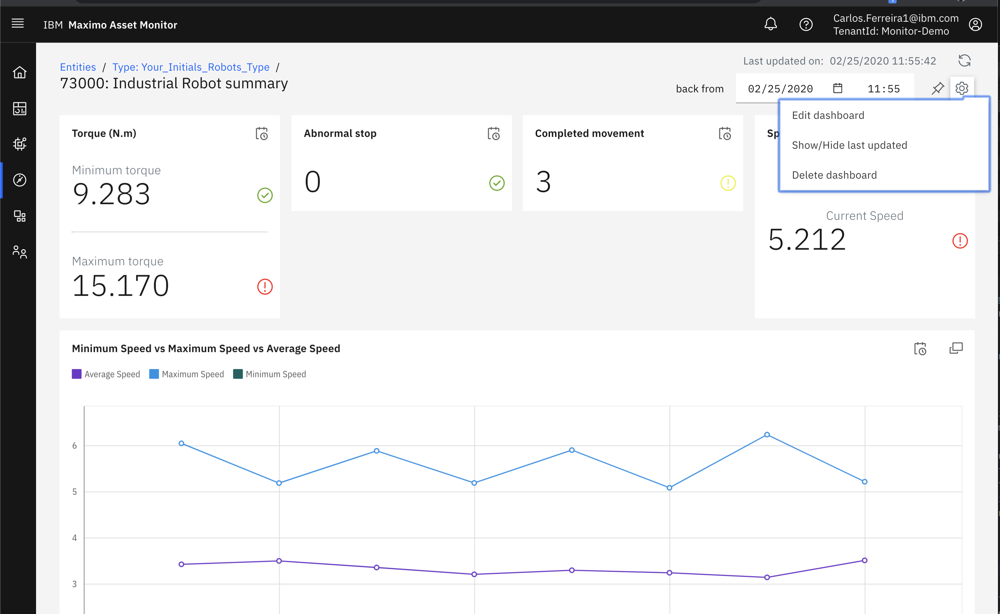
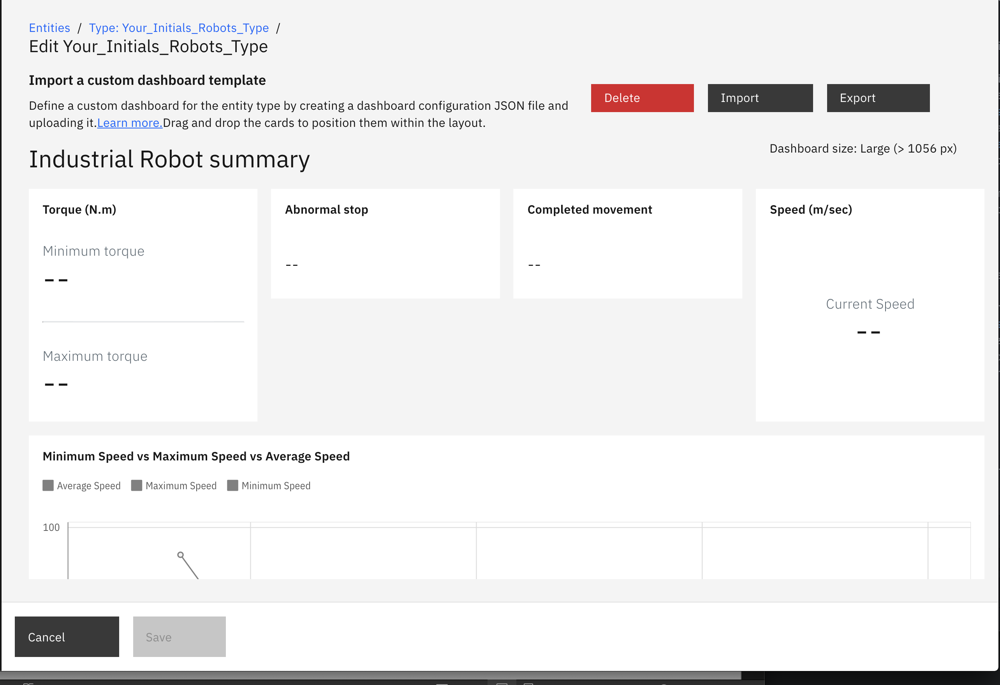
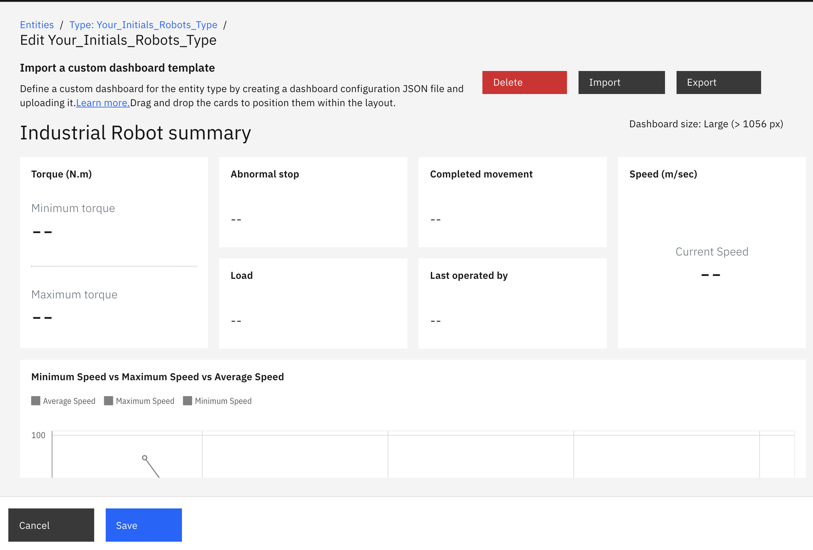
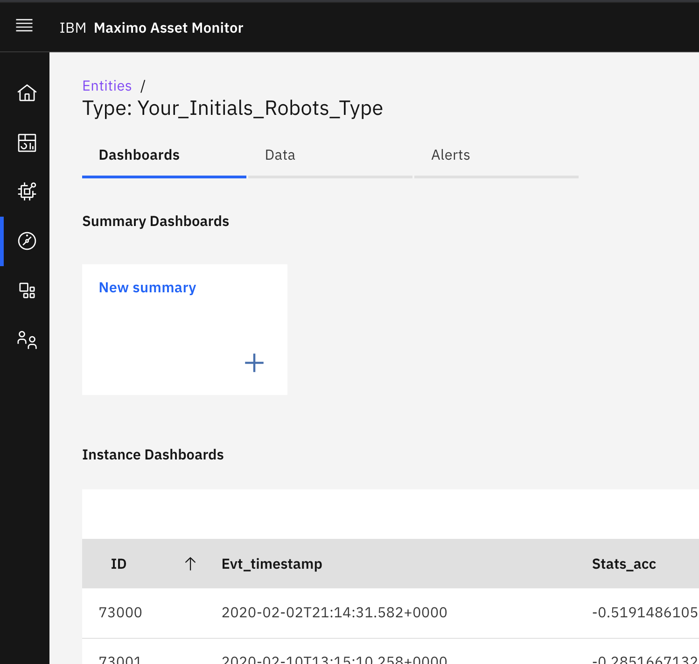
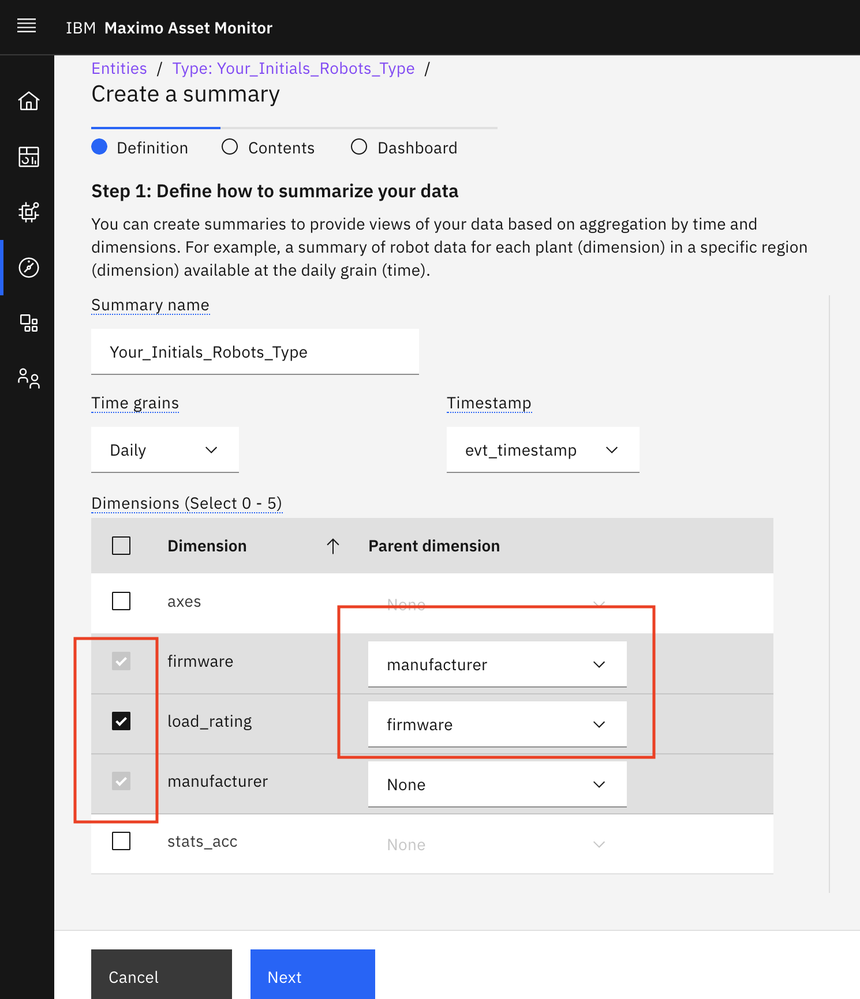
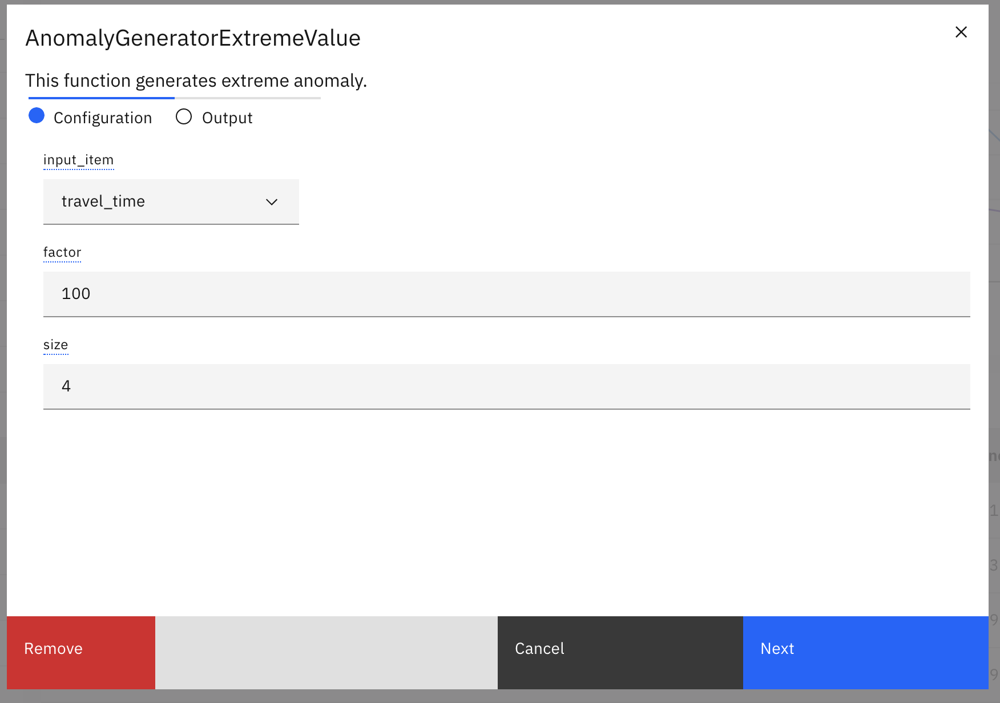
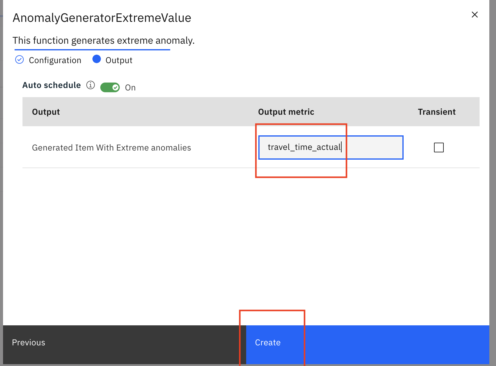
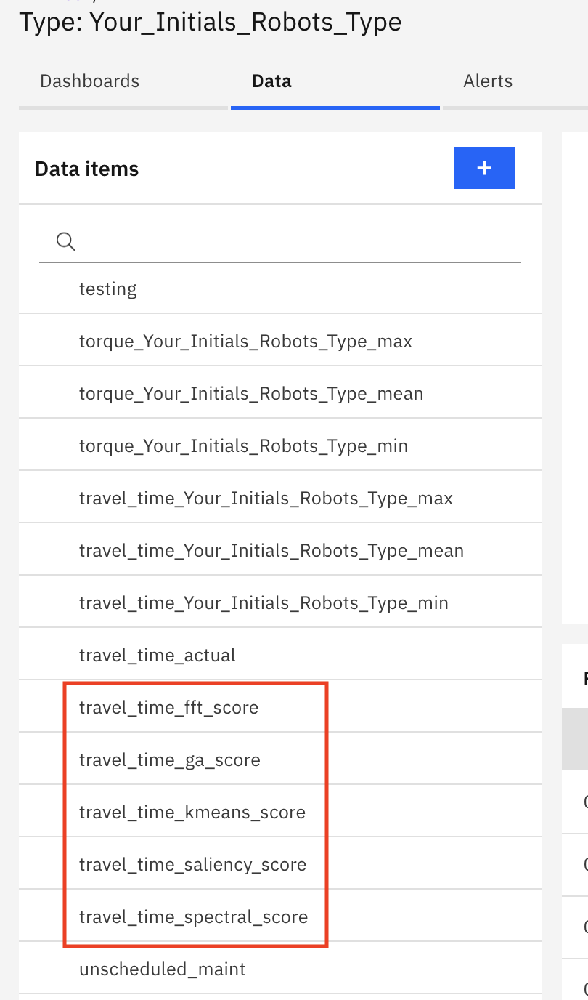
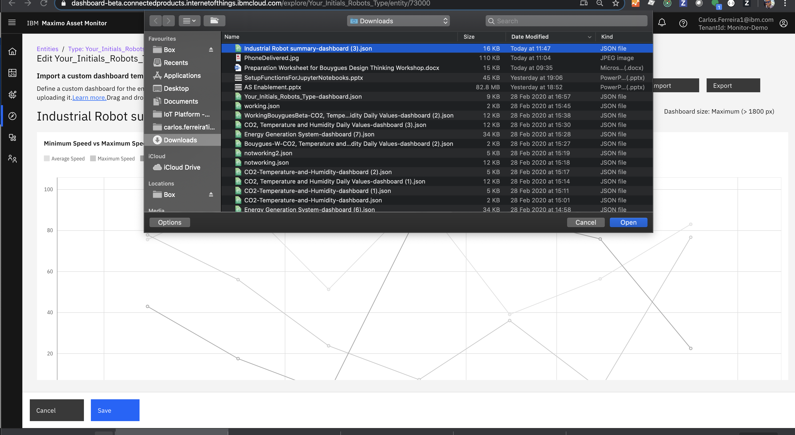

# Objectives
In this lab you will learn how to:

*  Create an asset instance dashboard to see how an individual asset is performing
*  Create a summary dashboard that aggregates asset performance metrics across multiple assets of the same type
*  Detect anomalies by applying anomaly models
*  Create alerts to prioritize anomalies
*  Monitor alerts across multiple assets in a summary dashboard you create
*  Troubleshoot to find the rood cause of a problem

---
*Before you begin:*  
This lab requires that you have completed the pre-requisites required for [all labs](../facilitator_instructions)
---

## Create Simulated Robots to Monitor
In this exercise you quickly create some simulated robot operational data that you will use in your exercises in this Lab.  You will use data from simulated industry robots as the assets you are responsible to monitor.

1.  Click `Home` to see the top level tasks you can do with Monitor.  &nbsp;
2.  Click `Monitor Entities` You will create a simulated set of robot assets (entities) that represent an assembly line of manufacturing robots.
3.  Click `Create entity type` button.  &nbsp;
4.  Select on `Sample Robot` and click on `Next`button.   &nbsp;
5.  Edit the Entity Type name prepending your own initials `Your_Initials_Robots_Type`. &nbsp;
6.  Click `Submit` button.  Monitor will create  a set of robots you can monitor with simulated random data.  

## Explore Instance Dashboards
An [instance dashboard](https://www.ibm.com/support/knowledgecenter/SSQP8H/iot/dashboard/tutorials/instance_dashboard_tutorial.html) displays the operational metrics for a single asset, i.e. one specific industry robot. The data metrics of the robot are presented on the dashboard using cards.

1.  On the `Data` tab, expand `Metric` to see the metrics that Monitor has created for your Robots with simulated time series data.   The outline shows the acc, load, speed and torque metrics in the data items outline.  &nbsp;
2.  Expand  `Dimensions` to see the classifications Monitor has created to filter and summarize all the Robots key performance metrics like by `Manufacturer`.  &nbsp;
3.  Expand  `Metric (calculated)` to see the functions used to create the simulated data like generating a random number to cause a fault like `abnormal_stop_count`. 
4.  Click the `Dashboards` tab to  to see the list of `Entities`(Robots) in the `Instance Dashboards` table.
5.  Click one of the Robot instance dashboards that have been automatically created for you by Monitor.  &nbsp;
6.  Click on the `Back from` calendar drop down to see historical performance metrics of this robot.    &nbsp;
7.  Note the different types of [cards](https://www.ibm.com/support/knowledgecenter/SSQP8H/iot/dashboard/cards_json_ref.html) in your dashboard.  Monitor provides multiple types of cards to choose from when configuring a dashboard.
8.  In this exercise the Instance Dashboard for the Robots was automatically created for you.  You can also export a summary dashboard and import it by managing instance dashboards as shown in the next exercise.  

9.   Monitor includes a variety of cards. Take a moment to see what cards were created for you in the instance dashboard.

*Value Cards*
A value card shows a single or multiple entity metric value. A value may be attributed with a title, a label and a unit. The value may be given a precision and rules on threshold levels.  A value card may be sized as a wide or tall card with big or small sized numbers.

*Line Graph Cards*
A line graph card shows time-series data from a single or multiple entities as a graph with time and value axes. The graph may be given a title and labels on the axes. The line graph may be shown in full screen mode and is added a data table with the metrics values plotted in the graph.
A line graph may also be overlaid with an Alert metric indicating any anomalies on the metric.

*Table Cards*
A table card shows tabular data by columns. A table card is configured by referencing some data source for each column. The table may group data source values and present a count rather than each individual value.
An Alerts Table is a preconfigured table presenting alert information.  You will add one later for tabulating alerts.

*Image cards*
An image card shows as a custom image with configured hotspots. Each hotspot is indicated at a position on the image with an icon and configured as a value card with entity metrics. The value card is shown when clicking on the hot spot.  You will add one later for displaying an image of the robot.

## Edit Instance Dashboard
In this exercise you will modify the layout of the individual robot instance dashboard.  An asset instance dashboard is a configuration of cards, layout and the datasource metrics for a specific asset. One instance dashboard json configuration file is used for all robots of your Robot Entity type.  You can export and dashboard configuration file adding new cards.  You can also reuse and import dashboard configuration files from others.

1.  Click the `gear icon` to modify the layout of your Robot instance dashboard.  This dashboard template is shared by all robots in your Entity Type.  &nbsp;
2.  Monitor provides a responsive user interface as the display size of the device or browser window changes you can reposition the cards.  Change the layout of your dashboard by dragging cards around with you mouse.  &nbsp;
3.  Once you are satisfied with the layout, change the width of the browser window to a smaller size.  Note the `Dashboard Size` of the layout has changed.  Once again change the layout of your dashboard by dragging cards around with your mouse.  &nbsp; The dashboard configuration saves all the adjustments you make to the layout for each resize your browser window.
4.  Click on `Export` button. The dashboard configuration file in a json format is saved to your local downloads directory on your computer.  
5.  Click on `Save` to save the new dashboard layout.


# Create a Summary Dashboard
In the previous exercise you created an instance dashboard for each Robot.   In this exercise you will create a [Summary Dashboard](https://www.ibm.com/support/knowledgecenter/SSQP8H/iot/dashboard/tutorials/summary_dashboard_tutorial.html).  There is one summary dashboard presenting aggregated and filtered performance KPI across all robots of the type.  A summary dashboard allows you to see the metrics for a filtered group of assets.  "Show me all robots from a manufacturer and with a specific firmware.""

The filters are called dimensions.  In the "Mastering Monitor" Lab you will learn how to assign dimensions to the entities. Our simulated robots already have the appropriate dimensions for assigned to each robot.  Robot 73000 may have a manufacturer GHI Industries and Robot 73002 may have Rentech. A summary dashboard allows you filter assets and then compute the data metrics aggregations for the applied filter.  For example, the Max, Min and Mean torque of all robots for the filtered scope of a selected manufacturer.

A summary dashboard uses time grains when computing the aggregations.  Monitor can display four types of summary dashboards. You can choose by hour, day, week, month time grains.  A summary dashboard supports the same cards as an instance dashboard.

1.  From the side menu, click `Monitor`
2.  From the `Entity Types` tab, select your entity type and click `View`
3.  Select the `Dashboards` tab  &nbsp;
4.  Click `New Summary`
5.  On the `Definition` page, assign the name `robot_daily_summary` to the dashboard
 &nbsp;
6.  Select the `daily` time grain
7.  Accept the default value for `timestamp`
8.  Since your simulated robot data also created dimensions, define your filters.  Select `load_rating` as the lowest-level dimension and `manufacturer` as the parent dimension
9.  Select `firmware` as the mid-level dimension and `manufacturer` as the parent dimension
10.  Select `manufacturer` as the dimension and leave `None` as the parent since it is the top level filter and aggregation we want to see.
11. Click `Next` and choose the max, min and mean for aggregation methods for all the number metrics.  &nbsp;
12. Click `Export`to save the dashboard json configuration. You will edit it later.  You can also import dashboard configurations from this menu.
 &nbsp;
14.  Click `Create summary` to create the dashboard.  Your dashboard should like something like the one below.
 &nbsp;
15.  Notice the summary dashboard form automatically added the aggregations to your `Metrics (calculated)` for the min, max and mean.  Optionally repeat the steps above to create summary dashboards to view hourly, weekly and monthly performance metrics summaries of the all robots.

# Add Metric Line Card
You need anomalies to be able to detect anomalies.  Monitor provides simulated anomalies that you can apply to learn about anomaly detection.  In this exercise you will add some simulated anomalies to your robots using the steps below.  The anomaly requires an existing metric as input and the output is an abruptly increasing or decreasing value than normal value. The increased value is still within a SCADA system normal operating range.  Therefore max or min business rules would not adequately detect the anomaly.  You will then add the metric as a line card to your instance dashboard.

1.  Search the function catalog for  `AnomalyGeneratorExtremeValue` to create an anomaly for the metric `travel_time`.
 &nbsp;
2.  Choose  `travel_time` for the metric `input_item`.  Extreme anomaly values will be added to this time series metric.
3.  Set `factor` to a value of `2` times the normal value levels.
3.  Set `size` to a value of `6`.  This is how frequently in terms of the number of sample intervals between how often an an anomaly will occur.   &nbsp;
5.  Set the `output_metric` to `trave_time_actual`  &nbsp;
6.  Click `Create`
7.  Click on `Dasbhoards` tab to see the list instance dashboards
8.  Click on `Gear` icon top right.  Choose `Manage instance dashboards`
9.  Click on `Export` button top right. Instance dashboard json file should be saved in your browser downloads directory with a name of `Industrial Robot summary-dashboard.json`
 &nbsp;
10.  Open the file using an Integrated Developer Environment like [Atom](https://atom.io/) or copy the file contents into an online [Web JSON editor](https://jsoneditoronline.org/#left=local.ginesu).  Read about the structure of [Monitor dashboard Json files](https://www.ibm.com/support/knowledgecenter/SSQR84_monitor/iot/dashboard/dashboard_json_ref.html) and study the json file in the editor.
 &nbsp;  
11.  Insert the [line card json](https://www.ibm.com/support/knowledgecenter/SSQR84_monitor/iot/dashboard/line_graph_json_ref.html) below into the `"cards":[]`.

    ```
{
    "content": {
        "series": [
            {
                "dataSourceId": "travel_time",
                "label": "Travel Time"
            }
        ],
        "unit": "sec"
    },
    "dataSource": {
        "attributes": [
            {
                "attribute": "travel_time",
                "id": "travel_time"
            }
        ],
        "range": {
            "count": -24,
            "interval": "hour"
        }
    },
    "id": "travel_time_line_card",
    "size": "LARGE",
    "title": "Travel Time",
    "type": "TIMESERIES"
},
    ```

12.  Notice how the JSON `content >  series > dataSourceId`  fields don't have an aggregation ` "aggregator": "min",` like other line metrics.  As a result the `travel_time` metric line series graph data will display raw data.
13.  Notice how the `range` json node lets Monitor know to only display the last 24 hours of data.    
13.  Make sure to change all values with size `XLARGE` to `LARGE`.  and `XSMALLWIDE`to `SMALLWIDE`. and save your changes to the instance dashboard json file.    &nbsp;
13.  You can see the finished [Industrial_Robot_Instance_Travel_Time.json](here)  or in the [online Json editor]
13.  Click on `import` button, choose the `file` you updated with the line card click `open` to import your updated json file.  &nbsp;
14.  Your instance dashboard should now look similar to the one below and have a Travel Time Card.

# Add Anomaly Detection
Maximo Asset Monitor includes models to [detect anomalies](https://www.ibm.com/support/knowledgecenter/SSQR84_monitor/iot/analytics/as_detect_predict.html) in the function catalog.  The anomaly models can detect a variety of anomaly patterns.  These include;

*  Varying signal becomes flat line.
*  Varying signal becomes a near vertical line.
*  Peak maximum or minimum exceeds historic values with a known time period.
*  Flat line becomes  a varying signal.
*  No sensor data is available.
*  A correlated dependent target variat doesn’t come within range of it’s prediction.

In this exercise you will:

 *  Add anomaly models functions to your Robot Entity Type.  
 *  Add a line chart to visually compare how each anomaly model high scores correlates with the robot travel_time
 *  Add an alert function with anomaly model score threshold that corresponds to a level that indicates an anomaly for a robot metric.
 *  Add an alerts table that summarizes alerts across all the Robots in your Entity Type in a summary dashboard.

**Add anomaly models functions to your Robot Entity Type**

1.  Search the function catalog for an anomaly model to detect anomalies for the metric `travel_time`.  On the `Data` tab, click the '+' button and search on `Anoamaly`  Select `K-MeansAnomalyScore`. Notice the different kinds of [Anomaly Model functions](https://www.ibm.com/support/knowledgecenter/SSQR84_monitor/iot/analytics/as_detect_predict.html) included with Monitor.
2.  Click `Select` button.
3.  Select the metric to score for anomalies `travel_time`
4.  Anomaly models require a [window size](https://www.ibm.com/support/knowledgecenter/SSQR84_monitor/iot/analytics/as_window_size.html) which is the number of samples evaluate each time the model is scheduled to execute.   Enter a `window_size` of `12`.   
4.  Provide the name for the calculated metric `travel_time_kmeans_score`
5.  Repeat the previous in this exercise adding anomaly functions with a similar naming convention `travel_time_anomalyfunction_score`.  
6.  Search on `FFTbasedGeneralizedAnomalyScore2`, configure and name it `travel_time_fft_score`
7.  Search on `GeneralizedAnomalyScore`, configure and name it `travel_time_ga_score`
8.  Search on `SaliencybasedGeneralizedAnomalyScore`, configure and name it `travel_time_saliency_score`
9.  Search on `SpectralAnomalyScore`, configure and name it `travel_time_spectral_score`


**Add Line Graph Card**

Add a line graph card to your instance dashboard that plots the anomaly model scores for time_travel metric.

1.  From the Entity Type click on the `gear icon` &nbsp;
2.  Select `Manage instance dashboard`
3.  Add the following [line graph card Json](json/AnomalyScoreLineGraph.json) for `travel_time`anomaly score line graph card to your instance dashboard.

```
{
    "id": "card-anomaly-scores-line-timeseries",
    "dataSource": {
        "attributes": [
            {
                "attribute": "travel_time_spectral_score",
                "id": "travel_time_spectral_score"
            },
            {
                "attribute": "travel_time_saliency_score",
                "id": "travel_time_saliency_score"
            },
            {
                "attribute": "travel_time_ga_score",
                "id": "travel_time_ga_score"
            },
            {
                "attribute": "travel_time_fft_score",
                "id": "travel_time_fft_score"
            },
            {
                "attribute": "travel_time_kmeans_score",
                "id": "travel_time_kmeans_score"
            }
        ],
        "range": {
            "count": -24,
            "interval": "hour"
        }
    },
    "content": {
        "series": [
            {
                "dataSourceId": "travel_time_spectral_score",
                "label": "Spectral"
            },
            {
                "dataSourceId": "travel_time_saliency_score",
                "label": "Saliency"
            },
            {
                "dataSourceId": "travel_time_ga_score",
                "label": "Generalized"
            },
            {
                "dataSourceId": "travel_time_fft_score",
                "label": "FFT"
            },
            {
                "dataSourceId": "travel_time_kmeans_score",
                "label": "Kmeans"
            }
        ],
        "xLabel": "Time",
        "yLabel": "Score"
    },
    "size": "MEDIUM",
    "title": "Anomaly Scores for Travel Time",
    "type": "TIMESERIES"
},
```

4.  Add a table card that displays the daily mean work_performaned by robots for the last 7 days. Add the work_performed_too_high alert.
5.  Show a value card that displays the average work_performed value for entities `73000` and `73001`. Use the `dataFilter` object to specify each `deviceid`.
6.  You should now have the following Anomaly models scoring. {: style="height:50px;width:50px"} &nbsp;

#  Add Anomaly Alerts to Line Charts
This requires you to add anomalies to your line charts.

## Add an image card.
Display the map that you added when you added the source data.
Add a hotspot over two states on the map. Associate one state with robot 73001 and another state with robot 73002. Tip: If you created a robot with different devices names, replace with the name of two of your devices.
Save you file. The dashboard configuration in the JSON file is similar to the following example. Remember: You might use different device names in your configuration, for example in dataFilter.
Expand to see dashboard example

## Step 4: Import the JSON configuration
From the Entity types tab, select your entity type.
From the Dashboards tab, find the dashboard that you want to edit under Summary Dashboards.
Click Menu and click Edit.
Go to the Dashboard page of the Summary Dashboard editor.
Click Import.
Browse to find a local summary dashboard configuration file.
Verify that the dashboard looks as expected and then click Save.
Tip: If the hotspots do not display on the image card, make sure to set the time range on the image card to a period of time that contains data. Alternatively, you might need to resize the dashboard for the hotspots to display.

## Step 5: Monitor the dashboard
From the Entity types tab, select your entity type.
From the Dashboards tab, find the dashboard that you want to edit under Summary Dashboards.
Click the dashboard to open it.
If Summary Controls are displayed, either:
Choose GHI Industry under manufacturer and choose 2.14 under firmware
Choose martech under provider and choose red under color
View the average daily worked performed by painting robots. If a taxonomy is defined, either view:
The average daily work performed by painting robots on firmware 2.1 in GHI Industry.
The average daily work performed by the red painting robots that are provided by Martech.
Hover over the map to view the average work performed in each state. If a taxonomy is defined, either view:
The average work performed in each state for 2.1 robots in GHI Industry plants.
The average work performed in each state for red robots that are provided by Martech.

## Add Line Graph Cards
Time series data is represented well as line graphs. Let's display the the critical performance metrics the Thingy is providing so that we can see historical trends and in later labs apply ai models to detect anomalies.

1.  Navigate back to the landing page for your entity type. You will see under “Summary Dashboards” an option to create a new dashboard. Click `+New Summary`.
2.  Next to `Definition`, click `Contents`. Select which data you would like to graphed on your dashboard.  
3.  Select which aggregation methods  you would like to see on your line graphs for each of your data types (You created these in the Analytics Service chapters).
4.  Now, click `Dashboard` next to contents. You can drag and drop the line graph cards that you just made in whichever orientation you see fit.
5.  Once you are content with your dashboard layout, click `Create Summary`. After a few minutes, you will end up with the beginnings of a sophisticated and value driven dashboard.
6.  Copy and paste the JSON lines 3 to 158 from “Monitor Final JSON without Image.json” into the top of the card array of your exported JSON. Copy and paste the JSON from my file beginning at the curly brace on line 3.

You are adding a few value cards to your dashboard. Please refer to the Full Hands on Lab in the Box folder if you would like to go through the whole lab.

Be careful of your commas, curly braces, and brackets or your JSON will get angry. In Atom, you can click on the curly brace at the top of your value card and it will underline that brace blue along with the last curly brace of the card. Make sure to put a comma after the last curly brace before the beginning of the next card.

Congratulations you have successfully create an asset instance dashboard and a summary dashboard that aggregates asset performance metrics across multiple assets.  You also learned how to detect anomalies by applying anomaly models and alerts at scale across all your enterprise assets.
